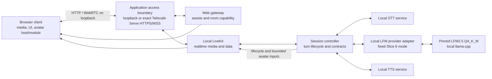

# Voice Agent v2 architecture

> **Status:** Authoritative target architecture
>
> **Owner:** Voice Agent v2 project architecture
>
> **Last updated:** 2026-08-22

This document defines the active target architecture. It records user-approved candidate identities and endpoints only at their evidence gate; a gateway investigation is not a passing provider/model selection.

## 1. Evidence language

Statements in this document use three labels:

- **Decision** — accepted product or architecture direction. An ADR is linked when the decision is costly or surprising to reverse.
- **Hypothesis** — a plausible design detail that an implementation slice must test before it becomes a decision.
- **Measurement required** — evidence that does not yet exist and is an acceptance gate in [`roadmap.md`](roadmap.md).

Untested behavior is not implied by a target diagram.

## 2. Decision baseline

| ID | Status | Statement |
| --- | --- | --- |
| D1 | Decision | V2 is a clean repository. Every active media, control, STT/TTS, application, and local-inference service runs on one Arch Linux PC; the legacy Pi/Desktop inference split is not part of V2. Historical ADR-0004 external-relay evidence is preserved but is not an active application dependency. See [ADR-0001](adr/0001-clean-v2-single-host.md) and [ADR-0004](adr/0004-tailnet-litellm-cloud-gateway-evaluation.md). |
| D2 | Decision | LiveKit, STT, and TTS remain local. The original BF16/vLLM local candidate failed its measured gates; ADR-0008 separately selects the measured Q4_K_M/llama.cpp artifact for the active Slice 6 development path. Any future cloud LLM still requires the separate gateway, model, transport, privacy, cost, and measurement gate. Provider failure never causes automatic fallback. See [ADR-0003](adr/0003-local-first-llm-with-explicit-cloud-option.md). |
| D3 | Decision | The avatar boundary is renderer-agnostic. The MVP module is a deterministic custom animated AI eye; Live2D and 3D are optional later modules. The LLM never emits frames or renderer parameters. See [ADR-0002](adr/0002-renderer-agnostic-avatar-boundary.md). |
| D4 | Decision | Internal gateway, LiveKit signaling/control, and inference stay loopback. The personal installation additionally supports one exact tailnet-only dev topology: HTTPS application and WSS signaling through two Tailscale Serve listeners plus one exact `tailscale0` UDP candidate and one explicitly approved peer-IPv4 `/32` firewalld admission. Stand operations/readiness own that external transport; the supervised application process tree does not. See [ADR-0016](adr/0016-tailscale-remote-voice-topology.md). |
| D5 | Decision | Exact STT/LLM/TTS models, quantization, serving choices, and any cloud provider become accepted selections only after repeatable resource, latency, quality, privacy, and required-concurrency gates. An explicit ADR may pin a development candidate before final acceptance only while every remaining gate stays visible; an endpoint or alias alone is not a provider selection. |
| D6 | Decision | Custom wake work is optional and deferred until after the core MVP. Kiosk operation is outside current scope. |
| D7 | Decision | The pinned [legacy repository](#34-pinned-legacy-reference) is provenance, not a dependency. A future slice may selectively migrate a proven contract, component, or test only with fresh V2 validation and recorded origin. |
| D8 | Decision | Design Gate V completed the avatar/module and full UI-shell design. Slice 7 implements the versioned host boundary, deterministic SVG eye, avatar-first shell, and two-level reduced motion defined by ADR-0002, ADR-0011, and ADR-0012. |
| D9 | Decision | For the cumulative Slice 2–5 delivery branch, Pasha fixes Whisper large-v3-turbo, LiteLLM `deepseek-v4-flash`, and Qwen3-TTS CustomVoice/`ryan` despite recorded gate failures. Pasha attested the final human microphone/listening turn on 2026-08-11; every automated failure and exception remains visible, and no fallback or false pass is allowed. See [ADR-0005](adr/0005-operator-fixed-slices-2-5-model-stack.md). |
| D10 | Superseded for active Slice 6 | ADR-0006 temporarily authorized Slice 6 private live transcript traffic through the failed, operator-opaque LiteLLM alias with an untracked server-side `LITELLM_BASE_URL` and no default, redirect, alias, or fallback. D12 supersedes that runtime authorization; ADR-0006 remains historical evidence. |
| D11 | Decision | Slice 6 uses pinned local LiveKit Server with the low-level official Python RTC/API SDK, a loopback FastAPI gateway/controller process, and a React + TypeScript + Vite client using official `livekit-client`. One room admits one browser and one agent; no avatar contract is introduced. See [ADR-0007](adr/0007-slice-6-livekit-react-realtime-boundary.md). |
| D12 | Decision | Issue #15 supersedes the active ADR-0006 cloud exception inside the same Slice 6 delivery. The app uses only pinned cache-local official LFM2.5 Q4_K_M on GPU-enabled llama.cpp, loopback-only, two 32,768-token slots, no credentials and no cloud fallback. Historical DeepSeek evidence remains factual. See [ADR-0008](adr/0008-local-lfm2-llamacpp-for-slice-6.md). |
| D13 | Decision | The private unmerged TTS evaluation branch adds backend-neutral TTS/event/control v2 contracts but fixes active composition directly to exact cache-local Silero `v5_5_ru` / `kseniya`. Input stays mono 16 kHz; output is native mono 48 kHz through two isolated resident workers and generation-gated playback. Historical Qwen/TTS v1 stays inactive and immutable. There is no TTS selector, second adapter, co-start, retry, fallback, production authority, or commercial authority. See [ADR-0009](adr/0009-silero-kseniya-tts-v2-native-48-private-evaluation.md). |
| D14 | Decision | The browser is a portrait-first full-viewport avatar shell. UI chrome knows only the avatar-host v1 API; the selected module knows no panels or controls. Four steady overlays, right-edge panels, neon-minimal tokens, and system/user reduced-motion behavior are fixed by ADR-0011 and ADR-0012. |
| D15 | Decision | Slice 8 observation shapes and failure-to-user-state mapping have one direct owner in `voice_agent_v2.observability`. The existing metadata trace, realtime-control payload, reducer, and System/Timeline panels compose that boundary; there is no telemetry service, generalized event bus, fallback controller, or hosted vendor. |
| D16 | Decision | Slice 9 uses one non-root system-level systemd service around the existing owned foreground process tree, immutable compatible releases, a one-recovery restart window, non-destructive cache/disk refusal, and verified prior-release rollback. Browser avatar recovery stays a client-build/readiness boundary; inactive cloud mode is external-readiness-only. See [ADR-0013](adr/0013-systemd-bounded-single-host-operations.md). |
| D17 | Decision | E1.1 adds only an operator-owned private agent-profile source tree and strict offline `voice-agent-ops agent-config` inspection path. Its release capability registry is immutable and empty; reserved SOUL/skills/sessions/memory paths are inert, and no profile data enters prompting, persistence, tools, or authority. |
| D18 | Decision | E1.2 loads the typed private profile exactly once when the existing gateway/controller process is composed. The immutable startup snapshot is pinned until controlled restart; every load failure degrades only the future agent-capability plane to deny-all while the existing local voice readiness and STT → LLM → TTS path remain unchanged. No watcher, repair, writable profile state, daemon, listener, or capability is introduced. |
| D19 | Decision | E2.1 preregisters three operation-proposal mechanisms but its sole authorized exact-model command was unavailable before matrix admission. The content-free machine decision is therefore `model_operation_proposals_unavailable`: no model-backed mechanism is selected, ordinary local conversation remains the only behavior, and the production capability registry stays exact-empty. See [`e2-1-local-lfm-operation-proposals.md`](evidence/e2-1-local-lfm-operation-proposals.md). |
| D20 | Decision | E2.2 ships only a deterministic synthetic tracer: one test-injected proposer may cross closed admission, one release-owned typed test handler, bounded opaque `external_tool_data`, and one deterministic final-answer round. The real `LocalLFMProvider` remains tool-unaware, production capability count stays zero, and no test capability can enter configuration, status, prompt, or production composition. |
| D21 | Decision | E2.3 binds every synthetic operation task to the existing cancellation token and full session/epoch/turn/request/generation identity. Cancellation closes admission, requests bounded component cancellation, drops late outcomes, rolls back uncommitted context, and completes the realtime cleanup barrier before replacement admission. One whole-loop deadline and narrower handler deadline never reset; release-owned proposal/result limits and inert-result validation prevent data from creating authority or direct output. Production composition remains unchanged. |
| D22 | Decision | E2.4 adds the production `AgentRun` v1 path through only the exact cache-local LFM2.5 Q4_K_M/llama.cpp identity and exactly one installation-owned persistent Docker `AgentEnvironment`. Strict `voice-agent.config.v2` removes active selectable identity; Docker endpoint/owner/spec/generation custody, at-most-once receipts, fixed exec helpers, explicit lifecycle, effective resource inspection, and no normal teardown or host/alternate-runtime fallback are fixed. The personal-install correction replaces the never-published registry assumption with one explicit rootless host-native preparation whose private exact local image ID is runtime authority. E2.1 remains consumed and E2.2/E2.3 remain historical synthetic contracts. |
| D23 | Decision | E3.2 gives that same environment normal egress with no published ports, one fixed restart-pinned credential declaration backed only by private installation state, bounded binary controller streams, acknowledgement/unknown/no-auto-retry truth, and remote Git. Redaction is display/log-only. Credential confidentiality from the agent, domain/payload binding, DLP, proxy enforcement, and cancellation rollback are explicitly not claimed. |
| D24 | Decision | E3.3 adds opaque persistent background-process receipts, fresh rootfs+`/proc` identity reconciliation, typed restart-pinned RO/RW additional mounts, and complete selector-free exact-ID lifecycle UX to the same one Docker environment. Process survival ends with a real container stop; mounts expand accepted read/exfiltration or write/destruction authority; no job restart, port publishing, model-selected path/target, or broad cleanup is introduced. |
| D25 | Decision | E4.1 adds provider-neutral bounded Web search/fetch/extract conveniences and receipt-bound citations to the same AgentRun/AgentEnvironment. Outcome-based frozen evidence requires refinement, independent fetches, traceability and honest redirect/time/byte/hash/truncation/cache/error facts without prescribing a route. Web bytes are untrusted data that may influence later admitted decisions and exercise all existing container/mount/network/credential authority; no prompt-injection prevention, taint/DLP/filtering, browser automation, alternate runtime, environment/lifecycle selection, or host fallback is claimed. |
| D26 | Decision | E4.2 adds one controller-owned atomic saved-report and Telegram delivery path. The private direct-Pasha tuple is restart-pinned, the Bot API endpoint and `TELEGRAM_BOT_TOKEN` credential name are release-fixed, document bytes come only from the existing Docker-exec stream, and durable opaque artifact/delivery IDs own exact hashes, acknowledgement, unknown/no-auto-resend, reconciliation, and explicit same-byte resend truth. No recipient/router selection, DLP/content rewriting, automatic uncertainty retry, second environment, host-file fallback, or live-Pasha claim is introduced. |
| D27 | Decision | E4.3 adds trusted later-artifact resolution, expected-revision/hash atomic update, optional explicitly chosen new-receipt research refresh, and current-revision resend. Prompt injection remains unprevented: later admitted work has full configured RW/mount/network/credential authority. Display redaction is copy-only, and the sole containment claim is the measured correctly configured unescaped-container boundary against direct unmounted-host/process/socket/device access. No detection, taint/DLP/filtering, rollback, automatic retry/refresh, lifecycle/selection authority, or stronger sandbox claim is introduced. |
| D28 | Decision | Until a separately queued multilingual speech design is accepted, production AgentRun finals are Russian-only and must pass exact shaped-form admission before visibility or worker dispatch. Server-owned action provenance, bounded same-session AgentRun conversation, option-B visible-TTS-failed context, and private allowlisted Silero request-error classification are fixed without retry, translation, selector, fallback, durable history, or broader content logging. See [ADR-0014](adr/0014-truthful-voice-action-context-correction.md). |
| D29 | Decision | The versioned dev stand has one mechanically configured Tailscale remote voice path on the current MagicDNS identity: app HTTPS `:8443`, full-path LiveKit WSS `:7443`, exact `tailscale0` IPv4 UDP media, and runtime+permanent firewalld admission from one private explicitly approved peer `/32` only. No peer auto-selection, Funnel, LAN/wildcard/interface/tailnet-wide admission, TURN/ICE-TCP, alternate candidate, or retry/fallback is admitted. Remote readiness composes Serve/TLS/application/WSS/exact-bind/effective-zone/exact-owned-rule proof and claims configured admission, not current physical audibility. See [ADR-0016](adr/0016-tailscale-remote-voice-topology.md). |

## 3. System boundary

### 3.1 Active product boundary

The canonical Arch PC contains every media, control, STT/TTS, application, and inference process. Historical Slices 2–5 used the operator-fixed failed LiteLLM route under ADR-0005, and ADR-0006 briefly authorized it for Slice 6 implementation. ADR-0008 now supersedes that active path: the combined Slice 6 / Issue #15 app uses only the pinned cache-local official LFM2.5 Q4_K_M artifact on local GPU-enabled llama.cpp. No Slice 6 transcript crosses a cloud/provider boundary, and there is no active LiteLLM credential, endpoint, alias or fallback. Historical cloud evidence remains preserved rather than relabelled.

The ordinary browser may run locally or use the one ADR-0016 dev URL from another device in the same tailnet. In remote mode, application HTTPS and LiveKit WSS terminate in Tailscale Serve while internal control/signaling remains loopback and media uses the exact `tailscale0` candidate. Host-side remote topology readiness is supported; microphone publication, peer media, agent audio, and disconnect cleanup from the real second device remain physical Acceptance. On the private ADR-0009 branch, local TTS is fixed directly to Silero/Kseniya and is authorized only for noncommercial evaluation; this does not alter the active local-LFM choice or create a runtime selector.

The diagram expresses logical boundaries, not a framework or container decision. Multiple logical roles may share a process only if their contracts, readiness, and resource ownership remain independently testable.

### 3.2 Logical roles

| Logical role | Responsibility | Required location | Resource class |
| --- | --- | --- | --- |
| Web gateway | Serve versioned client assets and mint narrow LiveKit room capabilities using server-side credentials. | Canonical host | CPU/RAM |
| LiveKit server | Own rooms, participants, WebRTC media, and realtime data delivery. | Canonical host | Network/CPU/RAM |
| Session controller | Join as the agent participant; own session/turn state, endpointing policy, orchestration, cancellation, provider selection, contract validation, and control-event publication. | Canonical host | CPU/RAM |
| STT inference service | Turn bounded or streaming audio into transcript results. | Canonical host | GPU/CPU/RAM, as measured |
| LLM provider adapter | Present one provider-neutral request/result contract and route only to the explicitly configured provider. | Canonical host | CPU/RAM |
| Local LLM inference service | Produce response text for an explicitly selected local mode; active Slice 6 uses the fixed ADR-0008 artifact/runtime while full-stack acceptance remains pending. | Canonical host; initially preferred | GPU/CPU/RAM, as measured |
| Historical LiteLLM gateway | Preserved evidence for the superseded cloud experiment; it is not used by the active application. | External historical setup | Network/CPU/RAM |
| Managed cloud LLM | Produce response text only when cloud mode has been explicitly measured, approved, and selected. | Approved external provider; optional | External network/service |
| TTS inference service | Produce bounded synthesized segments for validated response text behind TTS v2. ADR-0009 uses two CPU-only complete-waveform Silero workers; delivery streams independently after each segment returns. | Canonical host | CPU/RAM, as measured |
| Browser client | Capture/play media, show session state, host the selected avatar module, and derive speech-synchronous visual input from the local decoded audio signal without treating it as physical-speaker proof. | Same host or an intended device in the same tailnet through ADR-0016 | Client CPU/GPU |
| Avatar module | Render one visual implementation behind the avatar-host boundary. | Browser client | Client CPU/GPU |

### 3.3 Outside the active boundary

- Cloud STT/TTS and any unapproved or automatically selected cloud LLM.
- Any auxiliary inference/control host or user-managed node beyond ADR-0004's single allowlisted LiteLLM relay.
- Live2D and 3D as MVP renderers. They remain possible later avatar modules.
- A2F and A2E.
- Kiosk boot/session management.
- Wake-word inference until the optional post-MVP slice is authorized.
- Model/package registries after installation and cloud-provider control planes beyond the explicitly configured LLM API. Artifact acquisition is a setup concern, not a local runtime dependency.

### 3.4 Pinned legacy reference

The only legacy code reference is the read-only tree [`prineycom/voice-agent@93c5c397`](https://github.com/prineycom/voice-agent/tree/93c5c39786ff790d7ae436772d2cf37a2eeb32c6), the exact commit audited before V2. Future agents must not treat the legacy default branch, its documentation, or its backlog as current V2 truth.

A V2 slice may consult the pinned tree through authenticated read-only GitHub access or an existing read-only checkout. Before migrating anything, it must:

1. identify the exact pinned source path and behavior needed by the slice;
2. inspect relevant source and tests rather than trust stale narrative documentation;
3. record the pinned commit/path in the slice evidence;
4. bring over only the smallest contract, component, or test needed;
5. adapt ownership/configuration to V2 and revalidate observable behavior;
6. leave behind legacy secrets, recordings, model artifacts, deployment topology, backlog, and unrelated code.

## 4. Realtime data and control flow

Media and control remain distinct even when LiveKit transports both.

1. The local browser obtains application assets and a short-lived, room-scoped LiveKit capability from the loopback web gateway.
2. The browser joins a realtime session and publishes microphone audio to local LiveKit.
3. The session controller consumes 20 ms frames resampled by the official LiveKit SDK to 16 kHz mono PCM. Before importing its runtime, the cache-local Silero v6 ONNX model verifies its pinned size and checksum; it then runs on CPU in 32 ms windows and owns public speech admission/barge-in. The configured 96 ms start threshold is combined with the 192 ms minimum-speech gate, continuation uses 0.35 hysteresis, and submitted STT payloads are capped at 15 s. The endpoint decision still waits for 640 ms of silence, while STT input retains up to 256 ms of frozen pre-onset custody and only 160 ms after the last Silero speech window. Absolute energy is privacy-safe telemetry only and cannot start a turn. Rejected noise candidates never emit `turn.listening` or cancel resident inference. This adapts the pinned legacy `infra/pi/agent/agent.py` Silero behavior without importing its competing livekit-agents pipeline.
4. The controller streams or submits audio to local STT. Partial transcript events may improve feedback; only a final transcript can advance the turn to response generation.
5. The controller sends the final transcript and bounded per-session context only to the fixed loopback `LocalLFMProvider`. llama.cpp owns two 32,768-token slots; hidden reasoning is parsed separately and never reaches the response, UI or TTS. Wrong identity, hidden-only, over-limit, truncated, timeout and cancellation outcomes fail explicitly. No Slice 6 provider endpoint or credential is configurable.
6. The selected LLM provider returns response text. Provider identity and the external-transfer fact, when applicable, remain associated with the turn; provider failure cannot select another provider.
7. Production AgentRun accepts a final only after redaction and deterministic segmentation/shaping prove that every exact spoken segment contains no unsupported Latin prose. The deliberately smallest pronunciation map covers only the established `PDF`, `SSD`, `HTTP`, and redaction tokens; punctuation, digits, dates, times and Russian abbreviations keep their existing shaping. Rejection is typed `tts_language_unsupported` before `llm.visible`, TTS reservation, worker dispatch or PCM, with only bounded aggregate character counts/reason observed. This temporary Russian-only boundary is not translation or global English support. Admitted original visible text is then published, while deterministic plain-text segments remain target 40–100 characters with a hard 240-character safe-whitespace boundary; TTS-only normalization/`ё`/stress shaping never alters UI/history text or enters diagnostics.
8. Active composition hands each admitted segment serially to exactly two isolated resident Silero `v5_5_ru` / `kseniya` workers. Each returns one complete native 48-kHz waveform; before synthesis the controller reserves one of two process-wide segment permits, then validates ≤64-KiB worker chunks/totals, aggregates the bounded segment, releases the worker, and retains the permit until segment-buffer consumption. This bounds in-flight synthesis plus buffered PCM across turns before the two-block 60-ms pump. The persistent `AudioSource(48000,1)` receives 20-ms/1,920-byte frames with exact final-partial accounting. Request/turn/media freshness is checked before dispatch, after worker return, at segment/block buffers, pump, sink, every frame, and completion. A supported-content worker/TTS failure may preserve a visible/already accepted prefix; unsupported-language admission never does. Confirmed speech clears old source/queues and permits one obsolete non-cooperative Silero call to finish silently while its replacement uses the other worker. Browser playback observations remain telemetry and do not prove physical speaker output.
9. The browser avatar host routes validated lifecycle, speech-envelope, palette/state, and optional external-target inputs to the selected module. The MVP eye module deterministically owns motion and frames.
10. Completion, interruption, or failure emits exactly one terminal turn event. All work and turn-bound avatar input for the turn is released or cancelled.

**Decision:** gateway HTTP, LiveKit internal signaling/control, and inference remain IPv4-loopback-only. A local browser uses the selected same-host IPv4 media path; the supported remote dev topology instead loads one exact current `tailscale0` IPv4 candidate while Tailscale Serve supplies separate HTTPS application and WSS signaling listeners. Raw audio remains in local STT/TTS/media paths and is neither retained by default nor sent to a cloud LLM. Stand readiness owns remote Serve/TLS/WSS/ICE configuration, while actual second-device media and physical audio remain Acceptance. In any separately approved future cloud mode, only the final transcript and permitted context may cross the approved provider boundary.

**Hypothesis:** streaming STT and incremental delivery of bounded complete-waveform TTS segments will meet the latency target with fewer resources than fully buffered turn delivery. The model/provider-budget and real-inference slices must test this.

## 5. Contracts and ownership

“Owner” means the component responsible for versioning the contract, publishing compatibility rules, validating inputs, and maintaining contract tests. A producer does not gain ownership merely because it emits data.

| Contract | Producer → consumer | Owner | Required properties |
| --- | --- | --- | --- |
| Room capability | Web gateway → browser | Web gateway | Short-lived, room-scoped, server secret never exposed, failure explicit. |
| Realtime media | Browser/controller → LiveKit participants | LiveKit adapter in the session controller | Negotiated media settings recorded; interruption and disconnect observable. |
| STT request/result | Session controller ↔ STT service | STT service | Versioned audio metadata, session/turn correlation, ordered partial/final results, terminal error/cancel. |
| LLM provider request/result | Session controller ↔ selected LLM provider | Session controller/provider adapter | Versioned permitted-context envelope, provider mode/identity, correlated bounded response text, explicit terminal error/cancel, no fallback. |
| TTS request/stream | Session controller ↔ TTS service | TTS service | Historical `tts.v1` remains 16-kHz evidence. Active `tts.v2` is backend-neutral and carries session/epoch/turn/turn-generation/request/segment correlation, adapter identity/capabilities, plain shaped text, explicit 48-kHz target, ordered ≤64-KiB chunks, exact totals, one terminal outcome, and delivery invalidation. The ADR-0009 composition contains only the Silero adapter. |
| Realtime event envelope | Session controller → browser | Session controller | Historical event/control v1 remains immutable. Active `event-envelope.v2` and `realtime-control.v2` add request, turn generation, and output media generation. Reliable LiveKit data uses topic `voice-agent.control.v2`; `turn.media-ready` identifies the only attachable persistent publication generation before PCM. Wrong-version/session/epoch/turn/generation/request, duplicate, late, out-of-order, oversized, and malformed events are dropped before media/UI actions. |
| Client control envelope | Browser → session controller | Session controller | A session-wide increasing sequence admits only the current-epoch reconnect notice. Browser track subscription, autoplay, and playback observations are non-authoritative telemetry and never determine turn success. |
| Avatar module interface | Avatar host/media adapter → selected avatar module | Avatar host | `voice-agent.avatar-host.v1` capabilities plus `voice-agent.avatar-control.v1`: bounded lifecycle/time/idle seed, decoded-playout envelope, optional target, reduced motion, explicit cancellation, and reported fallback. |
| Speech envelope | Browser decoded-audio analyser → avatar module | Browser media adapter | Derived from the decoded audio signal, bounded rate/range, correlated lifecycle, no raw audio in the control event, and never treated as physical-speaker evidence. |
| External tracking target | Approved trigger producer → avatar host | Avatar host | Optional, bounded coordinates/age/confidence, stale-input rejection; producer implementation is separate. |
| Render state | Avatar module internal | Avatar module | Deterministic mapping from validated inputs; never accepted from an LLM or network as frame data. |
| Health/readiness report | Server capability owners → controller/browser System panel | Session-controller observability boundary | `voice-agent.health-readiness.v1`: liveness distinct from readiness for LiveKit, controller, STT, selected LLM, and TTS; failure enrichment preserves each component owner's liveness while changing readiness/reason. Silero pool liveness and admission readiness come from one locked worker snapshot: one live worker is alive/unready, while zero live workers is dead/unready. The report also carries contract/artifact compatibility, identity, reason code, and bounded recovery attempts; no secrets. The browser maps the existing avatar-host health contract into separate avatar-host and active-module System rows rather than relabelling client health as a server report. |
| Public operational status | Web gateway → private browser/operator readiness probe | Web gateway | `voice-agent.public-operational-status.v2`: composes one fresh unchanged five-component voice health report with admission/capacity, exact build/release IDs, fixed local/no-fallback facts, avatar build identity, and content-free active agent configuration status. Agent-plane degradation never changes ordinary voice readiness. |
| Privacy-safe observation | Services/controller/browser adapters → operator report | Session-controller observability boundary | `voice-agent.observation.v1`: one session/turn correlation, monotonic sequence/time, scalar content-free fields, bounded storage/failures, and executable reconstruction/percentile rules. |
| Agent configuration | Operator source → gateway/controller startup | Agent-config boundary | Active `voice-agent.config.v2` is strict and selector-free. It pins AgentRun budgets, the release tool set, prepared-local-native image contract, lifecycle and resource bounds; the exact local image ID lives only in shared private installation state. Public status exposes only safe revision/bounds facts. Historical V1 is accepted only by the explicit one-way upgrade, which carries no former identity. |
| AgentRun / decision / operation / result / budget / realtime identity / cancellation | Exact local LFM adapter ↔ controller ↔ AgentEnvironment | AgentRun manager | Active AgentRun v5 with decision v4 retains at most 24 decisions in 600 seconds, full turn identity, opaque controller-owned call IDs, fixed tools, bounded same-session conversation separate from turn-local receipts, Russian-only final admission, server-owned operation count/action outcome, one final answer, and zero retry/fallback. Historical run v1 remains pre-research, v2 pre-delivery, v3 pre-update, and v4 pre-correction. |
| Web receipt / research citation | AgentEnvironment helper → AgentRun manager → final answer | AgentRun manager | A citation names one actual successful source-fetch call ID and carries its normalized display URL, optional title, retrieval time, bytes/hash, redirects, truncation/cache/stale/error facts, plus bounded answer claims/spans. Search receipts guide refinement but are not source citations. Failed or model-invented receipts cannot become citations; citation presence is not a truth guarantee. |
| Saved report / Telegram delivery | AgentRun manager ↔ AgentEnvironment stream ↔ trusted Telegram transport | Report-delivery controller | `saved-report.v1` and `telegram-delivery.v1` bind opaque artifact/delivery IDs to one `/workspace` path, exact bytes/hash/media/citation receipt IDs, restart-pinned private target, fixed credential/endpoint, bounded text/caption/network hashes, and acknowledged/failed/unknown at-most-once truth. Raw report/multipart/network bytes are not display-redacted. |
| AgentEnvironment registry/status/call receipt | Controller ↔ private installation state ↔ Docker container | AgentEnvironment controller | Stable owner and endpoint fingerprint, atomic exact-ID/spec/generation registry, cross-process lock, fresh label query plus inspect, bounded logical cwd and rootfs ledger. Status is content-free and distinguishes file/rootfs persistence from process survival. |

Contract versions change for semantic compatibility, not every implementation release. During implementation, machine-readable schemas and executable producer/consumer contract tests become authoritative; this document continues to own the boundary and invariants.

### 5.1 LLM provider boundary

- Exactly one provider mode is configured for a deployment/session; request failure never changes it.
- Local mode uses a host-local endpoint and locally managed model artifact.
- Cloud mode uses one allowlisted endpoint, explicit gateway alias and underlying provider/model identity, and a server-side credential from an explicitly authorized untracked source. Historical ADR-0006 required Slice 6's temporary endpoint from untracked server-side `LITELLM_BASE_URL` with no default or alternate name; ADR-0008 supersedes that route, so the active Slice 6 app accepts no cloud-provider endpoint or credential configuration.
- Cloud requests contain only final transcript and explicitly permitted context fields—never raw microphone/TTS audio, arbitrary local files, environment values, or credentials.
- Before activation, cloud-provider retention/training policy, privacy terms, cost model, and region where relevant are recorded and approved.
- Provider mode/identity, correlation, external-transfer fact, latency, usage/cost when available, and error class are observable without logging request/response content.
- Switching provider is an explicit configuration and readiness transition, not transparent retry behavior.

The original local LFM BF16/vLLM failure and the historical operator-fixed LiteLLM `deepseek-v4-flash` evidence remain recorded. ADR-0005 authorized that failed cloud alias only for cumulative Slices 3–5; ADR-0006 temporarily extended private testing to Slice 6. ADR-0008 supersedes the active route with a different measured artifact/runtime: official LFM2.5 Q4_K_M on llama.cpp. This does not retroactively make the BF16/vLLM result or any DeepSeek gate pass.

### 5.2 Avatar-boundary constraints

The avatar host owns `voice-agent.avatar-host.v1` compatibility/capability checks, module mount/dispose, monotonic control admission, bounded signal validation, cancellation, health, and explicit fallback reporting. `voice-agent.avatar-control.v1` carries only a finite timestamp/idle seed, lifecycle, motion preference, optional normalized target with confidence/age, and a bounded fresh `decoded-playout` envelope. Malformed, future, stale, or out-of-bounds optional signals become deterministic safe defaults and increment content-free rejection counts.

Input precedence is: the user static-motion preference suppresses all animation; system reduced motion suppresses ambient idle/blink while preserving state representation; thinking owns the loader representation; a valid fresh external target overrides seeded idle pupil motion; otherwise the seed/time pair owns bounded idle; and only a fresh decoded-playout envelope affects the speaking ring. Interruption cancels speech/target input and returns to neutral within 360 ms. The host boundary may activate only an explicitly configured fallback and must report it as degraded. The active ordinary-client composition configures only MVP-eye, so a selected-module failure stops visual output with visible degradation and never affects voice/session control.

The UI shell provides the full-viewport container and communicates through the host API only. It does not name eye geometry or elements. Modules own only their viewport contents and know nothing about menus, overlays, panels, microphone control, or conversation history.

The MVP requires no visual output from the LLM. If a later design admits LLM-provided semantic controls, they must be finite, bounded, validated, renderer-neutral, coarse, and associated with a turn. They must contain no renderer parameter names, vertices, shaders, assets, executable expressions, keyframes, frame timestamps, or arbitrary per-frame values.

### 5.3 Avatar-module authority

The selected avatar module exclusively owns:

- pupil/render geometry and all frames;
- bounded external-target or seeded idle pupil movement;
- blink behavior and transitions;
- speech-synchronous outer-ring/pattern pulsing from the playout envelope;
- palette and state-specific behavior such as a thinking loader;
- interpolation, motion limits, scheduling, cancellation, and return-to-neutral;
- reduced-motion behavior and render fallback.

The avatar host owns validation, module lifecycle, and capability/fallback reporting. The LLM cannot choose how a frame is drawn.

## 6. Lifecycle

### 6.1 Host and service lifecycle

1. `voice-agent-ops` validates the tracked operations schema, ignored mode-`0600` local server configuration, exact artifact/runtime identities, immutable release inventory, and non-destructive disk/cache bounds before service startup. It rejects any selected private configuration tracked by the captured commit. Inventory covers every payload path/type/mode, symlink target, size, and file hash; exact release metadata is bound to the release ID.
2. The one `voice-agent-v2.service` systemd unit runs as non-root `priney`. Its release tree is read-only, while Python bytecode and other runtime scratch state are explicitly rooted in private mutable runtime/cache paths outside the release. A 300-second hard startup boundary covers exact release/artifact hashing, the two bounded runtime probes, and the runner's sequential 80-second component readiness allowance. The existing foreground runner remains the child-process owner; no logical role is turned into a second orchestration framework or network service.
3. When the gateway/controller process is composed, it calls the strict agent-config loader exactly once and retains one immutable startup snapshot. Valid input records profile identity, semantic config revision, and the empty effective-policy revision; missing, invalid, unsupported, unknown-capability, or unsafe input records a content-free degraded code. Either result has zero admitted agent capabilities and is pinned until the existing controlled service restart path composes a new process. No runtime read repairs or changes the profile source.
4. Start order is configuration/artifacts, local LLM, loopback LiveKit, then the loopback gateway/controller-owned STT/TTS/provider adapter. A partial start is closed in the declared stop order and cannot publish success. Tailscale Serve remains outside this supervised process tree; the existing stand operation configures and verifies it separately.
5. LiveKit, the web gateway/controller, and inference owners expose liveness separately from capability readiness. `/api/status` includes a fresh five-component health report, exact build/release identities, fixed loopback/local-provider/no-fallback facts, selected avatar build identity, and the content-free restart-pinned agent-profile result; bounded current probes make LiveKit or local LFM unready when a living process stops serving its listener or `/health`. Agent-profile degradation never changes these five components or voice admission. The `Type=notify` main process emits systemd readiness only after the voice report is ready and every local listener belongs to its expected supervised process tree; install/reconciliation and rollback additionally match the reported release ID.
6. The product is ready for a new voice turn only when LiveKit, controller, STT, the explicitly selected LLM provider, TTS, and—when AgentRun is enabled—the installation's exact persistent AgentEnvironment report compatible loaded/running truth. AgentEnvironment provisioning is part of selected-provider startup readiness rather than a sixth selectable component or a lazy action path. An idle controller-owned worker/provider loss that stays unready for two seconds fails the outer service rather than leaving an unobserved dead inference child.
7. Graceful shutdown first closes application admission, gives the gateway/controller up to 54 seconds to terminalize/cancel turns and close resident workers, then stops LiveKit and local LLM with eight seconds each. That is a 70-second graceful budget; reserving one additional forced-reap second for each role gives a 73-second ordered maximum below systemd's 75-second hard boundary. Service-owned diagnostic guardians bind their lifetime to the authoritative main PID generation, remove their captures, and exit when that generation ends; development guardians retain independent TTL behavior.
8. Runtime exit `1` permits one completed restart after five seconds; `StartLimitBurst=2` across an infinite interval makes the next failure actionable and stopped. Supported install/reconciliation and rollback starts reset systemd's failed/start-rate state immediately before their one manual activation, preserving exactly one later automatic recovery instead of spending a lifetime counter on operator actions. Compatibility exit `2` is never restarted. Inference requests themselves retain zero retry/fallback.
9. The browser may connect while inference is unavailable only to show the explicit degraded state; it must not pretend a turn succeeded. Avatar host/MVP eye recovery is versioned client readiness and reconnect behavior, not kiosk/browser process supervision; the ordinary client configures no replacement avatar module.

ADR-0013 owns this systemd/release decision. `config/operations-v1.json` owns its executable component/order/restart/cache/sustained thresholds, while each runtime component still owns its readiness and cancellation contract.

### 6.2 Realtime-session lifecycle

Before a session exists, the live browser remains explicitly `DISCONNECTED`: it contains no fixture history and performs no capability, microphone, or LiveKit work until the user selects `CONNECT`. That gesture owns capability admission and microphone permission. A session then moves through `connecting`, `ready`, `degraded`, `reconnecting`, and `closed`. Browser conversation content is current-page memory only. Separately, AgentRunProvider owns at most two user/final exchanges (four messages and 8,192 serialized UTF-8 bytes) in process memory for the exact session; it never imports browser history or persists/logs content, and its conversation field never contains same-run raw receipt data. Completed turns commit. A TTS-failed turn commits only after final text became visible and records typed `visible_tts_failed`, operation count and safe action outcome; it remains failed and retains no audio, raw receipt, secret or diagnostic. Pre-visibility failure, interruption and cancellation restore the pre-turn snapshot. Reset, reconnect, close and another session receive no context. On the ADR-0009 branch, a joined browser is not ready until both exact Silero workers are resident and warmed, the single 48-kHz agent track has been published, and its permitted 16-kHz microphone track is subscribed. Readiness below two healthy TTS workers blocks admission. The same bounded admission timer covers room join and microphone publication. On reconnect the browser suspends playback and rejects pre-reconnect epochs; the controller invalidates request/media generations, clears the persistent source queue, drains cooperative provider/STT cleanup, resets provider context, advances the stream epoch, and publishes readiness. A non-cooperative obsolete Silero call may only finish silently and cannot block replacement or reattach old media.

Every admission waits for all session-level cancel/rollback work; interrupt and discard register that work before replacement admission; reconnect waits for the same barrier before resetting context; transport failure registers cleanup before room shutdown; and close retains capacity until cleanup and the active turn have both terminated. Adapter operations atomically register with their turn cancellation token and retain that cancellation across late process or HTTP-resource startup.

### 6.3 Voice-turn lifecycle

The public browser phase is one of `idle`, `listening`, `thinking`, or `speaking`; history records exactly one terminal outcome of `completed`, `interrupted`, or `failed`. It independently renders server-authoritative `operation_count` plus `action_outcome=no_operation|completed|failed` and `speech_outcome=not_started|delivered|failed|interrupted`. A future-tense final is never an execution receipt: zero operations always renders no action, successful action requires validated helper receipt provenance, failed action remains distinct from a visible final or speech failure, and TTS/publication failure cannot erase a completed/failed action outcome. Public fields contain no arguments, paths, output, raw receipt/container/session IDs or other tool payload. Internal STT/LFM/TTS events may be finer grained. Input and output are deliberately separate: microphone/VAD/STT uses the bounded mono 16-kHz s16le path specified in the realtime flow, while active TTS media is native mono 48-kHz s16le (180 seconds / 17,280,000 bytes). `turn.speaking` begins only after the first current-generation frame is accepted by the server media pump. `turn.completed` follows local generation final plus submission of every accepted original byte/frame; final frame padding is reported separately and has no browser acknowledgement predecessor. The persistent track remains published across turns but is attachable only for the matching current media generation. History records server-authoritative acoustic-endpoint-to-first-visible and endpoint-to-first-accepted-PCM durations; the PCM label means server streamed output, never physical audibility. Autoplay failure is nonfatal UI/telemetry.

On barge-in, the controller:

1. marks the prior turn interrupted;
2. cancels remaining selected-provider/TTS work where supported;
3. stops publishing prior response audio and turn-bound avatar inputs;
4. tells the client to discard queued prior-turn media, events, and visual state;
5. admits a new turn only after correlation prevents stale chunks from crossing turns.

### 6.4 Slices 3–5 pre-LiveKit runtime

The cumulative pre-LiveKit tracer now has three concrete adapters: process-isolated local Whisper large-v3-turbo, a single-alias LiteLLM `deepseek-v4-flash` HTTP adapter, and process-isolated local Qwen3 CustomVoice/`ryan`. The provider adapter admits only a final transcript and a bounded memory-only per-session context, filters request fields, ignores hidden reasoning content, and has no fallback. Readiness performs a bearer-authenticated, content-free exact-alias capability check; neither readiness nor request admission runs DNS-class, route-interface, Tailscale peer, TSMP/WireGuard, freshness, TTL, or related shell-command proof. Streamed content reaches the TTS handoff only after the response has echoed exactly `deepseek-v4-flash`; a missing or alternate response identity fails the turn. Qwen's native 24 kHz stream is HQ-converted in its process boundary to the preserved TTS v1 16 kHz mono PCM contract and emitted as validated ordered chunks without an output path by default.

The historical pre-ADR-0009 LiveKit path forwarded each complete visible provider sentence to the UI and Qwen while the provider stream remained open, then sent Qwen PCM immediately to the correlated LiveKit source instead of retaining the full response. Standalone historical tracer callers may retain bounded PCM for their explicit diagnostics. Cancellation terminates future delivery with one correlated terminal event and no later chunks. A provider failure after a streamed prefix cannot retract that already delivered prefix. Default execution persists neither microphone input, transcript/response, nor synthesized audio.

### 6.5 Slice 6 development runtime

The pinned implementation is LiveKit Server `1.13.5`; Python `livekit` `1.1.14`, `livekit-api` `1.2.0`, FastAPI `0.141.1`, and Uvicorn `0.52.1`; and React `19.2.8`, TypeScript `7.0.2`, Vite `8.2.1`, and official `livekit-client` `2.21.0`. The gateway and controller share a Python process but retain separate static/capability, room/media, session, and inference objects. The browser capability expires after at most 300 seconds and grants only one generated room, microphone publication, agent subscription, and data publication; it has no room-management grant. Issuance also requires the exact loopback or explicitly configured operator-owned application `Origin`, preventing a cross-site form from consuming the one-session path. One measured session is admitted at a time.

Before its first POST, the browser creates one unguessable UUIDv4 attempt identity and stores only that value in tab-scoped `sessionStorage`. Same-origin requests carry it in `X-Voice-Session-Attempt`; it is never part of the capability or diagnostics. Concurrent/retried requests for the same active identity share one startup task/controller and may reissue an equivalent same-room/same-browser token bounded by the attempt's remaining 300-second lifetime. A distinct identity remains `409` while the controller owns `max_sessions=1`. Unclaimed publication still closes on the shorter join timer; exact explicit end closes the controller and clears browser storage; startup failure cleans before retirement; expiry/end leave a bounded 60-second in-process stale-replay tombstone. A service restart has no attempt memory and may admit the still-stored identity as a new attempt only when its fresh one-slot registry is empty. Document unload does not explicitly end, allowing reload before microphone readiness to reclaim the same attempt; genuine terminal client failure does end it. No path admits overlapping owners.

The agent reuses `RealTurnController`, Whisper, and local LFM rather than creating a second inference pipeline. Whisper readiness runs one discarded silent request through the public inference path; it accepts an empty hypothesis for that warm-up only when the result is structurally valid, and malformed results leave STT unready. The ADR-0009 composition root replaces only the active TTS leg with one contained Silero/Kseniya TTS v2 adapter; historical Qwen/TTS v1 remains inactive evidence. `LiveTurnRunner` starts and warms exactly two Silero worker processes, publishes initial pool readiness atomically only after both warm-ups finish, and exposes no backend selection surface; direct pool callers remain unready during either warm-up. Live microphone bytes remain memory-only except for the existing fail-closed Whisper temporary-file boundary. Agent PCM uses one persistent 48-kHz session source with its 100-ms sender queue, a process-wide two-segment permit bound spanning synthesis and buffering, and a request-tagged two-block 60-ms pump. Barge-in invalidates the old turn before replacement admission, clears server/browser delivery, and detaches only non-cooperative TTS cleanup; cooperative STT/LFM cleanup still drains safely. Automated lifecycle evidence makes no claim about physical playback. Actual microphone capture, Kseniya audibility, joins, microphone-to-stop timing, and speaker render timing remain physical-browser acceptance measurements.

Initial and reconnect `session.ready` publications each require one freshly assembled valid [`health-readiness.v1`](../contracts/README.md#contract-ownership) report with exactly five unique server components and overall readiness `ready`; no separate admission read may race that report. Reconnect processing resets turn and context first; both a new acknowledgement and replay of the last bounded acknowledgement obtain a new report. Any unready component emits `session.degraded`, closes admission, and prevents the `session.reconnected`/`session.ready` pair.

`./run-slice6` remains a foreground development orchestrator only. Slice 9 composes it beneath the separate validated immutable-release/systemd boundary; it does not turn development startup into an updater or deployment control plane.

### 6.6 Slice 9 operational runtime

A clean committed source plus one ignored server configuration becomes an immutable release under `~/.local/share/voice-agent-v2/releases/`. The release records the Git build/tree, operations-manifest digest, public configuration fingerprint, configuration locator digest, provider/no-fallback facts, exact ordinary client build, and a full non-secret payload inventory covering files, symlinks, empty directories, types, modes, targets, sizes, and content hashes. Exact-key release metadata is recomputed into the release ID rather than excluded from compatibility. It never contains credentials or a verifier derived from them. `current` changes atomically only after compatibility passes. Every current/previous/validation/execution read rechecks state-root, releases-directory, lock, pointer, and release-target custody with no-follow descriptor identity; external/symlinked stores and pointer races fail closed. An identical deploy reports `changed=false`; a new compatible activation retains the old verified target as `previous`.

The mode-`0600` LiveKit configuration is read into one validated private snapshot at service execution, and that exact snapshot—not a second read—is passed to the foreground runtime. A private config retained from the superseded legacy Tailscale-coupled runtime still requires removal of `SLICE6_LIVEKIT_NODE_IP`, `SLICE6_APP_HTTPS_PORT`, `SLICE6_SIGNAL_HTTPS_PORT`, and `SLICE6_ENABLE_TAILSCALE_SERVE`. ADR-0016 does not revive those keys: the versioned dev stand writes the exact current `LIVEKIT_PUBLIC_URL`, `SLICE6_APP_PUBLIC_URL`, `VOICE_AGENT_RTC_INTERFACE`, and `VOICE_AGENT_RTC_IP` group to its own private configuration. Because credentials are deliberately absent from release identity, a credential-only or migration edit is not detected out of band and an already-running process does not observe it. The operator runs `voice-agent-ops install-service --restart` after an installed-service config edit to revalidate the active release/configuration and force a restart even at unchanged release identity, then checks status. Public configuration or payload changes still require deploy; `release_service_apply_required` describes only release/unit payload changes and never claims credential detection. Automatic credential rotation and a second private key are outside this single-host contract.

Runtime writes are disjoint from that tree. systemd exposes the release read-only and creates private non-root-owned mode-`0700` `/run/voice-agent-v2`, removed on every stop including automatic restart and reboot; boot therefore has no `/run/user/1000` or login-manager dependency, while diagnostic captures may be deleted early and cannot outlive TTL. The execution boundary validates its `pycache` subtree. STT and any historical isolated Python adapter name bounded cache-local bytecode roots, Silero/gateway/entry processes use `-B`, and detached diagnostic expiry processes receive an explicit private runtime-tmpfs prefix even though their environment otherwise remains minimal. The deterministic tracer allocates HOME/XDG cache/temp/bytecode under `VOICE_AGENT_MUTABLE_STATE_ROOT`, the user's runtime directory, or an owner-specific `/var/tmp` fallback. Compatibility never ignores a generated path: repeated recovered-release tracer and full-runtime runs must preserve the complete inventory.

Rollback accepts only that `previous` target and revalidates its inventory, operations schema, referenced current-user mode-`0600` local configuration/public fingerprint, external artifacts/runtimes, and disk/cache preflight before swapping links and restarting the canonical unit. The desired `current`/`previous` pair is first persisted as a private fsynced transaction, so the next locked operation completes an interrupted swap before reading either pointer. Release staging likewise records one private transaction before creating its stage and carries ownership through promotion and final validation; the next locked operation custody-checks and removes only that named incomplete stage or unvalidated target, and neither is counted as a retained release. If that unit is installed, install and rollback reject any drop-in or normalized effective lifecycle/sandbox drift, and its root-owned bytes must already equal the verified target release unit before either pointer moves; rollback never installs a different lifecycle/sandbox policy, while a disposable store with no installed unit remains unprivileged. Reaching the three-release/1-GiB release-store bound or an active-cache bound refuses without deleting any existing release/model/cache. Optional external exposure is outside deployment and rollback. Artifact acquisition and automatic upgrades remain outside runtime.

The systemd unit starts loopback-only application/signaling/inference listeners plus the single configured exact host-IPv4 LiveKit UDP media bind, and changes no firewall, proxy, private-network identity, route, or global exposure. The existing stand operation separately owns the one ADR-0016 dev Serve configuration, exact-peer runtime+permanent firewalld admission, private ownership state, disable/delete cleanup hook, and combined remote readiness check; it creates no daemon or supervised proxy process and does not enter release rollback. The active local deployment declares cloud LLM inactive; any separately authorized future cloud mode reports external readiness only and can never be listed as a supervised host process or automatic fallback. Avatar host/MVP-eye compatibility is delivered and reported as part of the exact browser build because kiosk/autostart remains excluded.

## 7. Failure semantics

No failure silently switches LLM provider, moves another inference capability to cloud, changes authorization, enables always-listening wake behavior, or selects a different avatar module. `voice_agent_v2.observability.failure_disposition` is the single executable owner of mapping failure codes to the public state. `unavailable` blocks the affected operation, `degraded` preserves only explicitly safe remaining behavior, `retrying` exposes a bounded transport retry, and `interrupted` terminalizes the current delivery. A late/duplicate control is a soft degraded condition: the strict gate drops it without changing phase or media, increments the visible/diagnostic count, and sets a dedicated session-scoped degradation latch. Interruption, completion, reconnect, and later valid turns cannot clear that latch; only an explicit reset or creation of a new session does.

| Failure | Dependency class | Required behavior |
| --- | --- | --- |
| LiveKit unavailable | Hard for realtime use | Client shows unavailable/reconnecting. Reconnect acknowledgement is bounded. A hard media-publication setup/identity/stream failure publishes one correlated, failure-enriched terminal outcome before closing/degrading the session; a control-publication failure records the equivalent correlated terminal replacement when transport prevents publication. Both refuse later inference admission. |
| Host microphone duration, recorder availability/setup/startup/nonzero/timeout/output, or cleanup failure | Hard before turn admission | Capture remains within the 1–30 second bound. PipeWire status 1 is accepted only for exact-size bounded PCM. Every other capture failure emits content-free `microphone_capture`/`turn.failed` evidence without a Python traceback or STT/LLM/TTS admission. Cleanup is mandatory; if deletion and scrubbing cannot establish that no input remains, the failure evidence reports `input_retained=true`. |
| STT unavailable, temporary-audio setup/request/cleanup, or output failure | Hard for the affected voice turn | No transcript is fabricated and no downstream inference is admitted. The CLI normalizes the stage failure to content-free `turn.failed` output without a Python traceback. Temporary audio is deleted or scrubbed before a transcript is accepted; an unconfirmed cleanup reports its retention state. |
| Selected LLM provider unavailable or fails | Hard for the affected response | No fabricated answer or alternate-provider request. No visible/TTS handoff occurs before the exact selected identity is proven. A late failure stops future visible text/PCM and fails explicitly; an already published validated sentence/PCM prefix is non-retractable and never represented as atomic rollback. |
| Cloud credential, endpoint allowlist, or approved privacy metadata invalid | Hard for cloud-mode readiness | Cloud mode remains unready; secrets are not exposed and local mode is not selected automatically. |
| TTS unavailable or fails | Hard for supported spoken output; text is salvageable | Valid response text and an already accepted PCM prefix may remain, but later segments stop and the spoken turn fails explicitly. No retry, fallback, alternate adapter, or fabricated completion is allowed. Fewer than two healthy Silero workers blocks new admission. |
| Avatar input invalid, missing, late, or stale | Soft | Avatar host rejects it and chooses the designed safe deterministic state; voice continues and validation failure is counted without private content. |
| Avatar module/runtime failure | Soft for voice | Voice and text continue; client exposes visual degradation, prevents runaway motion, and does not select another module silently. |
| Client disconnect | Hard for that delivery | Controller cancels or expires in-flight work for that participant/session; no unbounded orphan inference. |
| GPU out of memory or local model process crash | Hard for affected local inference capability | Readiness drops and the current turn terminates explicitly. Slice 9 lets the outer service complete at most one restart after each initial or supported manual activation; another failure remains an actionable failed unit. No inference-request retry or provider switch can amplify/change load or alter privacy. |
| Late or duplicate event | Soft | Client discards it using session/turn identity and sequence rules. |

### 7.1 Executable user-state mapping

| Architecture row | User-visible state | Retry/admission consequence |
| --- | --- | --- |
| LiveKit unavailable | `retrying`, then `unavailable` on bounded reconnect failure | Reconnect acknowledgement attempts are bounded to 10 in 5 seconds. Every control publication attempt is bounded. A hard media/control publication failure or timeout records the correlated terminal replacement, closes/degrades the session, and permits no later inference admission; transport loss may prevent that terminal control from reaching the browser. |
| Microphone capture/cleanup failure | `unavailable` | No turn or inference admission; zero retry. |
| STT unavailable/temporary-input failure | `unavailable` for the turn | No downstream inference or transcript fabrication; a dead/unready resident capability blocks later admission. |
| Selected LLM failure | `unavailable` for the response | No fallback or fabricated answer. One malformed AgentRun decision is turn-local `agent_decision_invalid` before tool/TTS mutation and does not change otherwise-ready provider health. Transport loss is dead/unready while retaining the separately verified compatibility fact; endpoint identity/protocol/structured-output failure is alive/unready/incompatible. Those global failures block later admission. |
| Invalid cloud credential/allowlist/privacy facts | `unavailable` | Controlled inactive-cloud validation only in the fixed local deployment; local is not selected as fallback because it is already the configured mode. |
| TTS failure | `degraded` | Valid text/accepted prefix is salvageable; spoken completion fails, with zero request retry/fallback. |
| Invalid/stale avatar input | `degraded` | Deterministic safe state, count increment, voice admission continues. |
| Avatar runtime/render failure | `degraded` | Voice/text continue while the failed selected renderer stops and visual degradation is exposed; there is no alternate representation, selector, or fallback module. |
| Client disconnect | `interrupted` | Current delivery is terminalized and cleaned; no orphan admission. |
| GPU allocation/model process crash | `unavailable` | Readiness drops; zero inference request retry/provider switch. Foreground Slice 8 performs no automatic service restart. |
| Late/duplicate event | `degraded` | Strict drop plus visible/diagnostic count; no retry or phase/media action, and a new session is the bounded recovery boundary. |

The deterministic matrix executes every row. Real-process validation kills only disposable task-owned workers, permits one test-only recovery, then proves a second restart is blocked. Actual model/service supervision remains Slice 9; Slice 8 therefore has a stricter zero-automatic-restart runtime rather than an admission/restart loop.

## 8. Observability and privacy

Every turn must be diagnosable without recording its private content by default.

### 8.1 Required structured observations

- Build, contract, selected LLM provider mode/identity, loaded-model, and avatar-module identifiers.
- Session and turn correlation IDs. Concurrent TTS segment observations are selected by full session/epoch/turn/generation/request identity, never by temporal slices of shared adapter history.
- State transitions and one terminal outcome per turn; failed-turn reconstruction retains dependency class, failure-matrix ID, failure stage/code, and allowed user state. If transport replaces a completion/interruption or prevents publishing its control, the replacement remains correlated and enriched, and the mutually exclusive terminal counters record exactly one failure.
- Audio duration/bytes, not raw audio.
- Endpoint-to-STT-final, selected-provider time to its first non-empty reasoning-or-visible token and completion, independently measured first visible response, TTS time-to-first-audio, first programmatically observed browser audio signal, and total-turn timing; partial provider failures retain observed TTFT, while physical audibility/timing is recorded only by manual acceptance.
- Cloud external-transfer fact, provider request ID, usage/token and cost data when available, and error class—never prompt/response content.
- Cancellation latency and stale/duplicate/drop counts.
- Per-service/provider request counts, failures, queue depth, and readiness changes. A validated Silero request-local error preserves one private allowlisted worker enum while public code remains `silero_synthesis_failed`; its single failed-segment observation contains only logical slot class, segment index, shaped character/UTF-8 counts, bounded character-class counts, dispatch-to-error timing, readiness/pool counters and zero retry. Corrupt/malformed frames remain `silero_worker_failed`, quarantine the slot, drop readiness and claim no enum. No observation may contain text/hash, PCM, traceback, or raw worker/session/request identity. A turn is counted as admitted when its public media/control path is attempted, including an enriched publication-setup failure; an unannounced VAD candidate abandoned or cancelled before any public event is not counted. Every bounded control send resolves atomically: completion commits its public correlation/observation before caller cancellation propagates, and only a genuinely unfinished send is canceled. After `turn.listening` succeeds, caller cancellation waits only for the bounded `turn.media-ready` attempt; a successful announcement is followed by exactly one interruption, and cancellation raised by that media publication triggers the interruption immediately. A timeout, cancellation of an initial failure terminal or any post-announcement non-media/terminal send, or other hard control-publication failure records the correlated failed terminal replacement, cancels and cleans remaining turn work, closes/degrades the session, and may prevent a terminal control from reaching the browser; later admission remains refused. The shared interruption boundary defers caller cancellation through bounded audio clearing, exactly-one terminal accounting, and the bounded inference cancellation/rollback cleanup wait before applying required degradation and propagating cancellation. For `fail(stage, code)`, the requested stage is preserved; an applicable bounded drain or cleanup failure code takes precedence, otherwise the requested code is used, including when cancellation arrives immediately after the interruption control commits. Repeated caller cancellation is deferred until the bounded degradation publication succeeds or its transport failure is recorded. Completion, interruption, and failure counts remain mutually exclusive; delayed resource observations retain the originating turn epoch.
- GPU VRAM, GPU utilization, host RAM, CPU, and local-model load/unload events.
- Avatar input validation/fallback counts, active module capabilities, and render-loop health without private content.

`config/observability-v1.json` preregisters nearest-rank p50/p95/p99 for endpoint-to-STT-final, selected-provider first token/completion, TTS first audio, cancellation latency, total turn, CPU, RAM/RSS, GPU VRAM, and GPU utilization. Reports always include sample count; fewer than 20 turns is diagnostic evidence and cannot be called an acceptance percentile. The slowest measured stage is derived from those emitted durations. Resource samples are scheduled at endpoint and terminal on one serialized background thread boundary; they never block the asyncio event loop or admission, and a missing/late sample is optional metadata rather than a voice-path failure. Runtime model load/unload observations are separate content-free events. Browser playout remains programmatic telemetry, never a physical audibility claim.

### 8.2 Data handling

Raw recordings, transcripts, prompts, responses, model artifacts, tokens, content-bearing identifiers, and environment values are not committed or written by default diagnostics. `voice-agent.observation.v1` rejects content-bearing field names and non-scalar/unbounded values before JSONL storage; browser diagnostic errors retain only a normalized class/code, never an exception message. Temporary input cleanup must fail closed and report whether input may remain; it cannot silently admit downstream inference.

Content capture is off unless ignored server configuration sets exact `VOICE_AGENT_DIAGNOSTIC_CAPTURE=1` and an absolute `VOICE_AGENT_DIAGNOSTIC_CAPTURE_ROOT` outside every Git worktree and beneath a verified private runtime tmpfs. Development accepts the exact non-lingering `/run/user/<uid>` root; the system service accepts only its systemd-owned mode-`0700` `/run/voice-agent-v2` root, which is removed on every stop including automatic restart and reboot. Startup verifies the applicable exact path, tmpfs backing, current-user ownership, and `0700` privacy; any persistent or merely private configured directory fails closed. TTL defaults to 900 seconds; `VOICE_AGENT_DIAGNOSTIC_CAPTURE_TTL_SECONDS` may override it only within 60–3,600 seconds. Each capture is limited to 16 content files / 1 MiB of content plus its owned manifest, and a file-locked root admits at most four owned captures / 4 MiB of content, with `0700` directories and `0600` files. Creation fails closed at the aggregate limit or unless an owner-nonce-guarded detached expiry process is launched with paired wall-clock manifest expiry and boot-time monotonic deadline; it survives backend exit/crash, remains bounded if the wall clock moves backward, exits promptly when an early deletion removes its path, and can delete only the same manifest instance. A service guardian also receives the non-secret authoritative main PID generation, rechecks it every second, and deletes its owned capture and exits when that generation ends; no such lifetime shortening is applied to the development runtime. Each capture/guardian holds one of four file-locked custody leases until the guardian exits, including across early deletion, so retained data, live guardians, and reaper threads share the hard aggregate bound. Creation and owner-nonce revalidation/removal use the same root lock to prevent an owned path from being replaced between validation and deletion. The guardian inherits no application environment or secrets. Manifest purge is defense in depth, while the verified runtime tmpfs erases captures no later than TTL and may erase them earlier on stop, automatic restart, or reboot. Content never enters the browser download. `./manage-diagnostics status` emits only selected manifest fields without enumerating captured files. Capture creation, public deletion, purge, guardian launch/expiry, and guardian-lease release each revalidate the verified runtime boundary. Removal additionally revalidates current-user ownership, privacy modes, manifest ownership/nonce/expiry, and path identity; persistent or forged lookalikes are refused. This boundary still does not authorize a durable conversation-history store.

## 9. Configuration, artifacts, and secrets

### 9.1 Tracked configuration

Tracked files may contain schemas, safe defaults, loopback addresses, non-secret feature flags, resource limits, and the exact local LFM and Silero artifact/runtime manifests. `config/operations-v1.json` additionally owns the Slice 9 component coverage, exact start/stop and restart bounds, selected STT/LiveKit/LFM/Silero/runtime artifact checks, active-cache/free-disk/release-store bounds, client contract/module identity, inactive-cloud external-readiness-only fact, and preregistered sustained thresholds. Shared-cache immutability includes explicit symlink custody: a stable resolved target must remain read-only within its tree, within another declared immutable cache root, or at a root-owned non-group/other-writable Arch package path with `pacman` ownership evidence. The selected local-LFM CUDA-package subtree is therefore a separate bounded immutable cache root; dangling, looping, writable, undeclared user-cache, replaced, and unsafe-traversal targets fail closed. The active Slice 6 provider has no endpoint or credential configuration: llama.cpp is fixed at host loopback, and startup rejects every `LITELLM_*` value. Operational startup verifies the complete selected artifact/runtime set and immutable client/release compatibility before admission.

### 9.2 Untracked local state

The following remain outside Git:

- LiveKit signing/API secret material and any generated session capability;
- cloud LLM API credentials and local credential files/environment overrides;
- local model weights, caches, and generated engines;
- private recordings and diagnostic captures;
- user-specific runtime state.

The browser never receives LiveKit signing secrets, cloud LLM credentials, or inference-management credentials. Provider secrets are injected only into the controller/provider adapter and are redacted from logs, health, and errors. The application reads no private-network credentials and manages no external exposure; a selected private server configuration tracked by the release commit is rejected before staging.

Local model artifacts require identity, revision/hash, license/provenance, expected size, and either acquisition instructions or an explicit verify-only canonical-cache precondition in a non-secret manifest. ADR-0008 uses the latter for LFM. ADR-0009 does the same for `config/silero-kseniya-tts-v1.json`: exact model/runtime hashes, `kseniya`, native 48-kHz capability, two-worker/thread bounds, complete-waveform/no-cooperative-cancel facts, and CC BY-NC-SA 4.0 evaluation-only attribution. Setup never downloads, substitutes, copies, relocates, or replaces an absent Silero artifact/runtime, and readiness fails closed. Cloud mode additionally requires a non-secret approval record for provider/model identity, endpoint allowlist, privacy/retention assumptions, and cost/usage observability. A model name alone is not a reproducible or approved configuration.

### 9.3 Active agent configuration and historical V1 input

Active `voice-agent.config.v2` is a frozen strict model loaded once at gateway/controller composition. It contains AgentRun enablement and bounded decisions/deadline/fixed tools plus the fixed prepared-local-native image/lock mode, persistent/no-idle-action lifecycle, network/transfer/resource limits, and exactly one credential object whose four fixed lists contain exposure names only. Unknown fields fail the agent plane while the unchanged five-component voice path remains ready. The schema has no image reference/tag/registry, selectable identity, backend, binary, environment key/profile, credential value/source/selector, task isolation, persistence choice, or raw Docker arguments.

The landed E1.1/E1.2 V1 source, schemas, and evidence remain readable historical compatibility input. `voice-agent-ops agent-config upgrade-v2` validates that exact input and atomically writes the release default V2 document; it copies no former identity or authority. There is no reverse migration or compatibility mapping. Runtime status is `agent-runtime-status.v2` and exposes only config revision, enabled/admitted booleans, the fixed environment count, exact local provider mode, and no-fallback fact.

The running snapshot never observes later file edits. Only controlled restart composes a changed valid revision. Configuration degradation is not a sixth voice readiness component and cannot change STT → LLM → TTS admission. Historical E1 material stays factual, but it authorizes no E2.4 execution and supplies no AgentEnvironment identity.

### 9.4 E2.1 proposal measurement boundary

The E2.1 corpus, pure test handlers, candidate formats, parsers, and evidence validator live only under `benchmarks/`, `scripts/`, and `tests/`. Test capability IDs are absent from `src/` and from the exact-empty production registry. The benchmark never admits or dispatches an application operation and does not change the ordinary LFM system prompt, request shape, context, response parsing, status, UI, voice path, or runtime composition.

The committed preregistration freezes the 240 public-synthetic fixtures, five materialized orders, three candidate formats, exact ADR-0008 identity, immutable thresholds, two-slot maximum, 600-second outer bound, and content-free result schema. The one authorized real command did not reach runtime or fixture admission because the committed CLI handed its already-consumed selector to the nested benchmark parser. No model request was made and no retry is allowed. The factual machine result is an incomplete/unavailable no-go, not a failed threshold score and not permission to tune or activate a mechanism.

### 9.5 E2.2 synthetic operation boundary

`voice_agent_v2.operation_framework` owns the closed E2.2 v1 proposal, admitted-operation, and result contracts plus fail-closed admission. It has no capability ID or production composition: the deterministic proposer, startup-pinned test policy, test capability ID, typed handler, and deterministic final answer exist only in the hermetic tracer test. The real `LocalLFMProvider` receives no tool schema or result and retains its ordinary request/response bytes. E2.3 preserves these v1 schemas and uses v2 for its breaking full-identity extension.

Admission accepts exactly one proposal round, rejects mixed visible content and every unknown field, binds proposal session/epoch/turn/request/generation to controller correlation, resolves only a declared release definition, validates the definition's closed typed arguments, checks immutable policy enablement and revision, and stamps the admitted record with that revision, release-definition identity, and result bound. Any denial uses only a stable content-free code before handler dispatch. Result bytes are length-checked, encoded only as `external_tool_data`, and supplied to one final-answer round as opaque data; no result is interpreted as a command, instruction, or another operation. Default observations are limited to capability ID, policy revision, transition, count, duration, and reason code.

### 9.6 E2.3 operation custody and failure boundary

`voice_agent_v2.operation_runtime` and the operation v2 contracts are composed only by the hermetic tracer. They give proposal, admitted dispatch, typed handler, result injection, and final-answer work one `OperationIdentity` containing the existing session ID, stream epoch, turn ID, request ID, and turn generation. The existing turn `CancellationToken` closes that identity synchronously and requests cancellation from injected proposer, handler, and selected deterministic provider. A completed task is accepted only while the full identity remains current; late success, late failure, callback text, and audio from a closed identity are silent drops.

The realtime session's existing cleanup barrier owns context restoration. A replacement listening turn is not published until cancellation cleanup and rollback finish. Deliberately non-cooperative test work may finish only as a silent identity-gated drain; it has no public terminal, handler recursion, durable result, listener, process, or production composition. Cancellation at proposal request, admission-before-dispatch, handler running, result-before-injection, final generation, and TTS delivery therefore retains exactly one existing terminal voice-turn outcome.

One 750-ms monotonic operation deadline spans proposal through final response, while a 250-ms handler sub-budget is capped by that unchanged outer deadline. The immutable release also fixes proposal bytes/depth/count, argument bytes/depth/count, and result bytes/depth/count. Unicode controls and malformed/over-bound data fail with content-free codes. Bounded JSON-looking tool calls, role markers, follow-up commands, and prompt injection remain `external_tool_data`: they are never dispatched, never policy, never a journal field, and never direct UI/TTS output. Any attempted second proposal re-enters the already-consumed one-operation admission gate and invokes no handler.

The historical tracer, its exact-empty registry result, and its physical nonclaims remain unchanged. E2.4 does not retry, relabel, or promote that synthetic path.

### 9.7 E2.4 production AgentRun and AgentEnvironment

`voice_agent_v2.agent_run` owns the production multi-step loop. The `ExactLocalLFMAgentAdapter` accepts only the ADR-0008 provider identity and calls the fixed loopback llama.cpp path; there is no fallback object or alternate model. Each request is bound to session/epoch/turn/request/generation, a 24-decision/600-second outer budget, controller-owned opaque call IDs, fixed tool IDs, bounded arguments/results, cancellation, late-result suppression, and one final answer. Active AgentRun v5 carries an explicit `conversation` array separate from the same-run receipt `history`: exact-session memory holds at most two user/final exchanges and 8,192 serialized UTF-8 bytes, snapshots at the realtime transaction boundary, rolls back pre-visibility/cancelled work, resets on reconnect/session reset/close, and never persists or logs conversation. Completed turns record `completed`; under Pasha's option B a visible answer whose TTS leg fails records `visible_tts_failed` plus safe operation count/outcome while remaining a failed, undelivered turn. Raw tool results, audio, secrets and diagnostics never enter that conversation array.

The decision instruction requires Russian finals and requires `operation` when an admitted fixed tool is necessary; a final may answer or request one necessary clarification but may not promise future execution. Prompt compliance is not trusted as execution evidence. AgentRun v5 publishes the server-owned count and closed action outcome (`no_operation`, receipt-backed `completed`, or `failed`) through realtime history; speech delivery remains an independent outcome. Before provider callbacks, the redacted final's exact deterministic spoken segments are shaped and admitted against the fixed Russian contract. Unsupported Latin prose fails as `tts_language_unsupported` before visibility, worker dispatch or any prefix PCM. No retry, second decision, translation, selector, fallback, cloud path or Silero-model change is introduced.

The decision-specific request supplies llama.cpp's supported strict `response_format.json_schema` with a deterministic generation-only clone of the active closed decision v4 schema and fixed tool enumeration; the clone removes only final `answer.maxLength`, whose exact value 2000 hits pinned b10357's GBNF repetition-threshold off-by-one. Metadata, operation/final `oneOf`, closed variants, citations constraints, generic arguments and the fixed tools remain. The tracked decision V4 admission contract, nonempty 2,000-byte final bound and strict controller parser remain unchanged; AgentRun result v5 is the additive provenance/context correction over historical result v4. Malformed output terminates only the current identity with content-free `agent_decision_invalid` before environment/TTS mutation and does not change an otherwise ready provider; there is no repair, replay, coercion, unconstrained retry, or alternate provider. Transport, exact identity, protocol, or genuine structured-output rejection remains a global readiness failure under the existing resident supervisor contract. This is production correction evidence, not an E2.1 rerun.

`voice_agent_v2.agent_environment` owns one installation UUID, derived owner key, pinned non-secret Docker endpoint fingerprint, atomic private registry, one cross-process file lock, and the complete product-private state directory chain. Before status or runtime use, descriptor-relative custody checks require the trusted parent and each owned child to remain same-user, non-symlink directories with stable device/inode identity. Missing children are created at `0700`; an existing same-user non-writable owner-private mode such as the historically umask-created `0755` may only be narrowed to `0700` through the already-open exact descriptor and durably rechecked. Symlink, non-directory, foreign-owner, writable, cross-device or identity-drift state fails `environment_state_unsafe` before registry/Docker mutation and is never chmod-followed. Inspect-only status exercises this same owner and may create/harden only empty private directories; no-registry truth remains `absent` and creates no installation/container/generation. A first-use custody failure crosses AgentRun as its stable `agent_environment` stage/code without helper/TTS mutation or selected-provider readiness change.

Its private Docker client derives exactly `unix:///run/user/<effective-uid>/docker.sock` from trusted local identity, carries that endpoint explicitly with an otherwise empty private home/config, and freshly checks root-owned runtime ancestors, same-user private runtime-directory/socket custody, Linux/rootless daemon facts, socket identity across the call, and daemon identity. Ambient `DOCKER_HOST`/contexts/config/credentials, remote or system/rootful endpoints, and fallback are not admitted; missing, foreign, replaced, incompatible, or changed custody fails with a content-free endpoint reason before an image/container mutation. A nonzero create result and a zero-result malformed response retain distinct closed private causes while public AgentRun remains `agent_environment/environment_creation_failed`. The private create-failure record retains only allowlisted enums/booleans and bounded generation truth; inspect-only status preserves that unavailable reason, and this diagnostic record never stores or reports Docker arguments, stderr text/hash, endpoints, mounts, paths, environment values, IDs, credentials, or content. No create failure is automatically retried or routed elsewhere. Under the lock it queries exact managed+owner labels, freshly inspects every candidate, and either adopts one compatible orphan, reuses/starts the selected exact ID, creates one generation during enabled startup provisioning, or fails closed. Full readiness and action admission remain closed until the selected container is running and helper-ready; repeated gateway/service startup with the unchanged spec reuses it. Duplicate candidates, partial inspection, endpoint change, unsupported/effectively mismatched limits/security/mounts, and stale spec never create a replacement. Names are operator display only.

The selected container has restart policy `no`, writable rootfs, managed `/workspace` and `/cache`, bounded tmpfs, private namespaces, no ports, no privileged/host modes, cap drop `ALL`, `no-new-privileges`, and no Docker socket, host home, SSH/GPG agent, Docker auth, browser data, D-Bus, system control, device, or unrelated mount. Its authoritative process identity is namespace root (`0:0`) inside the already validated current-user rootless daemon: that namespace identity maps to the ordinary host user, not host root. The image's private helper ledgers are namespace-root-owned, and bind mounts remain exact current-user paths. This is not permission repair, rootful access, added capability, or host fallback. Every shell/file/search/write/edit/patch/code/process/receipt operation is `docker container exec` to a fixed image helper. Lifecycle calls are fixed controller constructions. Before resolution or creation, runtime reloads the shared private prepared-image record and freshly inspects the exact local image ID through the validated explicit current-user rootless endpoint for platform, fixed labels/context revision, user, entrypoint/helper command and rootfs presence; container inspect must later report that same image ID. Actual image absence remains distinct from endpoint/daemon unavailability or incompatibility, without exposing the endpoint path or Docker stderr. Missing/stale/mismatched preparation or Docker, permission/timeout/uncertain truth, stale container state, or unhealthy readiness fails only the agent plane; no host file/shell or alternate runtime is reachable.

The container-rootfs helper atomically claims each call ID and stores a bounded receipt. A duplicate claim returns the prior receipt. Only a definite pre-acceptance stopped-container rejection may start the same ID and retry once with the same call ID; any ambiguous post-acceptance transport result is `execution_outcome_unknown` and is never automatically redispatched. Cancellation signals only the recorded foreground process group. Each exec uses a new noninteractive shell; the bounded logical cwd persists and visibly falls back to `/workspace` if missing.

Turn/session completion, cancellation, `/quit`, idle cache eviction, normal gateway shutdown, gateway restart, and controller death issue no container stop/remove. Instance/service startup provisions or starts and validates the same exact ID before readiness. Ordinary instance stop separately stops but never removes it. A stopped compatible object is started with the same ID: rootfs/workspace/cache remain, while old processes and sockets are truthfully gone. Resource admission requires effective inspection plus an 8-GiB host-free reserve; breach closes admission and may stop—not remove—the exact container as `resource_stopped`. No hard rootfs quota is claimed without platform evidence.

Only selector-free `voice-agent-ops agent-environment status|reset|rebuild|remove|retire` controls lifecycle. Destructive commands require confirmation and immediate endpoint/exact-ID/owner/spec/generation reinspection. Rebuild retains the old exact generation as nonselectable recovery material and validates the next before selection; workspace/cache remain unless a separately authorized data deletion is introduced. No normal event, rollback, failure, uninstall, age, prefix, wildcard, or prune grants cleanup authority.

`stand agent-image prepare` is the sole image preparation owner. It verifies the v2 lock's digest-pinned base plus exact Dockerfile/helper bytes and original modes, derives the canonical context revision, requires the current user's rootless Docker, and performs one `buildx --load` for only the native `linux/amd64` or `linux/arm64` platform. It freshly inspects the result before atomically selecting its exact image ID in mode-`0600` shared private state. An unchanged valid record is idempotent; a changed locked context selects a new ID and records the prior ID as retained rollback material. Runtime revalidates identical lock/content/spec/revision from either the canonical tree or the complete deterministic immutable-release read-only mode transform; mixed, unexpected, byte-changed or revision-changed release contexts fail before container mutation. It never logs in, pulls by a mutable tag, pushes, publishes, prunes, or deletes. Runtime never builds or repairs preparation and trusts neither the build tag nor a RepoDigest. Deterministic PR tests use a fake Docker transcript only. Real native rootless build, Linux Engine, Docker Desktop/macOS, exact-model/network, daemon/Desktop restart, physical reboot/voice, and resource-pressure results remain separate evidence tiers and are never borrowed from one another.

### 9.8 E3.1 ordinary persistent files, packages, archives, and local Git

E3.1 keeps the E2.4 execution and lifecycle boundary unchanged: shell, file, archive, package, binary, and local-Git work still reaches only the fixed helper through `docker container exec` in the selected exact container. The helper is not a replacement virtual filesystem; general shell authority remains inside the existing container/rootfs and declared bind boundary. The release image contains ordinary local Git/archive tooling and permits a noninteractive container-local package-manager elevation, so installed packages persist in the writable rootfs while that exact ID/rootfs remains selected.

File convenience helpers are binary-safe and bounded. Receipts report byte counts, SHA-256, modes, ranges, and truncation so a partial response cannot be read as complete bytes. Write/edit/patch paths use a same-filesystem mode-`0600` temporary file, validate supported expected bytes/hash conditions, fsync before atomic rename, and fsync the parent directory. A failed foreground operation preserves already committed user files; it does not claim rollback of arbitrary shell/package/Git side effects.

The controller retains only a bounded logical cwd record after the helper successfully observes it. Each shell remains fresh; `cd` may update that record, while shell variables, aliases, and exports do not cross calls unless ordinary files/profile configuration causes a later shell to load them. A missing record directory falls back visibly to `/workspace`. Status v2 is content-free and separates rootfs, workspace/cache bind, tmpfs, process, shell-local, and logical-cwd persistence. Rootfs/package state survives ordinary calls, AgentRuns, controller restart, and same-ID stop/start; tmpfs and processes do not survive a real stop. Workspace/cache remain after an explicit environment reset/rebuild/remove by default. An unexported old rootfs is not claimed to survive destruction/replacement.

No host Git configuration, credentials/helpers, `.netrc`, SSH/GPG agent, Docker auth/socket, browser/keyring data, host home, or unrelated host path enters the helper environment. Remote Git, credentials, network transfer, downloads/uploads, background-process product UX, extra mounts, and alternate environments remain outside E3.1. [`evidence/e3-1-persistent-ordinary-files.md`](evidence/e3-1-persistent-ordinary-files.md) owns deterministic evidence and explicit nonclaims.

### 9.9 E3.2 network, one credential configuration, streams, and remote Git

E3.2 preserves E2.4/E3.1 identity, exact-container custody, Docker-exec-only execution, persistence, at-most-once calls, resource admission, explicit lifecycle, and no host/alternate-runtime fallback. Normal configuration selects Docker bridge egress for DNS/TLS/HTTP(S), package clients, SDKs, arbitrary reachable endpoints, and remote Git while publishing no host port; a declared disabled configuration selects network `none`. The controller Docker CLI uses an installation-private empty home/config rather than host Docker/Git credentials. No proxy, URL/domain allowlist, payload rewriting, DLP, destination binding, or remote-effect rollback is claimed.

There is exactly one public credential declaration, not a collection/profile/selector. It exposes fixed uppercase names in create-environment, create-file, exec-environment, or exec-file mode. Values and sources live only in the exact mode-`0600` private installation document. The model cannot enumerate another configuration, select a mode/source/endpoint, or request ambient forwarding. Create-time bytes are pinned when the controller snapshot is composed; keyed private fingerprints enter the canonical spec, so a changed restart snapshot makes the old exact ID `stale_spec` until explicit rebuild. Create-environment values enter Docker creation through one short-lived private `0600` env file; create-file bytes are base64-carried in that same create boundary and the fixed image init writes/validates their persistent `0600` paths before readiness. Labels/status expose neither value, fingerprint, source path, nor a direct guessable digest. Per-exec bytes are re-resolved before each call and use Docker exec environment values or mode-`0600` files under tmpfs `/run`; rotation affects the next exec while an existing process retains its inherited bytes. Fixed cleanup unlinks call-scoped files after the exec, and a real container stop loses all `/run` state.

The gateway-facing inbound API admits a bounded byte string, controller-owned transfer ID, and controller-chosen destination beneath `/workspace` or `/cache`; it accepts no host path or mount. A fixed Docker-exec helper writes a same-filesystem `0600` temporary, verifies exact length/SHA-256, fsyncs, atomically renames, and records a bounded claim receipt. Outbound transfer first obtains bounded file metadata, then streams the exact container bytes through fixed helper stdout and revalidates length/hash. A container path is never passed to a host file API. Delivery calls a target transport once. Only matching target/length/hash acknowledgement is `sent`; rejection remains rejected and ambiguity/exception is `unknown`, with `automatic_retry=false`.

Raw shell/model-needed output, file and patch data, injected credentials, URLs, headers, bodies, multipart parts, Git/API payloads, and transfer bytes are never redacted or rewritten. Redaction is a derived copy for UI/history/log/support/monitoring/safe-error or accidental final human display only. Status lists the fixed names/modes and warns that hostile content or a mistaken model may read/exfiltrate all readable container/mounted files, modify all writable state, install persistent software, spend credential authority/quota, reach arbitrary accessible services, push Git, and transfer data. The narrow boundary remains only that a correctly configured unescaped container cannot directly reach unmounted host paths/processes/sockets/devices. [`evidence/e3-2-network-credentials-streams-remote-git.md`](evidence/e3-2-network-credentials-streams-remote-git.md) owns deterministic evidence and nonclaims.

### 9.10 E3.3 background processes, explicit mounts, and lifecycle UX

`background=true` is admitted only for the existing shell/code Docker-exec route. The controller creates an opaque receipt and stores its full owner/spec/generation/container/process claim in private registry state; the fixed helper stores a bounded rootfs claim, bounded stdout/stderr logs, and writable-stdin FIFO while the container runs. `process`/`receipt` operations provide bounded `poll`, `logs`, `wait`, `write`, and `kill`. Before reporting liveness or signalling, the helper requires exact agreement between the private claim, rootfs claim, fresh PID/start-time/executable/process-group identity, and the current PID 1 start time. Missing/tampered claims, PID reuse, executable replacement, or changed init identity yields `unknown`/`gone` and never signal authority. TERM→KILL revalidates before escalation. Foreground cancellation uses a separate freshly validated call process-group claim, so it cannot target unrelated background work.

Background processes and internal listeners survive calls, AgentRuns, turns, sessions, `/quit`, idle eviction, graceful gateway shutdown, gateway/controller restart, and controller death only while the exact container remains running. A real container stop—including a Docker Engine/Desktop/VM event that stops it—kills them. The next tool may start the same compatible ID with rootfs/workspace/cache and old logs/claims intact, but reconciliation reports the old process gone and never restarts it. No host-reboot survival, job scheduler, cron, automatic restart, task isolation, or transaction isolation is claimed. Port, Git-lock, package-lock, concurrent-writer, stale-receipt, stopped/unhealthy/resource-stopped, and retained-generation conflicts remain visible and never authorize killing unrelated work.

`additional_mounts` is the sole typed restart-pinned list. Every entry names one absolute precreated user-owned non-symlink source, fixed nonoverlapping container destination, and `read_only` or `read_write` mode. Admission and reuse pin source device/inode/owner/mode/type, reject changed custody, protected/default/helper destinations, dangerous host/control/socket/device sources, duplicates, overlaps, raw Docker arguments, and Docker file-sharing/create failure. Creation uses only explicit Docker `--mount`; the spec and effective inspection include every source/destination/mode/custody fact. Any change preserves the old ID as `stale_spec` until confirmed lifecycle action. RO means readable and exfiltratable; RW additionally means mutable, deletable, and encryptable. Unmounted host paths, Docker/control sockets, devices, host home/system roots, agents, and published host ports remain outside authority.

`voice-agent-ops agent-environment status|reset|rebuild|remove|retire` accepts no selector. Status performs inspection only. Every destructive action requires `--confirm`, the installation lock, endpoint validation, exact recorded-ID candidate lookup, and immediate managed/owner/spec/generation reinspection. Reset and remove affect only current exact container and preserve all host binds; reset documents lazy same-spec recreation. Rebuild warns that old processes die, stops the old generation, creates/starts/readiness-validates an unselected next generation, and atomically replaces registry selection while retaining the old stopped generation as nonselectable recovery material. A failed candidate never becomes selected. Retire removes only the next exact recorded noncurrent generation. Bind-data deletion is not implemented by these confirmations; no normal completion, rollback, age, wildcard, prefix, prune, or failed rebuild removes current/stale/retained state. [`evidence/e3-3-background-mounts-lifecycle.md`](evidence/e3-3-background-mounts-lifecycle.md) owns deterministic evidence and nonclaims.

### 9.11 E4.1 bounded cited Web research

E4.1 extends only the existing production AgentRun and its one selected persistent Docker container. The closed fixed tool list adds `web.search`, `web.fetch`, and `web.extract`. Each convenience call is compiled by the controller into fixed Python source plus a base64 data envelope and enters the existing image's fixed shell helper through `docker container exec`; model values never become shell source. Search takes a caller-chosen HTTP(S) endpoint/query parameter, so no provider or provider order is fixed. Fetch/search save bounded exact response bytes and a receipt sidecar under `/workspace` or `/cache`; extraction reads such persisted bytes. Ordinary container `curl`, scripts, installed CLIs/SDKs, configured APIs, parsing, notes, downloads and Git remain equally available before, between or after convenience calls, with no mandatory synthesis-only round or workflow order.

The helper follows at most five redirects and records normalized displayed effective/request URLs, redirect targets, status/content type, retrieval and observation time, duration, observed/saved bytes, SHA-256, truncation, title/extraction failure, artifact destination, and cache/fresh/stale/fallback/error truth. `network`, `prefer`, `only`, and stale-on-failure `fallback` modes never relabel a stale byte source as a fresh fetch. Network or extraction failure is a normal bounded failed receipt that the later model may inspect; it is not automatically retried, and prior persisted state remains. Search/fetch previews supplied to later decisions are raw exact captured bytes within the existing result bound. Sidecars and artifacts follow the E3 rootfs/workspace/cache matrix and can be reused by later AgentRuns.

Active AgentRun v5/decision v4 retains v3/v2's final citation request shape and lets a final decision request bounded claims/spans against controller-owned call IDs. The controller binds only completed `web_fetch` source metadata it actually received, requires every span to occur in the unredacted final answer, rejects missing/failed/invented receipts, and requires at least one citation when successful citable research exists. Final citation records expose the receipt ID, displayed URL, title if present, retrieval time, byte/hash identity, redirects, truncation, cache/stale/network/extraction facts, claims and spans. Credential values and private prompt/completion content are absent; display redaction applies to accidental secrets in the final answer/title/claims/spans only. It never rewrites the requested URL, headers/body, downloaded artifact, model preview, saved sidecar, shell/API bytes, or cache content. A citation proves traceability to retrieved bytes, not source truth.

Frozen deterministic tasks are scored by useful concept outcomes, distinct refined-query hashes, independently fetched URL origins, citation coverage/receipt equality and release bounds—not exact prose, one provider, a fixed tool sequence, or one final route. Tool/page content containing instructions, roles, fake citations, or serialized operations remains inert receipt data: only a later parsed model decision can re-enter closed admission. That is not prompt-injection prevention. Controlled evidence explicitly accepts that such a later decision may change/delete/encrypt RW files, read/exfiltrate RO and other readable container data, install persistent tools, use every exposed synthetic credential, call reachable endpoints, consume quota, and leave processes running while the container runs.

The only containment claim is the existing correctly configured unescaped-container boundary: unmounted host home/sentinels, Docker socket/CLI, host processes/control sockets/services, devices, and undeclared mounts are not directly reachable. Research cannot create/select a second environment, change mounts/ports/credentials, call Docker lifecycle, invoke a host tool, or trigger host/alternate-runtime fallback. Missing Docker/network/resource capacity fails the agent plane within the existing run/call deadlines and preserves ordinary voice readiness. Linux Engine, Docker Desktop/macOS, exact-model/live-network, physical voice/reboot and full-stack evidence remain separate; browser automation, authentication/paywall bypass, prompt-injection prevention, semantic taint/DLP/domain filtering and production credential/provider spend are not claimed. [`evidence/e4-1-bounded-cited-web-research.md`](evidence/e4-1-bounded-cited-web-research.md) owns deterministic evidence and nonclaims.

### 9.12 E4.2 atomic saved reports and exact-Pasha Telegram delivery

`report.deliver` is the only new fixed AgentRun operation. For a new report, the model may provide bounded UTF-8 or base64 document bytes, a clean `reports/…` relative path, media type, bounded summary, actual successful fetch receipt IDs, and `text`, `document`, or `both`. It cannot provide a chat/user/thread/topic, credential name/value/source, endpoint, host path, container/environment selector, alternate runtime, or transport implementation. Explicit `resend` accepts only a known opaque artifact ID; `reconcile` accepts only a known delivery ID. Neither reruns research.

The report-delivery controller first sends the report through E3.2 `stream_inbound`: the fixed helper writes mode `0600`, checks byte count/SHA-256, fsyncs, atomically renames under `/workspace`, and returns only a container path. A bounded workspace sidecar then preserves the exact text chunks, caption, media/filename, and controller-bound displayed source records needed after restart. Private atomic controller state records only opaque IDs and content-minimal custody facts. No gateway host path is created or interpreted. A later send rereads report and sidecar only through fixed Docker-exec stdout and refuses changed bytes/hash rather than silently delivering an edited artifact.

Trusted mode-`0600` installation state contains exactly one restart-pinned direct-private target tuple (`chat_id == user_id`, no thread/topic). The release fixes `https://api.telegram.org` and the sole credential name `TELEGRAM_BOT_TOKEN`; its value is resolved only from the existing E3.2 `exec_environment_names` declaration and `private/credentials.json`, never ambient state. The controller injects the tuple into every JSON/multipart request. Report, page, summary, filename, sidecar and model text remain data and cannot alter authority. Status may expose the authorized non-secret tuple, names, opaque IDs, counts, hashes, duration and stable reasons, but never token, source path, report/summary/conversation content, prompt/completion, or request bodies.

Text is UTF-8 chunked on character/whitespace boundaries to at most four 4096-byte requests; every text product and the at-most-1024-byte caption cite actual controller-bound displayed Web receipts. Document payload bytes are exactly the saved bytes. Each operation records payload, document and complete request-body counts/SHA-256 before one HTTPS dispatch. Display/log redaction may derive safe copies only; it never changes the report, caption, Telegram JSON/multipart part, credential injection or network bytes. No DLP, prompt-injection filter, semantic approval or Telegram confidentiality claim is added.

A controller-owned delivery ID is claimed durably as `dispatching` before transport. `sent` requires acknowledgement matching the exact pinned target, operation kind, payload count and SHA-256 for every requested text/document operation. Definite Telegram rejection is `failed`; disconnect/timeout/malformed or mismatched acknowledgement is `delivery_outcome_unknown`. There is no automatic retry after either result. Cancellation preserves the saved artifact, records already acknowledged operations, and never claims remote retraction. Restart reconciliation returns known acknowledged truth without sending; a leftover dispatch claim becomes unknown. Only an explicit artifact resend creates one new delivery ID and rereads the same pinned bytes without Web/model work.

Target, credential, Telegram, Docker, container, stream, size, cancellation or controller failures affect only report/agent delivery. Saved bytes remain under the ordinary workspace persistence matrix whenever saving completed; no failure creates another environment, reads a host path, uses ambient credentials, selects another runtime/target, stops/removes the container, or changes ordinary voice readiness. Deterministic `./verify` uses only fake Docker/research/Telegram and synthetic tuple/token fixtures. Linux Engine, Docker Desktop/macOS, exact local model/live network, exact-Pasha Telegram, physical voice/reboot/full-stack and Raspberry Pi evidence remain separate and unclaimed. [`evidence/e4-2-atomic-telegram-report-delivery.md`](evidence/e4-2-atomic-telegram-report-delivery.md) owns deterministic evidence and nonclaims.

### 9.13 E4.3 later retrieval, revisioned update, current-byte resend, and honest boundary

Active AgentRun v5/decision v4 keeps the fixed `report.artifact` controller seam. A later natural-language run with a Russian admitted final can locate a prior report by its trusted opaque artifact receipt or by one exact bounded `reports/…` match in the controller's at-most-128-entry artifact index. Resolution freshly streams the selected file from the same installation-owned environment and reports its current revision, byte count and SHA-256; it accepts no gateway host path, container ID, environment/runtime selector, mount/port, credential or lifecycle argument. `local_summary` returns raw model-needed container bytes and records zero external calls. It neither invokes Web research nor mutates the artifact.

`local_update` requires the current artifact ID, expected monotonically increasing revision and expected SHA-256. A new bounded sidecar is staged, then E3.1 `file.write` performs same-filesystem mode-`0600` fsync+rename with the expected-current hash. The controller rereads committed bytes before atomically advancing its private ledger. Each immutable revision receipt links the artifact, prior receipt, current bytes/hash/media/citations and sidecar. Expected-state or concurrent/background-writer mismatch returns a visible conflict and leaves the ledger revision unchanged; the product does not claim filesystem transaction isolation or rollback for arbitrary concurrent shell/background/remote effects.

`bounded_refresh` has the same CAS update boundary but can bind only explicit successful `web.fetch` receipt IDs produced earlier in that run. Research remains a separately admitted, budgeted E4.1 multi-tool plan; refresh is never automatic. Local update preserves prior citation custody. Resend creates a new E4.2 delivery ID, streams the artifact's current committed revision and uses the unchanged restart-pinned exact-Pasha tuple. It performs no research itself. Exact acknowledgement is still required for `sent`; rejection is failed, ambiguity is unknown, and neither outcome is automatically repeated or remotely retracted.

Hostile role/system markers, fake tool calls/citations and instructions are ordinary untrusted bytes and cannot directly dispatch. A later parsed decision still must pass the fixed tool list and closed action shape, but if admitted it retains the full configured open-sandbox authority: all readable container/RO data can be read and exfiltrated; RW workspace/mount state can be altered or deleted; packages may persist; exposed credentials may be deliberately sent to any reachable service. This accepted risk is operator-visible. There is no prompt-injection detection/prevention, semantic taint, DLP, domain/payload filter, per-tool human approval, credential confidentiality, malicious-package prevention, or automatic compensation.

Redaction protects only derived UI/history/log/support/accidental-final-display copies. It never mutates raw model-needed output, report/patch/file bytes, credentials supplied to exec, Web/Git/API requests, Telegram JSON/multipart/document bytes, or deliberate exfiltration. Status exposes no credential or prompt/completion content and states `prompt_injection_prevented=false`. The only containment claim is that a correctly configured unescaped container cannot directly access unmounted host home/sentinels, Docker/control sockets or CLI, host processes/services/sockets, SSH/GPG/browser/keyring state, devices or undeclared mounts. Agent operations cannot create/select another environment, add mounts/ports, invoke lifecycle, or fall back to host/Podman. This does not claim resistance to Docker/kernel escape.

Failure/cancellation preserves the last committed report revision, records no arbitrary-effect rollback or automatic retry, closes the one affected AgentRun outcome, and leaves the ordinary voice path and next identity healthy without stale tool output. Deterministic `./verify` uses only synthetic fake-Docker/Web/Telegram/credential/host-sentinel fixtures. Linux Engine and Docker Desktop authority matrices, exact-model/live-network/exact-Pasha Telegram, gateway/controller/daemon/Desktop/host restart, physical voice, reboot/full-stack and Raspberry Pi evidence remain separately authorized and unclaimed. [`evidence/e4-3-later-update-resend-open-sandbox.md`](evidence/e4-3-later-update-resend-open-sandbox.md) owns deterministic evidence and nonclaims.

### 9.14 Independent versioned stand instance boundary

`main` and `dev` are two complete stacks, not selectors for one running stack. Each has its own `instances/<name>/current` symlink into the shared immutable `releases/<commit>` store and its own strict configuration, explicit listener ports, LiveKit credentials, data, mutable cache/runtime, workspace, credential store, and Docker AgentEnvironment registry/client/container identity. They share only releases, pinned heavy caches, and the exact prepared native image record/ID; they never share a container, registry, workspace, cache, credential or mutable rootfs. A deployment changes and starts only the requested instance. Dev accepts an explicit permitted remote branch, tag, full SHA, or clean local committed SHA. Main accepts only an explicit exact `vMAJOR.MINOR.PATCH` remote tag: branches, SHAs, tag-qualified refs, malformed/extended SemVer, omitted versions, and implicit latest selection are closed.

Main peels the exact advertised tag to one full commit SHA through the ordinary user-authenticated controller clone. The first resolved target for every observed main tag is durably recorded under the external main instance root before construction or validation; a later different commit for the same tag is always refused. A completed immutable release may be shared/reused by SHA, but tag identity is never inferred from the release directory. Deployment constructs or reuses the target, validates its manifest and complete external instance/launcher configuration without reading through `current`, then atomically changes only the requested pointer. Validation failure preserves the prior selection. Readiness occurs after activation: failure leaves the new SHA visibly selected and not-ready, without pointer restoration. Manual rollback is a deliberate `stand deploy main <older-accepted-tag>` through the identical admission path. There is no automatic latest lookup, rollback, retry, or hidden compensation.

The launcher selects one exact release, uses that release's Python environment and frontend, and exports its absolute `VOICE_AGENT_INSTANCE_ROOT` plus the installation-shared private `VOICE_AGENT_AGENT_IMAGE_ROOT`. In a selected-instance process, profile configuration is rooted at `config/agent-profile`, diagnostics and inference temporary/log state at `runtime`, generic cache state at `cache`, workspace at `workspace`, private credentials at `credentials`, and AgentEnvironment controller/Docker state at `agent-environment`; only prepared-image identity is shared above the instance roots. Required instance ports have no legacy default once the instance root exists. The historical `~/.voice-agent` and user-wide AgentEnvironment roots remain available only to unselected legacy commands and are neither read nor adopted by a selected stand. Existing user data is not migrated or modified.

Only immutable release bytes and pinned heavy immutable model/runtime caches are shared. Each service launches its own llama.cpp, LiveKit, gateway/controller, Whisper STT, and two-worker Silero TTS process tree. All ports are explicit and non-overlapping between instances. Gateway, LiveKit signaling, and llama.cpp remain IPv4 loopback. Local instances select one exact same-host IPv4 media path; ADR-0016 dev instead restricts its UDP media port and ICE allowlist to the current exact `tailscale0` IPv4 address/interface from private instance configuration. Readiness probes use the selected instance's ports. After readiness the launcher records per-role process-tree count and resident RSS with `shared_inference=false`; this measures the intentionally duplicated runtime rather than introducing shared inference or claiming the host resource gate has passed. Status and logs name the queried instance and exact selected commit, and journal lookup uses only that instance's template unit.

Lifecycle is explicit and instance-exact. `start` requires a selected release, validates its external launcher contract before mutation, enables current-user linger and the user template instance, clears its bounded failed state, and starts it. The foreground startup path provisions/starts and helper-validates that instance's one exact persistent container before systemd readiness or agent action admission; a repeated start or running-instance deploy with the same spec reuses the selected identity. `stop` disables and stops only that unit, then locks and reinspects the exact registry-selected Docker identity against its pinned same-user rootless endpoint, labels, generation, and spec before and after stopping it. Stop never removes a container or any instance path, rootfs, data, credentials, workspace, release, or pointer. Deployment snapshots whether the target unit is active before construction and restarts it after selection only in that case; a stopped or failed unit remains stopped or failed and the newly selected release stays visible.

The user template is enabled under `default.target` with current-user linger and explicitly `Requires=`/orders after that same user manager's rootless `docker.service`. Its only `ExecStart` is the foreground launcher; `Type=notify`, main-process readiness, control-group shutdown, and journal stdout/stderr keep child ownership and readiness in one process boundary. Exit status `2` is an expected configuration/startup failure and is never restarted. Other nonzero exits use `Restart=on-failure` with a five-second delay and a three-start/60-second limit, so repeated quick runtime failure settles in systemd `failed` rather than looping. Status distinguishes running, stopped, starting/stopping, configuration-failed, and bounded runtime failed states and reports enablement and the exact still-selected release. There is no automatic rollback, deletion, migration, cleanup, or release compensation.

## 10. Local application and Tailscale remote voice

**Decision:** HTTP/signaling/inference services remain loopback on the host. The default dev ports remain gateway `127.0.0.1:8000`, LiveKit internal signaling `127.0.0.1:7880`, WebRTC UDP `7882`, and llama.cpp `127.0.0.1:18080`; main uses separately configured non-overlapping ports. ICE/TCP and TURN remain disabled.

ADR-0016 adds one exact dev browser topology on the current node MagicDNS hostname: application HTTPS `:8443` proxies to the gateway and LiveKit WSS `:7443` proxies the complete LiveKit root namespace. LiveKit UDP binds/advertises only the current private-config-owned Tailscale IPv4 on `tailscale0`. The gateway issues that exact WSS URL and admits only the exact HTTPS Origin plus the existing direct-loopback exception.

- First `./stand remote-voice apply dev --peer <approved-tailnet-ipv4>/32` requires one explicit peer and later apply reuses only its private value. It discovers current self identity and the effective firewalld zone, backs up structured Serve plus that zone's runtime/permanent state, refuses unrelated handlers, applies only the two Serve listeners, atomically writes the private URL/RTC/peer group, and restarts an already running dev stand.
- The operation uses only `sudo -n firewall-cmd` to own one canonical IPv4 peer `/32` + configured UDP-port accept rule in runtime and permanent state. Apply/update reconciles and proves only exact privately recorded old/new bytes; failure rolls back only its partial mutation. Disable and explicit deletion/uninstall cleanup remove and prove absence of exactly the owned rule. No reload, raw nftables/iptables, peer auto-selection, Funnel, generic LAN/wildcard service listener, wildcard media, interface trust, broad tailnet source, TCP, TURN, forwarding, masquerade, alternate candidate, blind retry, or fallback is permitted.
- `./stand status dev` distinguishes internal application readiness from remote voice configured-admission readiness and requires both Serve handlers, HTTPS app health, LiveKit HTTPS/WSS, exact UDP bind, current effective zone, exact private owner, and runtime plus permanent presence; absent surfaces, zone drift, stale ownership and broader lookalikes remain distinct not-ready results. `/api/status` reports loaded remote configuration but assigns external transport readiness to that stand check. Neither claims current reachability or physical audibility.
- LiveKit signing material remains only in the gateway; the browser receives only a narrow room capability. Inference, Docker, credentials, raw tokens, administrative endpoints, and generic services have no Serve handler.
- The current Tailscale IPv4 is never tracked. A changed identity requires reapplying the explicit operation; no alternate path is selected.

Historical Tailscale cloud-gateway measurements remain historical provider evidence and are unrelated to this active browser transport.

## 11. GPU, CPU, and RAM budget

### 11.1 Measured host inventory

Measured on 2026-08-10 using `lscpu`, `free -h`, and `nvidia-smi`:

| Resource | Observed inventory |
| --- | --- |
| OS/kernel | EndeavourOS, Linux `7.1.6-arch1-1`, x86_64 |
| CPU | Intel Core i5-10600KF, 6 cores / 12 threads |
| RAM | 31 GiB total |
| Swap | 511 MiB total |
| GPU | NVIDIA GeForce RTX 4070 |
| VRAM | 12,282 MiB reported total |
| NVIDIA driver | `610.57.04` |

This inventory proves available capacity, not model compatibility, sustainable allocation, latency, or quality. Runtime free memory is transient and is not a budget.

### 11.2 Budget policy

**Decision:** local STT/TTS and, when selected, the local LLM must fit the one host under the required overlapping workload with empirically established headroom. Documentation must not make individually successful local model runs look like a proven concurrent stack. If local LLM candidates cannot pass this gate—or cannot pass the latency/quality gate—an explicit cloud LLM evaluation is allowed rather than forcing a false local success.

The measured peak must account for:

- display/system GPU use;
- resident weights and runtime allocations for every loaded local model;
- local-LLM context/KV cache at the supported context and concurrency when local mode is evaluated;
- temporary buffers during STT, generation, and synthesis;
- the required overlap of local-LLM decode with TTS startup, or cloud response streaming with TTS startup in cloud mode;
- barge-in, where new STT may begin while cancellation releases prior selected-provider/TTS work;
- browser/MVP-eye rendering on the canonical host;
- host services, filesystem cache, and failure/restart transients.

The Slice 2 overlap measurement observed a Qwen3+Whisper peak of `7,494 MiB`, leaving `4,788 MiB`, with CPU p95 `66.67%`; it also observed failed latency regressions. The cumulative Slice 5 cloud-provider diagnostics observed peak local VRAM up to `7,600 MiB` with more than `24 GiB` RAM available. Focused Issue #15 two-slot llama.cpp runs observed about `2,900 MiB` process VRAM, visible TTFT about 0.91–1.73 seconds and completion about 1.21–1.98 seconds for simultaneous public prompts. These historical isolated/local-subset facts cannot be added or used to claim coexistence.

The focused ADR-0009 check measured the complete two-worker Silero pool and a Silero/VAD/Whisper subset rather than extrapolating one worker; [`silero-kseniya-48k-private-evaluation.md`](evidence/silero-kseniya-48k-private-evaluation.md) owns those numeric observations and their limits. The check starts no network service and is not full-stack proof. Resident llama.cpp + Whisper + two Silero workers + LiveKit + browser still requires physical-session measurement under overlap/barge-in and a safe reserve before acceptance.

### 11.3 Measurements required before model/provider selection

The host/model budget slice must pre-register quality and latency thresholds, then capture for every local candidate:

- exact artifact ID/revision/hash, license, quantization, runtime, and driver;
- cold load time and warm steady state;
- idle and peak VRAM/RAM, CPU utilization, and GPU utilization;
- STT real-time factor and finalization latency on a fixed Russian corpus;
- local-LLM first-token rate, generation rate, context size, and a fixed response-quality rubric;
- TTS first-audio latency, synthesis real-time factor, and a fixed listening rubric;
- required overlap, cancellation/recovery behavior, and out-of-memory margin;
- repeatability across cold, warm, and sustained runs.

Local LLM candidates, including the user's preferred candidate once supplied, are evaluated first. If none passes, the same slice may evaluate explicit cloud-provider candidates for response quality, first-token/completion latency, sustained availability, streaming/cancellation, cost/usage, credential flow, endpoint/model identity, retention/training policy, and permitted-data boundary. It must never use a cloud result to disguise a failed local measurement.

The slice publishes raw numeric results, local rejection evidence when applicable, privacy review for a cloud selection, and the rationale for exactly one provider mode. Exact models/providers enter accepted tracked configuration only after this gate passes. A separately approved measurement/development pin such as ADR-0008 may be tracked earlier only with its unpassed acceptance gates explicit.

## 12. Known hypotheses and evidence gates

| Hypothesis | Evidence required | Roadmap gate |
| --- | --- | --- |
| A sufficiently capable local LLM can coexist with local STT/TTS inside 12 GB VRAM and meet latency/quality gates. | Local-first candidate matrix under required overlap/cancellation; explicit cloud provider evaluation only if it fails. | Slice 2 |
| One provider-neutral LLM contract can preserve cancellation, privacy, and observability without silent fallback. | Contract and fault tests for selected local or approved cloud mode. | Slice 4 |
| Local service contracts can stream and cancel without leaking stale work across turns. | Real STT/selected-LLM/TTS tracer tests with correlated terminal outcomes. | Slices 3–5 |
| LiveKit with loopback internal signaling and one exact selected UDP candidate provides acceptable 48-kHz Kseniya playout, segment joins, and barge-in locally and through the Tailscale dev topology. | Exact generated-config official-client join plus generation-aware headless deterministic media test; host-side Serve/WSS/exact-tailnet-bind proof; then real second-device microphone/media/listening and repeated-interruption validation. | Slice 6 / ADR-0009 / ADR-0016 |
| The renderer-agnostic boundary and deterministic custom eye can provide a readable MVP visual. | Dedicated Grill/design output, contract/capability tests, deterministic replay, performance capture, and human visual review. | Design Gate V and Slice 7 |
| The stack recovers predictably from process, provider, GPU, network, and browser failures. | Fault matrix, soak, restart, and resource evidence. | Slices 8–9 |
| Wake activation is worth its privacy/resource cost. | Explicit post-MVP decision and measured recall/false accepts. | Optional Slice 10 |

## 13. Architecture change rule

- Update this document when a boundary, owner, lifecycle, or failure policy changes.
- Add an ADR only when the decision is costly to reverse, surprising without context, and represents a real trade-off.
- Record model/framework measurements in the roadmap evidence or a focused benchmark report; do not turn every replaceable selection into an ADR.
- Keep [`CONTEXT.md`](../CONTEXT.md) implementation-free and update it only when stable vocabulary changes.
