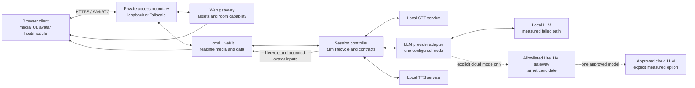

# Voice Agent v2 architecture

> **Status:** Authoritative target architecture
>
> **Owner:** Voice Agent v2 project architecture
>
> **Last updated:** 2026-08-11

This document defines the active target architecture. It records user-approved candidate identities and endpoints only at their evidence gate; a gateway investigation is not a passing provider/model selection.

## 1. Evidence language

Statements in this document use three labels:

- **Decision** — accepted product or architecture direction. An ADR is linked when the decision is costly or surprising to reverse.
- **Hypothesis** — a plausible design detail that an implementation slice must test before it becomes a decision.
- **Measurement required** — evidence that does not yet exist and is an acceptance gate in [`roadmap.md`](roadmap.md).

Untested behavior is not implied by a target diagram.

## 2. Decision baseline

| ID | Status | Statement |
| --- | --- | --- |
| D1 | Decision | V2 is a clean repository. Media, control, STT/TTS, application, and local-inference services run on one Arch Linux PC; the legacy Pi/Desktop inference split is not part of V2. After documented local-LLM failure, one user-operated tailnet LiteLLM gateway is the narrow topology exception and may relay only an approved cloud LLM path. See [ADR-0001](adr/0001-clean-v2-single-host.md) and [ADR-0004](adr/0004-tailnet-litellm-cloud-gateway-evaluation.md). |
| D2 | Decision | LiveKit, STT, and TTS remain local. The sole local LLM failed its measured gates; one explicit cloud LLM may now be selected only after the separate gateway, model, transport, privacy, cost, and measurement gate passes. Provider failure never causes automatic fallback. See [ADR-0003](adr/0003-local-first-llm-with-explicit-cloud-option.md). |
| D3 | Decision | The avatar boundary is renderer-agnostic. The MVP module is a deterministic custom animated AI eye; Live2D and 3D are optional later modules. The LLM never emits frames or renderer parameters. See [ADR-0002](adr/0002-renderer-agnostic-avatar-boundary.md). |
| D4 | Decision | Tailscale membership is sufficient authorization for the private current stage. Protocol credentials are still scoped and protected, but V2 will not invent a second identity system now. |
| D5 | Decision | Exact STT/LLM/TTS models, quantization, serving choices, and any cloud provider are selected only after repeatable resource, latency, quality, privacy, and required-concurrency gates. User-supplied candidates may be recorded before measurement, but an endpoint or alias alone is not a provider selection. |
| D6 | Decision | Custom wake work is optional and deferred until after the core MVP. Kiosk operation is outside current scope. |
| D7 | Decision | The pinned [legacy repository](#34-pinned-legacy-reference) is provenance, not a dependency. A future slice may selectively migrate a proven contract, component, or test only with fresh V2 validation and recorded origin. |
| D8 | Decision | The detailed avatar-module and visual-control contract is deferred to a separate Grill/design task that must complete before MVP eye implementation. |
| D9 | Decision | For the cumulative Slice 2–5 delivery branch, Pasha fixes Whisper large-v3-turbo, LiteLLM `deepseek-v4-flash`, and Qwen3-TTS CustomVoice/`ryan` despite recorded gate failures. Pasha attested the final human microphone/listening turn on 2026-08-11; every automated failure and exception remains visible, and no fallback or false pass is allowed. See [ADR-0005](adr/0005-operator-fixed-slices-2-5-model-stack.md). |
| D10 | Decision | Slice 6 private live transcript traffic may use the same failed, operator-opaque LiteLLM alias under Pasha's explicit exception. Its endpoint is required only from untracked server-side `LITELLM_BASE_URL`, with no code default, alternate name, redirect, alias, or fallback; the current test value is HTTP and remains non-production. See [ADR-0006](adr/0006-slice-6-live-transcript-and-endpoint-configuration.md). |
| D11 | Decision | Slice 6 uses pinned local LiveKit Server with the low-level official Python RTC/API SDK, a loopback FastAPI gateway/controller process, and a React + TypeScript + Vite client using official `livekit-client`. One room admits one browser and one agent; no avatar contract is introduced. See [ADR-0007](adr/0007-slice-6-livekit-react-realtime-boundary.md). |
| D12 | Decision | Issue #15 supersedes the active ADR-0006 cloud exception inside the same Slice 6 delivery. The app uses only pinned cache-local official LFM2.5 Q4_K_M on GPU-enabled llama.cpp, loopback-only, two 32,768-token slots, no credentials and no cloud fallback. Historical DeepSeek evidence remains factual. See [ADR-0008](adr/0008-local-lfm2-llamacpp-for-slice-6.md). |

## 3. System boundary

### 3.1 Active product boundary

The canonical Arch PC contains every media, control, STT/TTS, application, and inference process. Historical Slices 2–5 used the operator-fixed failed LiteLLM route under ADR-0005, and ADR-0006 briefly authorized it for Slice 6 implementation. ADR-0008 now supersedes that active path: the combined Slice 6 / Issue #15 app uses only the pinned cache-local official LFM2.5 Q4_K_M artifact on local GPU-enabled llama.cpp. No Slice 6 transcript crosses a cloud/provider boundary, and there is no active LiteLLM credential, endpoint, alias or fallback. Historical cloud evidence remains preserved rather than relabelled.

The ordinary browser may run on the canonical PC. A browser on another tailnet device is an optional presentation endpoint: it performs no required inference or orchestration, but it runs the selected avatar module.

The diagram expresses logical boundaries, not a framework or container decision. Multiple logical roles may share a process only if their contracts, readiness, and resource ownership remain independently testable.

### 3.2 Logical roles

| Logical role | Responsibility | Required location | Resource class |
| --- | --- | --- | --- |
| Web gateway | Serve versioned client assets and mint narrow LiveKit room capabilities using server-side credentials. | Canonical host | CPU/RAM |
| LiveKit server | Own rooms, participants, WebRTC media, and realtime data delivery. | Canonical host | Network/CPU/RAM |
| Session controller | Join as the agent participant; own session/turn state, endpointing policy, orchestration, cancellation, provider selection, contract validation, and control-event publication. | Canonical host | CPU/RAM |
| STT inference service | Turn bounded or streaming audio into transcript results. | Canonical host | GPU/CPU/RAM, as measured |
| LLM provider adapter | Present one provider-neutral request/result contract and route only to the explicitly configured provider. | Canonical host | CPU/RAM |
| Local LLM inference service | Produce response text when local mode passes and is selected. | Canonical host; initially preferred | GPU/CPU/RAM, as measured |
| LiteLLM gateway | Relay only to the explicitly selected cloud alias; expose safe health/model/usage/error metadata; never choose a default or fallback. | Allowlisted user-operated tailnet node; optional and gated | Network/CPU/RAM |
| Managed cloud LLM | Produce response text only when cloud mode has been explicitly measured, approved, and selected. | Approved external provider; optional | External network/service |
| TTS inference service | Stream synthesized speech for validated response text. | Canonical host | GPU/CPU/RAM, as measured |
| Browser client | Capture/play media, show session state, host the selected avatar module, and derive speech-synchronous visual input from actual playout. | Local browser by default; tailnet browser optional | Client CPU/GPU |
| Avatar module | Render one visual implementation behind the avatar-host boundary. | Browser client | Client CPU/GPU |

### 3.3 Outside the active boundary

- Cloud STT/TTS and any unapproved or automatically selected cloud LLM.
- Any auxiliary inference/control host or user-managed node beyond ADR-0004's single allowlisted LiteLLM relay.
- Live2D and 3D as MVP renderers. They remain possible later avatar modules.
- A2F and A2E.
- Kiosk boot/session management.
- Wake-word inference until the optional post-MVP slice is authorized.
- Model/package registries after installation and cloud-provider control planes beyond the explicitly configured LLM API. Artifact acquisition is a setup concern, not a local runtime dependency.

### 3.4 Pinned legacy reference

The only legacy code reference is the read-only tree [`prineycom/voice-agent@93c5c397`](https://github.com/prineycom/voice-agent/tree/93c5c39786ff790d7ae436772d2cf37a2eeb32c6), the exact commit audited before V2. Future agents must not treat the legacy default branch, its documentation, or its backlog as current V2 truth.

A V2 slice may consult the pinned tree through authenticated read-only GitHub access or an existing read-only checkout. Before migrating anything, it must:

1. identify the exact pinned source path and behavior needed by the slice;
2. inspect relevant source and tests rather than trust stale narrative documentation;
3. record the pinned commit/path in the slice evidence;
4. bring over only the smallest contract, component, or test needed;
5. adapt ownership/configuration to V2 and revalidate observable behavior;
6. leave behind legacy secrets, recordings, model artifacts, deployment topology, backlog, and unrelated code.

## 4. Realtime data and control flow

Media and control remain distinct even when LiveKit transports both.

1. The browser obtains application assets and a short-lived, room-scoped LiveKit capability from the web gateway over the tailnet or loopback.
2. The browser joins a realtime session and publishes microphone audio to local LiveKit.
3. The session controller consumes 20 ms frames resampled by the official LiveKit SDK to 16 kHz mono PCM. Slice 6 uses a bounded CPU energy endpoint (100 ms speech start, 600 ms trailing silence, 200 ms pre-roll, 15 s utterance maximum); the physical-browser gate must validate this deliberately small choice before it is treated as a quality result. The controller owns utterance boundaries and creates one turn correlation ID per accepted utterance.
4. The controller streams or submits audio to local STT. Partial transcript events may improve feedback; only a final transcript can advance the turn to response generation.
5. The controller sends the final transcript and bounded per-session context only to the fixed loopback `LocalLFMProvider`. llama.cpp owns two 32,768-token slots; hidden reasoning is parsed separately and never reaches the response, UI or TTS. Wrong identity, hidden-only, over-limit, truncated, timeout and cancellation outcomes fail explicitly. No Slice 6 provider endpoint or credential is configurable.
6. The selected LLM provider returns response text. Provider identity and the external-transfer fact, when applicable, remain associated with the turn; provider failure cannot select another provider.
7. The controller sends validated response text to local TTS and publishes ordered transcript/lifecycle events. LLM generation and TTS may overlap only in a way proven safe by the measured budget.
8. TTS audio is published through LiveKit. The controller publishes turn/lifecycle state, while the browser derives a bounded speech envelope from actual playout.
9. The browser avatar host routes validated lifecycle, speech-envelope, palette/state, and optional external-target inputs to the selected module. The MVP eye module deterministically owns motion and frames.
10. Completion, interruption, or failure emits exactly one terminal turn event. All work and turn-bound avatar input for the turn is released or cancelled.

**Decision:** remote microphone audio may travel only from an authorized tailnet client to LiveKit on the canonical host. Raw audio remains in local STT/TTS/media paths and is neither retained by default nor sent to a cloud LLM. In explicitly selected cloud mode, only the final transcript and permitted context cross the approved provider boundary. Synthesized audio may leave the host only through LiveKit to authorized session participants.

**Hypothesis:** streaming STT and streaming TTS will meet the latency target with fewer resources than batch operation. The model/provider-budget and real-inference slices must test this.

## 5. Contracts and ownership

“Owner” means the component responsible for versioning the contract, publishing compatibility rules, validating inputs, and maintaining contract tests. A producer does not gain ownership merely because it emits data.

| Contract | Producer → consumer | Owner | Required properties |
| --- | --- | --- | --- |
| Room capability | Web gateway → browser | Web gateway | Short-lived, room-scoped, server secret never exposed, failure explicit. |
| Realtime media | Browser/controller → LiveKit participants | LiveKit adapter in the session controller | Negotiated media settings recorded; interruption and disconnect observable. |
| STT request/result | Session controller ↔ STT service | STT service | Versioned audio metadata, session/turn correlation, ordered partial/final results, terminal error/cancel. |
| LLM provider request/result | Session controller ↔ selected LLM provider | Session controller/provider adapter | Versioned permitted-context envelope, provider mode/identity, correlated bounded response text, explicit terminal error/cancel, no fallback. |
| TTS request/stream | Session controller ↔ TTS service | TTS service | Correlated text input, declared audio format, ordered chunks, one terminal outcome, cancellation. |
| Realtime event envelope | Session controller → browser | Session controller | Schema version, session ID, turn ID where applicable, connection epoch, session-wide sequence, closed event type, bounded payload, lifecycle order, and terminal semantics. Reliable LiveKit data uses topic `voice-agent.control.v1`; wrong-version/session/epoch/turn, duplicate, late, out-of-order, oversized, and malformed events are dropped before media/UI actions. |
| Client control envelope | Browser → session controller | Session controller | A session-wide increasing sequence admits only reconnect notices and correlated two-phase media waits. `client.wait-started` proves the browser has begun its shorter timer before the server arms its longer timer; the matching readiness or playout acknowledgement must retain the same epoch, turn, and media generation. Missing preparation, readiness, or playout acknowledgement fails closed. |
| Avatar module interface | Avatar host/media adapter → selected avatar module | Avatar host | Version/capabilities, bounded validated inputs, explicit cancellation/fallback; detailed shape waits for the design gate. |
| Speech envelope | Browser playout analyser → avatar module | Browser media adapter | Derived from actual playout, bounded rate/range, correlated lifecycle, no raw audio in the control event. |
| External tracking target | Approved trigger producer → avatar host | Avatar host | Optional, bounded coordinates/age/confidence, stale-input rejection; producer implementation is separate. |
| Render state | Avatar module internal | Avatar module | Deterministic mapping from validated inputs; never accepted from an LLM or network as frame data. |
| Health/readiness report | Each service → operator/controller | Owning service | Liveness distinct from readiness; build, provider mode, and loaded-model/module identity; no secrets. |

Contract versions change for semantic compatibility, not every implementation release. During implementation, machine-readable schemas and executable producer/consumer contract tests become authoritative; this document continues to own the boundary and invariants.

### 5.1 LLM provider boundary

- Exactly one provider mode is configured for a deployment/session; request failure never changes it.
- Local mode uses a host-local endpoint and locally managed model artifact.
- Cloud mode uses one allowlisted endpoint, explicit gateway alias and underlying provider/model identity, and a server-side credential from an explicitly authorized untracked source. For Slice 6, ADR-0006 requires the endpoint from untracked server-side `LITELLM_BASE_URL` with no default or alternate name; its current accepted value is `http://rpi:4000`, redirects and fallback remain rejected, and HTTPS is deferred.
- Cloud requests contain only final transcript and explicitly permitted context fields—never raw microphone/TTS audio, arbitrary local files, environment values, or credentials.
- Before activation, cloud-provider retention/training policy, privacy terms, cost model, and region where relevant are recorded and approved.
- Provider mode/identity, correlation, external-transfer fact, latency, usage/cost when available, and error class are observable without logging request/response content.
- Switching provider is an explicit configuration and readiness transition, not transparent retry behavior.

The original local LFM BF16/vLLM failure and the historical operator-fixed LiteLLM `deepseek-v4-flash` evidence remain recorded. ADR-0005 authorized that failed cloud alias only for cumulative Slices 3–5; ADR-0006 temporarily extended private testing to Slice 6. ADR-0008 supersedes the active route with a different measured artifact/runtime: official LFM2.5 Q4_K_M on llama.cpp. This does not retroactively make the BF16/vLLM result or any DeepSeek gate pass.

### 5.2 Avatar-boundary constraints

The MVP needs lifecycle state, a speech envelope derived from actual playout, explicit palette/state selection, optional external tracking target, cancellation, and reduced-motion input. The detailed schema, capability negotiation, input precedence, smoothing, visual states, and error fallback are a **design required** output of the dedicated Grill task before Slice 7.

The MVP requires no visual output from the LLM. If the later design admits LLM-provided semantic controls, they must be finite, bounded, validated, renderer-neutral, coarse, and associated with a turn. They must contain no renderer parameter names, vertices, shaders, assets, executable expressions, keyframes, frame timestamps, or arbitrary per-frame values.

### 5.3 Avatar-module authority

The selected avatar module exclusively owns:

- pupil/render geometry and all frames;
- bounded external-target or seeded idle pupil movement;
- blink behavior and transitions;
- speech-synchronous outer-ring/pattern pulsing from the playout envelope;
- palette and state-specific behavior such as a thinking loader;
- interpolation, motion limits, scheduling, cancellation, and return-to-neutral;
- reduced-motion behavior and render fallback.

The avatar host owns validation, module lifecycle, and capability/fallback reporting. The LLM cannot choose how a frame is drawn.

## 6. Lifecycle

### 6.1 Host and service lifecycle

1. Tracked, non-secret configuration is validated before service startup.
2. LiveKit, the web gateway, controller, and inference services expose liveness separately from capability readiness.
3. The product is ready for a new voice turn only when LiveKit, controller, STT, the explicitly selected LLM provider, and TTS report compatible contracts and loaded capabilities.
4. The browser may connect while inference is unavailable, but it must show the degraded state and must not pretend a turn succeeded.
5. Graceful shutdown stops admission, cancels in-flight turns with terminal events where possible, then releases model and media resources.

The exact supervisor, packaging, and start order are **hypotheses** until the operational-reliability slice proves restart and recovery behavior.

### 6.2 Realtime-session lifecycle

A session moves through `connecting`, `ready`, `degraded`, `reconnecting`, and `closed`. Conversation context is scoped to the session unless a later retention decision explicitly adds persistence. A joined browser is not ready until its permitted microphone track is subscribed; the same bounded admission timer covers both room join and microphone publication, and microphone stream EOF/failure degrades and closes the room. On Slice 6 transport reconnection the browser detaches playout, rejects pre-reconnect epochs, and sends one bounded increasing reconnect notice. The controller cancels active work, clears publication, waits for serialized cancellation, resets the in-memory provider context, advances the stream epoch, and only then publishes `session.reconnected`; the browser closes media if that epoch acknowledgement is not received within its bound. Cleanup/reset failure degrades and closes admission. This intentionally sacrifices conversational context across a reconnect so an answer not known to have played cannot reappear or influence a new turn.

Every admission waits for all session-level cancel/rollback work; interrupt and discard register that work before replacement admission; reconnect waits for the same barrier before resetting context; transport failure registers cleanup before room shutdown; and close retains capacity until cleanup and the active turn have both terminated. Adapter operations atomically register with their turn cancellation token and retain that cancellation across late process or HTTP-resource startup.

### 6.3 Voice-turn lifecycle

A turn moves through `listening`, `transcribing`, `thinking`, `speaking`, `playout-ready`, `playout-retired`, then exactly one of `completed`, `interrupted`, or `failed`. Every response gets a newly published, turn-correlated LiveKit audio track before any response PCM is captured. The shared finite output contract is mono 16 kHz s16le PCM capped at 180 seconds; TTS and publication reject an over-limit result before sending it, independently of the 30-second microphone-input bound. The browser attaches only the publication named by `turn.speaking`, starts its bounded wait, and sends `client.wait-started`; only then does the server arm its strictly longer timer and admit publication. After the finite publication is sealed, `playout-ready` carries its identity and exact sample count while the publication remains active. Before admitting PCM, the browser snapshots the fresh receiver's official WebRTC inbound `totalSamplesReceived` and `jitterBufferEmittedCount` counters and proves the transport clock from the correlated audio track settings. It derives the transport target from that clock and the render target separately from `AudioContext.sampleRate`; it sends `client.playout-drained` only when both transport counter deltas and the correlated Web Audio render delta reach their respective normalized targets without concealment. The server then retires that publication and emits `playout-retired`; only after the exact `RemoteTrackPublication` produces `TrackUnsubscribed` and its correlated track is removed may the browser send `client.playout-completed`. Neither amplitude, a media-element or always-live clock, sender-queue drain, a native `MediaStreamTrack` `ended` event, nor `TrackUnsubscribed` without the preceding full drain and correlated server retirement proves completion; unavailable, inconsistent, regressing, or incomplete receiver statistics fail closed. The turn remains interruptible until final acknowledgement. Interruption, failure, and reconnect detach and retire the old generation before a later turn prepares another fresh publication. Implementations may expose finer internal states, but external events must preserve this ordering.

On barge-in, the controller:

1. marks the prior turn interrupted;
2. cancels remaining selected-provider/TTS work where supported;
3. stops publishing prior response audio and turn-bound avatar inputs;
4. tells the client to discard queued prior-turn media, events, and visual state;
5. admits a new turn only after correlation prevents stale chunks from crossing turns.

### 6.4 Slices 3–5 pre-LiveKit runtime

The cumulative pre-LiveKit tracer now has three concrete adapters: process-isolated local Whisper large-v3-turbo, a single-alias LiteLLM `deepseek-v4-flash` HTTP adapter, and process-isolated local Qwen3 CustomVoice/`ryan`. The provider adapter admits only a final transcript and a bounded memory-only per-session context, filters request fields, ignores hidden reasoning content, and has no fallback. Readiness performs a bearer-authenticated, content-free exact-alias capability check; neither readiness nor request admission runs DNS-class, route-interface, Tailscale peer, TSMP/WireGuard, freshness, TTL, or related shell-command proof. Streamed content reaches the TTS handoff only after the response has echoed exactly `deepseek-v4-flash`; a missing or alternate response identity fails the turn. Qwen's native 24 kHz stream is HQ-converted in its process boundary to the preserved TTS v1 16 kHz mono PCM contract and emitted as validated ordered chunks without an output path by default.

The controller hands complete provider sentences to TTS while the provider stream remains open, but buffers audio events until `llm.final` so the public lifecycle ordering remains stable. Cancellation terminates delivery with one correlated terminal event and no later chunks. This tracer proves inference contracts; it does not implement LiveKit publication, browser behavior, or a durable conversation store. Default execution persists neither microphone input, transcript/response, nor synthesized audio.

### 6.5 Slice 6 development runtime

The pinned implementation is LiveKit Server `1.13.5`; Python `livekit` `1.1.14`, `livekit-api` `1.2.0`, FastAPI `0.141.1`, and Uvicorn `0.52.1`; and React `19.2.8`, TypeScript `7.0.2`, Vite `8.2.1`, and official `livekit-client` `2.21.0`. The gateway and controller share a Python process but retain separate static/capability, room/media, session, and inference objects. The browser capability expires after 300 seconds and grants only one generated room, microphone publication, agent subscription, and data publication; it has no room-management grant. Issuance also requires the exact loopback or configured tailnet application `Origin`, preventing a cross-site form from consuming the one-session path without inventing a second user identity system. One measured session is admitted at a time.

The agent reuses `RealTurnController` and the Slice 3–5 process-isolated Whisper/Qwen adapters rather than creating a second inference pipeline. `LiveTurnRunner` now supplies the fixed local LFM provider. Live microphone bytes remain memory-only except for the existing fail-closed Whisper temporary-file boundary. Agent PCM is published through one bounded, fresh-per-turn LiveKit audio source with a 100 ms sender queue. Barge-in clears and retires old source/browser media first, cancels generation-owned provider/STT/TTS work, rolls back undelivered provider context, and serializes replacement work. After the source queue drains, the turn remains interruptible until the browser acknowledges the finite publication's correlated render boundary; a missing two-phase acknowledgement fails and closes the session. Actual microphone-to-stop and render timing remain physical-browser acceptance measurements.

`./run-slice6` is a foreground development orchestrator only. Deployment supervision, reboot behavior, durable readiness and restart policy remain Slice 9.

## 7. Failure semantics

No failure silently switches LLM provider, moves another inference capability to cloud, changes authorization, enables always-listening wake behavior, or selects a different avatar module.

| Failure | Dependency class | Required behavior |
| --- | --- | --- |
| LiveKit unavailable | Hard for realtime use | Client shows unavailable/reconnecting; no inference turn is admitted. |
| Host microphone duration, recorder availability/setup/startup/nonzero/timeout/output, or cleanup failure | Hard before turn admission | Capture remains within the 1–30 second bound. PipeWire status 1 is accepted only for exact-size bounded PCM. Every other capture failure emits content-free `microphone_capture`/`turn.failed` evidence without a Python traceback or STT/LLM/TTS admission. Cleanup is mandatory; if deletion and scrubbing cannot establish that no input remains, the failure evidence reports `input_retained=true`. |
| STT unavailable, temporary-audio setup/request/cleanup, or output failure | Hard for the affected voice turn | No transcript is fabricated and no downstream inference is admitted. The CLI normalizes the stage failure to content-free `turn.failed` output without a Python traceback. Temporary audio is deleted or scrubbed before a transcript is accepted; an unconfirmed cleanup reports its retention state. |
| Selected LLM provider unavailable or fails | Hard for the affected response | No fabricated answer or alternate-provider request. No TTS handoff occurs before the selected response identity is proven; if a later stream failure follows a validated sentence handoff, buffered synthesized audio is discarded, no public audio chunk is emitted, and the turn fails with provider mode visible to the operator/user state. |
| Cloud credential, endpoint allowlist, or approved privacy metadata invalid | Hard for cloud-mode readiness | Cloud mode remains unready; secrets are not exposed and local mode is not selected automatically. |
| TTS unavailable or fails | Hard for supported spoken output; text is salvageable | Valid response text may remain visible, but the spoken turn is marked degraded/failed rather than complete. |
| Avatar input invalid, missing, late, or stale | Soft | Avatar host rejects it and chooses the designed safe deterministic state; voice continues and validation failure is counted without private content. |
| Avatar module/runtime failure | Soft for voice | Voice and text continue; client exposes visual degradation, prevents runaway motion, and does not select another module silently. |
| Client disconnect | Hard for that delivery | Controller cancels or expires in-flight work for that participant/session; no unbounded orphan inference. |
| GPU out of memory or local model process crash | Hard for affected local inference capability | Readiness drops, current turn terminates explicitly, supervised recovery is bounded, and no request retry or provider switch can amplify/change load or alter privacy. |
| Tailscale unavailable | Soft for loopback, hard for remote access | Local use may continue; remote clients receive no alternate public exposure. |
| Late or duplicate event | Soft | Client discards it using session/turn identity and sequence rules. |

## 8. Observability and privacy

Every turn must be diagnosable without recording its private content by default.

### 8.1 Required structured observations

- Build, contract, selected LLM provider mode/identity, loaded-model, and avatar-module identifiers.
- Session and turn correlation IDs.
- State transitions and one terminal outcome per turn.
- Audio duration/bytes, not raw audio.
- Endpoint-to-STT-final, selected-provider time-to-first-token and completion, TTS time-to-first-audio, first playout, and total-turn timing.
- Cloud external-transfer fact, provider request ID, usage/token and cost data when available, and error class—never prompt/response content.
- Cancellation latency and stale/duplicate/drop counts.
- Per-service/provider request counts, failures, queue depth, and readiness changes.
- GPU VRAM, GPU utilization, host RAM, CPU, and local-model load/unload events.
- Avatar input validation/fallback counts, active module capabilities, and render-loop health without private content.

### 8.2 Data handling

Raw recordings, transcripts, prompts, responses, model artifacts, tokens, and environment values are not committed. Production logs omit raw media and conversation content by default. Temporary input cleanup must fail closed and report whether input may remain; it cannot silently admit downstream inference. A bounded diagnostic capture must be explicitly enabled, identify its retention path and lifetime, and remain outside Git. This foundation does not authorize a durable conversation-history store.

## 9. Configuration, artifacts, and secrets

### 9.1 Tracked configuration

Tracked files may contain schemas, safe defaults, loopback addresses, non-secret feature flags, resource limits, and the exact local LFM artifact/runtime/generation manifest. The active Slice 6 provider has no endpoint or credential configuration: llama.cpp is fixed at host loopback, and startup rejects every `LITELLM_*` value. Startup verifies the cache-local model size/hash and llama.cpp binary hash before admission.

### 9.2 Untracked local state

The following remain outside Git:

- LiveKit signing/API secret material and any generated session capability;
- cloud LLM API credentials and local credential files/environment overrides;
- local model weights, caches, and generated engines;
- private recordings and diagnostic captures;
- user-specific runtime state.

The browser never receives LiveKit signing secrets, cloud LLM credentials, or inference-management credentials. Provider secrets are injected only into the controller/provider adapter and are redacted from logs, health, and errors. The application does not read or manage Tailscale node credentials; it relies on the host's existing tailnet membership.

Local model artifacts require identity, revision/hash, license/provenance, expected size, and acquisition instructions in a non-secret manifest. Cloud mode additionally requires a non-secret approval record for provider/model identity, endpoint allowlist, privacy/retention assumptions, and cost/usage observability. A model name alone is not a reproducible or approved configuration.

## 10. Tailscale exposure

**Decision:** tailnet membership is the current authorization boundary. This does not mean every process binds to the tailnet.

- Expose only the HTTPS application entry point and the minimum LiveKit signaling/media paths needed by a tailnet browser.
- Bind STT, TTS, any selected local LLM, health details, model lifecycle controls, and controller administration to loopback or an equally host-local transport.
- Bind the fixed llama.cpp OpenAI-compatible endpoint only to `127.0.0.1:18080`. Do not expose it through Tailscale Serve, browser capabilities/assets, or a model-management surface. The app accepts no LiteLLM configuration and has no cloud fallback.
- Keep LiveKit signing material in the web gateway; issue narrow room capabilities because LiveKit requires them as protocol credentials, not as a second user-auth subsystem.
- Do not publish a public fallback route or alternate provider route.
- Slice 6 configures the gateway at loopback TCP `8000` and LiveKit signaling at loopback TCP `7880`; Tailscale Serve terminates application/signaling HTTPS on explicit operator ports (the example uses `8443`/`7443`). LiveKit advertises only the host Tailscale IPv4 and binds WebRTC media to UDP `7882` on `tailscale0`; ICE/TCP media (`7881`) and TURN are disabled. A host smoke measured `127.0.0.1:7880`, tailnet UDP `7882`, and no TCP media listener. The configured Tailscale HTTPS paths remain unaccepted until the second-client browser gate.

**Hypothesis:** Tailscale transport plus scoped LiveKit capabilities will meet browser microphone, WebRTC, and interruption requirements without an additional reverse-proxy identity layer. The LiveKit slice must measure this from a second tailnet client.

## 11. GPU, CPU, and RAM budget

### 11.1 Measured host inventory

Measured on 2026-08-10 using `lscpu`, `free -h`, and `nvidia-smi`:

| Resource | Observed inventory |
| --- | --- |
| OS/kernel | EndeavourOS, Linux `7.1.6-arch1-1`, x86_64 |
| CPU | Intel Core i5-10600KF, 6 cores / 12 threads |
| RAM | 31 GiB total |
| Swap | 511 MiB total |
| GPU | NVIDIA GeForce RTX 4070 |
| VRAM | 12,282 MiB reported total |
| NVIDIA driver | `610.57.04` |

This inventory proves available capacity, not model compatibility, sustainable allocation, latency, or quality. Runtime free memory is transient and is not a budget.

### 11.2 Budget policy

**Decision:** local STT/TTS and, when selected, the local LLM must fit the one host under the required overlapping workload with empirically established headroom. Documentation must not make individually successful local model runs look like a proven concurrent stack. If local LLM candidates cannot pass this gate—or cannot pass the latency/quality gate—an explicit cloud LLM evaluation is allowed rather than forcing a false local success.

The measured peak must account for:

- display/system GPU use;
- resident weights and runtime allocations for every loaded local model;
- local-LLM context/KV cache at the supported context and concurrency when local mode is evaluated;
- temporary buffers during STT, generation, and synthesis;
- the required overlap of local-LLM decode with TTS startup, or cloud response streaming with TTS startup in cloud mode;
- barge-in, where new STT may begin while cancellation releases prior selected-provider/TTS work;
- browser/MVP-eye rendering on the canonical host;
- host services, filesystem cache, and failure/restart transients.

The Slice 2 overlap measurement observed a Qwen3+Whisper peak of `7,494 MiB`, leaving `4,788 MiB`, with CPU p95 `66.67%`; it also observed failed latency regressions. The cumulative Slice 5 cloud-provider diagnostics observed peak local VRAM up to `7,600 MiB` with more than `24 GiB` RAM available. Focused Issue #15 two-slot llama.cpp runs observed about `2,900 MiB` process VRAM, visible TTFT about 0.91–1.73 seconds and completion about 1.21–1.98 seconds for simultaneous public prompts. These isolated/local-subset facts cannot be added or used to claim coexistence. The combined resident llama.cpp + Whisper + Qwen + LiveKit + browser path must be measured under overlap/barge-in and retain a safe reserve on the 12,282 MiB device before acceptance.

### 11.3 Measurements required before model/provider selection

The host/model budget slice must pre-register quality and latency thresholds, then capture for every local candidate:

- exact artifact ID/revision/hash, license, quantization, runtime, and driver;
- cold load time and warm steady state;
- idle and peak VRAM/RAM, CPU utilization, and GPU utilization;
- STT real-time factor and finalization latency on a fixed Russian corpus;
- local-LLM first-token rate, generation rate, context size, and a fixed response-quality rubric;
- TTS first-audio latency, synthesis real-time factor, and a fixed listening rubric;
- required overlap, cancellation/recovery behavior, and out-of-memory margin;
- repeatability across cold, warm, and sustained runs.

Local LLM candidates, including the user's preferred candidate once supplied, are evaluated first. If none passes, the same slice may evaluate explicit cloud-provider candidates for response quality, first-token/completion latency, sustained availability, streaming/cancellation, cost/usage, credential flow, endpoint/model identity, retention/training policy, and permitted-data boundary. It must never use a cloud result to disguise a failed local measurement.

The slice publishes raw numeric results, local rejection evidence when applicable, privacy review for a cloud selection, and the rationale for exactly one provider mode. Exact models/provider enter tracked configuration only after this gate passes.

## 12. Known hypotheses and evidence gates

| Hypothesis | Evidence required | Roadmap gate |
| --- | --- | --- |
| A sufficiently capable local LLM can coexist with local STT/TTS inside 12 GB VRAM and meet latency/quality gates. | Local-first candidate matrix under required overlap/cancellation; explicit cloud provider evaluation only if it fails. | Slice 2 |
| One provider-neutral LLM contract can preserve cancellation, privacy, and observability without silent fallback. | Contract and fault tests for selected local or approved cloud mode. | Slice 4 |
| Local service contracts can stream and cancel without leaking stale work across turns. | Real STT/selected-LLM/TTS tracer tests with correlated terminal outcomes. | Slices 3–5 |
| Local LiveKit over loopback and Tailscale provides acceptable playout and barge-in. | Headless deterministic media test plus real browser/tailnet validation. | Slice 6 |
| The renderer-agnostic boundary and deterministic custom eye can provide a readable MVP visual. | Dedicated Grill/design output, contract/capability tests, deterministic replay, performance capture, and human visual review. | Design Gate V and Slice 7 |
| The stack recovers predictably from process, provider, GPU, network, and browser failures. | Fault matrix, soak, restart, and resource evidence. | Slices 8–9 |
| Wake activation is worth its privacy/resource cost. | Explicit post-MVP decision and measured recall/false accepts. | Optional Slice 10 |

## 13. Architecture change rule

- Update this document when a boundary, owner, lifecycle, or failure policy changes.
- Add an ADR only when the decision is costly to reverse, surprising without context, and represents a real trade-off.
- Record model/framework measurements in the roadmap evidence or a focused benchmark report; do not turn every replaceable selection into an ADR.
- Keep [`CONTEXT.md`](../CONTEXT.md) implementation-free and update it only when stable vocabulary changes.
