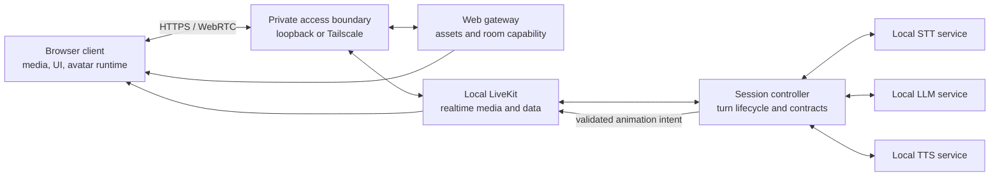

# Voice Agent v2 architecture

> **Status:** Authoritative pre-implementation architecture
>
> **Owner:** Voice Agent v2 project architecture
>
> **Last updated:** 2026-08-10

This document defines the active target architecture. It deliberately does not select models or frameworks before they have been measured on the target host.

## 1. Evidence language

Statements in this document use three labels:

- **Decision** — accepted product or architecture direction. An ADR is linked when the decision is costly or surprising to reverse.
- **Hypothesis** — a plausible design detail that an implementation slice must test before it becomes a decision.
- **Measurement required** — evidence that does not yet exist and is an acceptance gate in [`roadmap.md`](roadmap.md).

Untested behavior is not implied by a target diagram.

## 2. Decision baseline

| ID | Status | Statement |
| --- | --- | --- |
| D1 | Decision | V2 is a clean repository. The complete required stack runs on one Arch Linux PC; the legacy Pi/Desktop split is not part of V2. See [ADR-0001](adr/0001-clean-v2-single-host.md). |
| D2 | Decision | The active media and inference path is local LiveKit plus local STT, LLM, and TTS. There is no required cloud inference service or silent cloud fallback. |
| D3 | Decision | The active visual is an original Live2D AI-eyes avatar. The LLM emits bounded semantic intent; deterministic runtime code produces frames. 3D, A2F, and A2E are excluded. See [ADR-0002](adr/0002-live2d-semantic-intent.md). |
| D4 | Decision | Tailscale membership is sufficient authorization for the private current stage. Protocol credentials are still scoped and protected, but V2 will not invent a second identity system now. |
| D5 | Decision | Exact STT, LLM, TTS, quantization, and serving choices are selected only after a repeatable host/model budget measures VRAM, latency, quality, and required concurrency. |
| D6 | Decision | Custom wake work is optional and deferred until after the core MVP. Kiosk operation is outside current scope. |
| D7 | Decision | Legacy code is provenance, not a dependency. A future slice may selectively migrate a proven contract, component, or test only with fresh validation and recorded origin. |

## 3. System boundary

### 3.1 Active product boundary

The canonical Arch PC contains every process required to accept speech, reason, synthesize a reply, transport realtime media, and serve the application. The ordinary browser may run on that PC. A browser on another tailnet device is an optional presentation endpoint, not a second compute plane: it performs no required inference or orchestration.

The diagram expresses logical boundaries, not a framework or container decision. Multiple logical roles may share a process only if their contracts, readiness, and resource ownership remain independently testable.

### 3.2 Inside the boundary

| Logical role | Responsibility | Required location | Resource class |
| --- | --- | --- | --- |
| Web gateway | Serve versioned client assets and mint narrow LiveKit room capabilities using server-side credentials. | Canonical host | CPU/RAM |
| LiveKit server | Own rooms, participants, WebRTC media, and realtime data delivery. | Canonical host | Network/CPU/RAM |
| Session controller | Join as the agent participant; own session/turn state, endpointing policy, orchestration, cancellation, contract validation, and control-event publication. | Canonical host | CPU/RAM |
| STT inference service | Turn bounded or streaming audio into transcript results. | Canonical host | GPU/CPU/RAM, as measured |
| LLM inference service | Produce response text and a candidate semantic animation intent. | Canonical host | GPU/CPU/RAM, as measured |
| TTS inference service | Stream synthesized speech for validated response text. | Canonical host | GPU/CPU/RAM, as measured |
| Browser client | Capture/play media, show session state, and run the deterministic Live2D avatar runtime. | Local browser by default; tailnet browser optional | Client CPU/GPU |

### 3.3 Outside the active boundary

- Cloud inference and cloud fallback.
- A dedicated Pi, external inference desktop, or other required compute node.
- 3D rendering, A2F, and A2E.
- Kiosk boot/session management.
- Wake-word inference until the optional post-MVP slice is authorized.
- The legacy repository at `prineycom/voice-agent`; it is referenced only as provenance.
- Model registries and package registries after installation. Artifact acquisition is a setup concern, not a runtime dependency.

## 4. Realtime data and control flow

Media and control remain distinct even when LiveKit transports both.

1. The browser obtains application assets and a short-lived, room-scoped LiveKit capability from the web gateway over the tailnet or loopback.
2. The browser joins a realtime session and publishes microphone audio to local LiveKit.
3. The session controller consumes the audio. It owns utterance boundaries and creates one turn correlation ID per accepted utterance.
4. The controller streams or submits audio to local STT. Partial transcript events may improve feedback; only a final transcript can advance the turn to response generation.
5. The controller sends the final transcript and permitted conversation context to local LLM inference.
6. The LLM returns response text and a candidate animation intent. The controller validates both. Invalid or missing animation intent becomes the documented neutral fallback and never blocks valid response text.
7. The controller sends validated response text to local TTS and publishes ordered transcript/lifecycle events. LLM generation and TTS may overlap only in a way proven safe by the host budget.
8. TTS audio is published through LiveKit. The controller publishes the validated animation intent as a control event associated with the same turn.
9. The browser plays audio. Its avatar runtime maps semantic cues and lifecycle signals to local Live2D parameters, interpolation curves, and frames.
10. Completion, interruption, or failure emits exactly one terminal turn event. All work for the turn is released or cancelled.

**Decision:** remote microphone audio may travel only from an authorized tailnet client to LiveKit on the canonical host. Once received, it remains on that host: it is sent only to host-local inference and is neither retained by default nor sent to an external inference or storage service. Synthesized audio may leave the host only through LiveKit to authorized session participants.

**Hypothesis:** streaming STT and streaming TTS will meet the latency target with fewer resources than batch operation. The model-budget and real-inference slices must test this.

## 5. Contracts and ownership

“Owner” means the component responsible for versioning the contract, publishing compatibility rules, validating inputs, and maintaining contract tests. A producer does not gain ownership merely because it emits data.

| Contract | Producer → consumer | Owner | Required properties |
| --- | --- | --- | --- |
| Room capability | Web gateway → browser | Web gateway | Short-lived, room-scoped, server secret never exposed, failure explicit. |
| Realtime media | Browser/controller → LiveKit participants | LiveKit adapter in the session controller | Negotiated media settings recorded; interruption and disconnect observable. |
| STT request/result | Session controller ↔ STT service | STT service | Versioned audio metadata, session/turn correlation, ordered partial/final results, terminal error/cancel. |
| LLM request/result | Session controller ↔ LLM service | LLM service | Versioned context envelope, correlated response text, bounded output, explicit terminal error/cancel. |
| TTS request/stream | Session controller ↔ TTS service | TTS service | Correlated text input, declared audio format, ordered chunks, one terminal outcome, cancellation. |
| Realtime event envelope | Session controller → browser | Session controller | Schema version, session ID, turn ID where applicable, event sequence, event type, payload, terminal semantics. |
| Animation intent | LLM produces candidate; controller validates; browser consumes | Session controller | Schema version, turn ID, finite vocabulary, bounded values and cue count, coarse semantic anchors only. |
| Render state | Avatar runtime internal | Avatar runtime | Deterministic mapping from validated inputs; never accepted from the LLM or network as frame data. |
| Health/readiness report | Each service → operator/controller | Owning service | Liveness distinct from readiness; build and loaded-model identity; no secrets. |

Contract versions change for semantic compatibility, not every implementation release. During implementation, machine-readable schemas and executable producer/consumer contract tests become authoritative; this document continues to own the boundary and invariants.

### 5.1 Animation-intent invariants

The animation-intent schema must remain intentionally smaller than the render model:

- It identifies its contract version and voice turn.
- It uses a finite semantic vocabulary for expression, attention/gaze, and emphasis.
- Optional intensity and duration-like values have documented bounds.
- Cues attach only to coarse response anchors such as response start, sentence boundary, or response end.
- Cue count and serialized size have hard limits.
- Unknown fields, unknown vocabulary, non-finite values, and out-of-range values are rejected or normalized by deterministic policy.
- Invalid, late, or missing intent resolves to a safe neutral/attentive state without stopping speech.
- It contains no Live2D parameter names, vertices, keyframes, frame timestamps, executable expressions, asset paths, or arbitrary code.

The exact v1 vocabulary, bounds, and size limits are a **measurement required** in the Live2D vertical slice. They must be demonstrated against the original avatar rather than guessed in this foundation.

### 5.2 Avatar-runtime authority

The avatar runtime exclusively owns:

- mapping semantics to Live2D parameters;
- blink, gaze, idle behavior, and transitions;
- interpolation and motion limits;
- scheduling against response lifecycle and playout;
- cancellation and return-to-neutral behavior;
- reduced-motion behavior and render fallback.

The LLM can choose among supported meanings but cannot choose how a frame is drawn.

## 6. Lifecycle

### 6.1 Host and service lifecycle

1. Tracked, non-secret configuration is validated before service startup.
2. LiveKit, the web gateway, controller, and inference services expose liveness separately from capability readiness.
3. The product is ready for a new voice turn only when LiveKit, controller, STT, LLM, and TTS report compatible contracts and loaded capabilities.
4. The browser may connect while inference is unavailable, but it must show the degraded state and must not pretend a turn succeeded.
5. Graceful shutdown stops admission, cancels in-flight turns with terminal events where possible, then releases model and media resources.

The exact supervisor, packaging, and start order are **hypotheses** until the operational-reliability slice proves restart and recovery behavior.

### 6.2 Realtime-session lifecycle

A session moves through `connecting`, `ready`, `degraded`, `reconnecting`, and `closed`. Conversation context is scoped to the session unless a later retention decision explicitly adds persistence. Reconnection must not replay a stale response as a new turn.

### 6.3 Voice-turn lifecycle

A turn moves through `listening`, `transcribing`, `thinking`, `speaking`, then exactly one of `completed`, `interrupted`, or `failed`. Implementations may expose finer internal states, but external events must preserve this ordering.

On barge-in, the controller:

1. marks the prior turn interrupted;
2. cancels remaining LLM/TTS work where supported;
3. stops publishing prior response audio and intent;
4. tells the client to discard queued prior-turn output;
5. admits a new turn only after correlation prevents stale chunks from crossing turns.

## 7. Failure semantics

No failure silently switches to cloud inference, another host, always-listening wake behavior, or a different visual architecture.

| Failure | Dependency class | Required behavior |
| --- | --- | --- |
| LiveKit unavailable | Hard for realtime use | Client shows unavailable/reconnecting; no inference turn is admitted. |
| STT unavailable or fails | Hard for the affected voice turn | No transcript is fabricated; turn fails recoverably and retained raw audio is not created by default. |
| LLM unavailable or fails | Hard for the affected response | No fabricated answer or TTS request; turn fails with a user-visible state. |
| TTS unavailable or fails | Hard for supported spoken output; text is salvageable | Valid response text may remain visible, but the spoken turn is marked degraded/failed rather than complete. |
| Candidate animation intent invalid/missing | Soft | Controller substitutes neutral intent; voice continues; validation failure is counted without logging private content. |
| Avatar runtime/render failure | Soft for voice | Voice and text continue; client exposes visual degradation and prevents runaway motion. |
| Client disconnect | Hard for that delivery | Controller cancels or expires in-flight work for that participant/session; no unbounded orphan inference. |
| GPU out of memory or model process crash | Hard for affected inference capability | Readiness drops, current turn terminates explicitly, supervised recovery is bounded, and no request retry loop can amplify load. |
| Tailscale unavailable | Soft for loopback, hard for remote access | Local use may continue; remote clients receive no alternate public exposure. |
| Late or duplicate event | Soft | Client discards it using session/turn identity and sequence rules. |

## 8. Observability and privacy

Every turn must be diagnosable without recording its private content by default.

### 8.1 Required structured observations

- Build, contract, and loaded-model identifiers.
- Session and turn correlation IDs.
- State transitions and one terminal outcome per turn.
- Audio duration/bytes, not raw audio.
- Endpoint-to-STT-final, LLM time-to-first-token and completion, TTS time-to-first-audio, first playout, and total-turn timing.
- Cancellation latency and stale/duplicate/drop counts.
- Per-service request counts, failures, queue depth, and readiness changes.
- GPU VRAM, GPU utilization, host RAM, CPU, and model load/unload events.
- Avatar intent validation failures, fallback count, and render-loop health without prompt/response content.

### 8.2 Data handling

Raw recordings, transcripts, prompts, responses, model artifacts, tokens, and environment values are not committed. Production logs omit raw media and conversation content by default. A bounded diagnostic capture must be explicitly enabled, identify its retention path and lifetime, and remain outside Git. This foundation does not authorize a durable conversation-history store.

## 9. Configuration, artifacts, and secrets

### 9.1 Tracked configuration

Tracked files may contain schemas, safe defaults, loopback addresses, non-secret feature flags, resource limits, artifact manifests, and example variable names. Startup rejects invalid, missing, or incompatible required values.

### 9.2 Untracked local state

The following remain outside Git:

- LiveKit signing/API secret material and any generated session capability;
- local credential files and environment overrides;
- model weights, caches, and generated engines;
- private recordings and diagnostic captures;
- user-specific runtime state.

The browser never receives server signing secrets or inference-management credentials. The application does not read or manage Tailscale node credentials; it relies on the host's existing tailnet membership.

Model artifacts require identity, revision/hash, license/provenance, expected size, and acquisition instructions in a non-secret manifest. A model name alone is not a reproducible artifact.

## 10. Tailscale exposure

**Decision:** tailnet membership is the current authorization boundary. This does not mean every process binds to the tailnet.

- Expose only the HTTPS application entry point and the minimum LiveKit signaling/media paths needed by a tailnet browser.
- Bind STT, LLM, TTS, health details, model lifecycle controls, and controller administration to loopback or an equally host-local transport.
- Keep LiveKit signing material in the web gateway; issue narrow room capabilities because LiveKit requires them as protocol credentials, not as a second user-auth subsystem.
- Do not publish a public fallback route.
- Record the actual tailnet ports and transport behavior in the LiveKit slice after loopback and remote-client validation.

**Hypothesis:** Tailscale transport plus scoped LiveKit capabilities will meet browser microphone, WebRTC, and interruption requirements without an additional reverse-proxy identity layer. The LiveKit slice must measure this from a second tailnet client.

## 11. GPU, CPU, and RAM budget

### 11.1 Measured host inventory

Measured on 2026-08-10 using `lscpu`, `free -h`, and `nvidia-smi`:

| Resource | Observed inventory |
| --- | --- |
| OS/kernel | EndeavourOS, Linux `7.1.6-arch1-1`, x86_64 |
| CPU | Intel Core i5-10600KF, 6 cores / 12 threads |
| RAM | 31 GiB total |
| Swap | 511 MiB total |
| GPU | NVIDIA GeForce RTX 4070 |
| VRAM | 12,282 MiB reported total |
| NVIDIA driver | `610.57.04` |

This inventory proves available capacity, not model compatibility, sustainable allocation, latency, or quality. Runtime free memory is transient and is not a budget.

### 11.2 Budget policy

**Decision:** the selected stack must fit the one host under the required overlapping workload with empirically established headroom. Documentation must not make three individually successful model runs look like a proven concurrent stack.

The measured peak must account for:

- display/system GPU use;
- resident weights and runtime allocations for every loaded model;
- LLM context/KV cache at the supported context and concurrency;
- temporary buffers during STT, generation, and synthesis;
- the required overlap of LLM decode with TTS startup;
- barge-in, where new STT may begin while cancellation releases prior LLM/TTS work;
- browser/Live2D rendering on the canonical host;
- host services, filesystem cache, and failure/restart transients.

No fixed per-service VRAM allocation is accepted yet. Admission limits, model residency, unload policy, CPU offload, quantization, and context limits are **hypotheses** until measured together.

### 11.3 Measurements required before model selection

The host/model budget slice must pre-register quality and latency thresholds, then capture for every candidate:

- exact artifact ID/revision/hash, license, quantization, runtime, and driver;
- cold load time and warm steady state;
- idle and peak VRAM/RAM, CPU utilization, and GPU utilization;
- STT real-time factor and finalization latency on a fixed Russian corpus;
- LLM first-token rate, generation rate, context size, and a fixed response-quality rubric;
- TTS first-audio latency, synthesis real-time factor, and a fixed listening rubric;
- required overlap, cancellation/recovery behavior, and out-of-memory margin;
- repeatability across cold, warm, and sustained runs.

The slice must publish raw numeric results and the selection rationale. Exact models enter tracked configuration only after this gate passes.

## 12. Known hypotheses and evidence gates

| Hypothesis | Evidence required | Roadmap gate |
| --- | --- | --- |
| Candidate models can coexist within 12 GB VRAM with useful latency and quality. | Repeatable candidate matrix under required overlap and cancellation. | Slice 2 |
| Local service contracts can stream and cancel without leaking stale work across turns. | Real STT/LLM/TTS tracer tests with correlated terminal outcomes. | Slices 3–5 |
| Local LiveKit over loopback and Tailscale provides acceptable playout and barge-in. | Headless deterministic media test plus real browser/tailnet validation. | Slice 6 |
| A simple Live2D eyes design is expressive with a small semantic vocabulary. | Original asset provenance, capture replay, bounded intent tests, and human visual review. | Slice 7 |
| The stack recovers predictably from process, GPU, network, and browser failures. | Fault matrix, soak, restart, and resource evidence. | Slices 8–9 |
| Wake activation is worth its privacy/resource cost. | Explicit post-MVP decision and measured recall/false accepts. | Optional Slice 10 |

## 13. Architecture change rule

- Update this document when a boundary, owner, lifecycle, or failure policy changes.
- Add an ADR only when the decision is costly to reverse, surprising without context, and represents a real trade-off.
- Record model/framework measurements in the roadmap evidence or a focused benchmark report; do not turn every replaceable selection into an ADR.
- Keep [`CONTEXT.md`](../CONTEXT.md) implementation-free and update it only when stable vocabulary changes.
