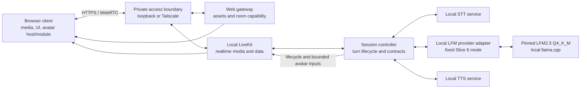

# Voice Agent v2 architecture

> **Status:** Authoritative target architecture
>
> **Owner:** Voice Agent v2 project architecture
>
> **Last updated:** 2026-08-16

This document defines the active target architecture. It records user-approved candidate identities and endpoints only at their evidence gate; a gateway investigation is not a passing provider/model selection.

## 1. Evidence language

Statements in this document use three labels:

- **Decision** — accepted product or architecture direction. An ADR is linked when the decision is costly or surprising to reverse.
- **Hypothesis** — a plausible design detail that an implementation slice must test before it becomes a decision.
- **Measurement required** — evidence that does not yet exist and is an acceptance gate in [`roadmap.md`](roadmap.md).

Untested behavior is not implied by a target diagram.

## 2. Decision baseline

| ID | Status | Statement |
| --- | --- | --- |
| D1 | Decision | V2 is a clean repository. Media, control, STT/TTS, application, and local-inference services run on one Arch Linux PC; the legacy Pi/Desktop inference split is not part of V2. After documented local-LLM failure, one user-operated tailnet LiteLLM gateway is the narrow topology exception and may relay only an approved cloud LLM path. See [ADR-0001](adr/0001-clean-v2-single-host.md) and [ADR-0004](adr/0004-tailnet-litellm-cloud-gateway-evaluation.md). |
| D2 | Decision | LiveKit, STT, and TTS remain local. The original BF16/vLLM local candidate failed its measured gates; ADR-0008 separately selects the measured Q4_K_M/llama.cpp artifact for the active Slice 6 development path. Any future cloud LLM still requires the separate gateway, model, transport, privacy, cost, and measurement gate. Provider failure never causes automatic fallback. See [ADR-0003](adr/0003-local-first-llm-with-explicit-cloud-option.md). |
| D3 | Decision | The avatar boundary is renderer-agnostic. The MVP module is a deterministic custom animated AI eye; Live2D and 3D are optional later modules. The LLM never emits frames or renderer parameters. See [ADR-0002](adr/0002-renderer-agnostic-avatar-boundary.md). |
| D4 | Decision | Tailscale membership is sufficient authorization for the private current stage. Protocol credentials are still scoped and protected, but V2 will not invent a second identity system now. |
| D5 | Decision | Exact STT/LLM/TTS models, quantization, serving choices, and any cloud provider become accepted selections only after repeatable resource, latency, quality, privacy, and required-concurrency gates. An explicit ADR may pin a development candidate before final acceptance only while every remaining gate stays visible; an endpoint or alias alone is not a provider selection. |
| D6 | Decision | Custom wake work is optional and deferred until after the core MVP. Kiosk operation is outside current scope. |
| D7 | Decision | The pinned [legacy repository](#34-pinned-legacy-reference) is provenance, not a dependency. A future slice may selectively migrate a proven contract, component, or test only with fresh V2 validation and recorded origin. |
| D8 | Decision | Design Gate V completed the avatar/module and full UI-shell design. Slice 7 implements the versioned host boundary, deterministic SVG eye, avatar-first shell, and two-level reduced motion defined by ADR-0002, ADR-0011, and ADR-0012. |
| D9 | Decision | For the cumulative Slice 2–5 delivery branch, Pasha fixes Whisper large-v3-turbo, LiteLLM `deepseek-v4-flash`, and Qwen3-TTS CustomVoice/`ryan` despite recorded gate failures. Pasha attested the final human microphone/listening turn on 2026-08-11; every automated failure and exception remains visible, and no fallback or false pass is allowed. See [ADR-0005](adr/0005-operator-fixed-slices-2-5-model-stack.md). |
| D10 | Superseded for active Slice 6 | ADR-0006 temporarily authorized Slice 6 private live transcript traffic through the failed, operator-opaque LiteLLM alias with an untracked server-side `LITELLM_BASE_URL` and no default, redirect, alias, or fallback. D12 supersedes that runtime authorization; ADR-0006 remains historical evidence. |
| D11 | Decision | Slice 6 uses pinned local LiveKit Server with the low-level official Python RTC/API SDK, a loopback FastAPI gateway/controller process, and a React + TypeScript + Vite client using official `livekit-client`. One room admits one browser and one agent; no avatar contract is introduced. See [ADR-0007](adr/0007-slice-6-livekit-react-realtime-boundary.md). |
| D12 | Decision | Issue #15 supersedes the active ADR-0006 cloud exception inside the same Slice 6 delivery. The app uses only pinned cache-local official LFM2.5 Q4_K_M on GPU-enabled llama.cpp, loopback-only, two 32,768-token slots, no credentials and no cloud fallback. Historical DeepSeek evidence remains factual. See [ADR-0008](adr/0008-local-lfm2-llamacpp-for-slice-6.md). |
| D13 | Decision | The private unmerged TTS evaluation branch adds backend-neutral TTS/event/control v2 contracts but fixes active composition directly to exact cache-local Silero `v5_5_ru` / `kseniya`. Input stays mono 16 kHz; output is native mono 48 kHz through two isolated resident workers and generation-gated playback. Historical Qwen/TTS v1 stays inactive and immutable. There is no TTS selector, second adapter, co-start, retry, fallback, production authority, or commercial authority. See [ADR-0009](adr/0009-silero-kseniya-tts-v2-native-48-private-evaluation.md). |
| D14 | Decision | The browser is a portrait-first full-viewport avatar shell. UI chrome knows only the avatar-host v1 API; the selected module knows no panels or controls. Four steady overlays, right-edge panels, neon-minimal tokens, and system/user reduced-motion behavior are fixed by ADR-0011 and ADR-0012. |
| D15 | Decision | Slice 8 observation shapes and failure-to-user-state mapping have one direct owner in `voice_agent_v2.observability`. The existing metadata trace, realtime-control payload, reducer, and System/Timeline panels compose that boundary; there is no telemetry service, generalized event bus, fallback controller, or hosted vendor. |

## 3. System boundary

### 3.1 Active product boundary

The canonical Arch PC contains every media, control, STT/TTS, application, and inference process. Historical Slices 2–5 used the operator-fixed failed LiteLLM route under ADR-0005, and ADR-0006 briefly authorized it for Slice 6 implementation. ADR-0008 now supersedes that active path: the combined Slice 6 / Issue #15 app uses only the pinned cache-local official LFM2.5 Q4_K_M artifact on local GPU-enabled llama.cpp. No Slice 6 transcript crosses a cloud/provider boundary, and there is no active LiteLLM credential, endpoint, alias or fallback. Historical cloud evidence remains preserved rather than relabelled.

The ordinary browser may run on the canonical PC. A browser on another tailnet device is an optional presentation endpoint: it performs no required inference or orchestration, but it runs the selected avatar module. On the private ADR-0009 branch, local TTS is fixed directly to Silero/Kseniya and is authorized only for noncommercial evaluation; this does not alter the active local-LFM choice or create a runtime selector.

The diagram expresses logical boundaries, not a framework or container decision. Multiple logical roles may share a process only if their contracts, readiness, and resource ownership remain independently testable.

### 3.2 Logical roles

| Logical role | Responsibility | Required location | Resource class |
| --- | --- | --- | --- |
| Web gateway | Serve versioned client assets and mint narrow LiveKit room capabilities using server-side credentials. | Canonical host | CPU/RAM |
| LiveKit server | Own rooms, participants, WebRTC media, and realtime data delivery. | Canonical host | Network/CPU/RAM |
| Session controller | Join as the agent participant; own session/turn state, endpointing policy, orchestration, cancellation, provider selection, contract validation, and control-event publication. | Canonical host | CPU/RAM |
| STT inference service | Turn bounded or streaming audio into transcript results. | Canonical host | GPU/CPU/RAM, as measured |
| LLM provider adapter | Present one provider-neutral request/result contract and route only to the explicitly configured provider. | Canonical host | CPU/RAM |
| Local LLM inference service | Produce response text for an explicitly selected local mode; active Slice 6 uses the fixed ADR-0008 artifact/runtime while full-stack acceptance remains pending. | Canonical host; initially preferred | GPU/CPU/RAM, as measured |
| LiteLLM gateway | Relay only to the explicitly selected cloud alias; expose safe health/model/usage/error metadata; never choose a default or fallback. | Allowlisted user-operated tailnet node; optional and gated | Network/CPU/RAM |
| Managed cloud LLM | Produce response text only when cloud mode has been explicitly measured, approved, and selected. | Approved external provider; optional | External network/service |
| TTS inference service | Produce bounded synthesized segments for validated response text behind TTS v2. ADR-0009 uses two CPU-only complete-waveform Silero workers; delivery streams independently after each segment returns. | Canonical host | CPU/RAM, as measured |
| Browser client | Capture/play media, show session state, host the selected avatar module, and derive speech-synchronous visual input from the local decoded audio signal without treating it as physical-speaker proof. | Local browser by default; tailnet browser optional | Client CPU/GPU |
| Avatar module | Render one visual implementation behind the avatar-host boundary. | Browser client | Client CPU/GPU |

### 3.3 Outside the active boundary

- Cloud STT/TTS and any unapproved or automatically selected cloud LLM.
- Any auxiliary inference/control host or user-managed node beyond ADR-0004's single allowlisted LiteLLM relay.
- Live2D and 3D as MVP renderers. They remain possible later avatar modules.
- A2F and A2E.
- Kiosk boot/session management.
- Wake-word inference until the optional post-MVP slice is authorized.
- Model/package registries after installation and cloud-provider control planes beyond the explicitly configured LLM API. Artifact acquisition is a setup concern, not a local runtime dependency.

### 3.4 Pinned legacy reference

The only legacy code reference is the read-only tree [`prineycom/voice-agent@93c5c397`](https://github.com/prineycom/voice-agent/tree/93c5c39786ff790d7ae436772d2cf37a2eeb32c6), the exact commit audited before V2. Future agents must not treat the legacy default branch, its documentation, or its backlog as current V2 truth.

A V2 slice may consult the pinned tree through authenticated read-only GitHub access or an existing read-only checkout. Before migrating anything, it must:

1. identify the exact pinned source path and behavior needed by the slice;
2. inspect relevant source and tests rather than trust stale narrative documentation;
3. record the pinned commit/path in the slice evidence;
4. bring over only the smallest contract, component, or test needed;
5. adapt ownership/configuration to V2 and revalidate observable behavior;
6. leave behind legacy secrets, recordings, model artifacts, deployment topology, backlog, and unrelated code.

## 4. Realtime data and control flow

Media and control remain distinct even when LiveKit transports both.

1. The browser obtains application assets and a short-lived, room-scoped LiveKit capability from the web gateway over the tailnet or loopback.
2. The browser joins a realtime session and publishes microphone audio to local LiveKit.
3. The session controller consumes 20 ms frames resampled by the official LiveKit SDK to 16 kHz mono PCM. Before importing its runtime, the cache-local Silero v6 ONNX model verifies its pinned size and checksum; it then runs on CPU in 32 ms windows and owns public speech admission/barge-in. The configured 96 ms start threshold is combined with the 192 ms minimum-speech gate, continuation uses 0.35 hysteresis, and submitted STT payloads are capped at 15 s. The endpoint decision still waits for 640 ms of silence, while STT input retains up to 256 ms of frozen pre-onset custody and only 160 ms after the last Silero speech window. Absolute energy is privacy-safe telemetry only and cannot start a turn. Rejected noise candidates never emit `turn.listening` or cancel resident inference. This adapts the pinned legacy `infra/pi/agent/agent.py` Silero behavior without importing its competing livekit-agents pipeline.
4. The controller streams or submits audio to local STT. Partial transcript events may improve feedback; only a final transcript can advance the turn to response generation.
5. The controller sends the final transcript and bounded per-session context only to the fixed loopback `LocalLFMProvider`. llama.cpp owns two 32,768-token slots; hidden reasoning is parsed separately and never reaches the response, UI or TTS. Wrong identity, hidden-only, over-limit, truncated, timeout and cancellation outcomes fail explicitly. No Slice 6 provider endpoint or credential is configurable.
6. The selected LLM provider returns response text. Provider identity and the external-transfer fact, when applicable, remain associated with the turn; provider failure cannot select another provider.
7. Each complete validated visible LFM sentence is published to the browser immediately. The controller separately accumulates original visible pieces into deterministic plain-text TTS segments: target 40–100 characters at protected sentence/clause boundaries, hard 240 characters only at safe preceding whitespace, never midword. TTS-only normalization/`ё`/stress shaping cannot alter UI/history text or enter diagnostics.
8. Active composition hands each segment serially to exactly two isolated resident Silero `v5_5_ru` / `kseniya` workers. Each returns one complete native 48-kHz waveform; before synthesis the controller reserves one of two process-wide segment permits, then validates ≤64-KiB worker chunks/totals, aggregates the bounded segment, releases the worker, and retains the permit until segment-buffer consumption. This bounds in-flight synthesis plus buffered PCM across turns before the two-block 60-ms pump. The persistent `AudioSource(48000,1)` receives 20-ms/1,920-byte frames with exact final-partial accounting. Request/turn/media freshness is checked before dispatch, after worker return, at segment/block buffers, pump, sink, every frame, and completion. A late provider/TTS failure preserves visible/already accepted prefix. Confirmed speech clears old source/queues and permits one obsolete non-cooperative Silero call to finish silently while its replacement uses the other worker. Browser playback observations remain telemetry and do not prove physical speaker output.
9. The browser avatar host routes validated lifecycle, speech-envelope, palette/state, and optional external-target inputs to the selected module. The MVP eye module deterministically owns motion and frames.
10. Completion, interruption, or failure emits exactly one terminal turn event. All work and turn-bound avatar input for the turn is released or cancelled.

**Decision:** remote microphone audio may travel only from an authorized tailnet client to LiveKit on the canonical host. Raw audio remains in local STT/TTS/media paths and is neither retained by default nor sent to a cloud LLM. In explicitly selected cloud mode, only the final transcript and permitted context cross the approved provider boundary. Synthesized audio may leave the host only through LiveKit to authorized session participants.

**Hypothesis:** streaming STT and incremental delivery of bounded complete-waveform TTS segments will meet the latency target with fewer resources than fully buffered turn delivery. The model/provider-budget and real-inference slices must test this.

## 5. Contracts and ownership

“Owner” means the component responsible for versioning the contract, publishing compatibility rules, validating inputs, and maintaining contract tests. A producer does not gain ownership merely because it emits data.

| Contract | Producer → consumer | Owner | Required properties |
| --- | --- | --- | --- |
| Room capability | Web gateway → browser | Web gateway | Short-lived, room-scoped, server secret never exposed, failure explicit. |
| Realtime media | Browser/controller → LiveKit participants | LiveKit adapter in the session controller | Negotiated media settings recorded; interruption and disconnect observable. |
| STT request/result | Session controller ↔ STT service | STT service | Versioned audio metadata, session/turn correlation, ordered partial/final results, terminal error/cancel. |
| LLM provider request/result | Session controller ↔ selected LLM provider | Session controller/provider adapter | Versioned permitted-context envelope, provider mode/identity, correlated bounded response text, explicit terminal error/cancel, no fallback. |
| TTS request/stream | Session controller ↔ TTS service | TTS service | Historical `tts.v1` remains 16-kHz evidence. Active `tts.v2` is backend-neutral and carries session/epoch/turn/turn-generation/request/segment correlation, adapter identity/capabilities, plain shaped text, explicit 48-kHz target, ordered ≤64-KiB chunks, exact totals, one terminal outcome, and delivery invalidation. The ADR-0009 composition contains only the Silero adapter. |
| Realtime event envelope | Session controller → browser | Session controller | Historical event/control v1 remains immutable. Active `event-envelope.v2` and `realtime-control.v2` add request, turn generation, and output media generation. Reliable LiveKit data uses topic `voice-agent.control.v2`; `turn.media-ready` identifies the only attachable persistent publication generation before PCM. Wrong-version/session/epoch/turn/generation/request, duplicate, late, out-of-order, oversized, and malformed events are dropped before media/UI actions. |
| Client control envelope | Browser → session controller | Session controller | A session-wide increasing sequence admits only the current-epoch reconnect notice. Browser track subscription, autoplay, and playback observations are non-authoritative telemetry and never determine turn success. |
| Avatar module interface | Avatar host/media adapter → selected avatar module | Avatar host | `voice-agent.avatar-host.v1` capabilities plus `voice-agent.avatar-control.v1`: bounded lifecycle/time/idle seed, decoded-playout envelope, optional target, reduced motion, explicit cancellation, and reported fallback. |
| Speech envelope | Browser decoded-audio analyser → avatar module | Browser media adapter | Derived from the decoded audio signal, bounded rate/range, correlated lifecycle, no raw audio in the control event, and never treated as physical-speaker evidence. |
| External tracking target | Approved trigger producer → avatar host | Avatar host | Optional, bounded coordinates/age/confidence, stale-input rejection; producer implementation is separate. |
| Render state | Avatar module internal | Avatar module | Deterministic mapping from validated inputs; never accepted from an LLM or network as frame data. |
| Health/readiness report | Server capability owners → controller/browser System panel | Session-controller observability boundary | `voice-agent.health-readiness.v1`: liveness distinct from readiness for LiveKit, controller, STT, selected LLM, and TTS; contract/artifact compatibility, identity, reason code, and bounded recovery attempts; no secrets. The browser maps the existing avatar-host health contract into separate avatar-host and active-module System rows rather than relabelling client health as a server report. |
| Privacy-safe observation | Services/controller/browser adapters → operator report | Session-controller observability boundary | `voice-agent.observation.v1`: one session/turn correlation, monotonic sequence/time, scalar content-free fields, bounded storage/failures, and executable reconstruction/percentile rules. |

Contract versions change for semantic compatibility, not every implementation release. During implementation, machine-readable schemas and executable producer/consumer contract tests become authoritative; this document continues to own the boundary and invariants.

### 5.1 LLM provider boundary

- Exactly one provider mode is configured for a deployment/session; request failure never changes it.
- Local mode uses a host-local endpoint and locally managed model artifact.
- Cloud mode uses one allowlisted endpoint, explicit gateway alias and underlying provider/model identity, and a server-side credential from an explicitly authorized untracked source. Historical ADR-0006 required Slice 6's temporary endpoint from untracked server-side `LITELLM_BASE_URL` with no default or alternate name; ADR-0008 supersedes that route, so the active Slice 6 app accepts no cloud-provider endpoint or credential configuration.
- Cloud requests contain only final transcript and explicitly permitted context fields—never raw microphone/TTS audio, arbitrary local files, environment values, or credentials.
- Before activation, cloud-provider retention/training policy, privacy terms, cost model, and region where relevant are recorded and approved.
- Provider mode/identity, correlation, external-transfer fact, latency, usage/cost when available, and error class are observable without logging request/response content.
- Switching provider is an explicit configuration and readiness transition, not transparent retry behavior.

The original local LFM BF16/vLLM failure and the historical operator-fixed LiteLLM `deepseek-v4-flash` evidence remain recorded. ADR-0005 authorized that failed cloud alias only for cumulative Slices 3–5; ADR-0006 temporarily extended private testing to Slice 6. ADR-0008 supersedes the active route with a different measured artifact/runtime: official LFM2.5 Q4_K_M on llama.cpp. This does not retroactively make the BF16/vLLM result or any DeepSeek gate pass.

### 5.2 Avatar-boundary constraints

The avatar host owns `voice-agent.avatar-host.v1` compatibility/capability checks, module mount/dispose, monotonic control admission, bounded signal validation, cancellation, health, and explicit fallback reporting. `voice-agent.avatar-control.v1` carries only a finite timestamp/idle seed, lifecycle, motion preference, optional normalized target with confidence/age, and a bounded fresh `decoded-playout` envelope. Malformed, future, stale, or out-of-bounds optional signals become deterministic safe defaults and increment content-free rejection counts.

Input precedence is: the user static-motion preference suppresses all animation; system reduced motion suppresses ambient idle/blink while preserving state representation; thinking owns the loader representation; a valid fresh external target overrides seeded idle pupil motion; otherwise the seed/time pair owns bounded idle; and only a fresh decoded-playout envelope affects the speaking ring. Interruption cancels speech/target input and returns to neutral within 360 ms. A selected-module failure may activate only the configured static fallback, must report degraded health, and never affects voice/session control.

The UI shell provides the full-viewport container and communicates through the host API only. It does not name eye geometry or elements. Modules own only their viewport contents and know nothing about menus, overlays, panels, microphone control, or conversation history.

The MVP requires no visual output from the LLM. If a later design admits LLM-provided semantic controls, they must be finite, bounded, validated, renderer-neutral, coarse, and associated with a turn. They must contain no renderer parameter names, vertices, shaders, assets, executable expressions, keyframes, frame timestamps, or arbitrary per-frame values.

### 5.3 Avatar-module authority

The selected avatar module exclusively owns:

- pupil/render geometry and all frames;
- bounded external-target or seeded idle pupil movement;
- blink behavior and transitions;
- speech-synchronous outer-ring/pattern pulsing from the playout envelope;
- palette and state-specific behavior such as a thinking loader;
- interpolation, motion limits, scheduling, cancellation, and return-to-neutral;
- reduced-motion behavior and render fallback.

The avatar host owns validation, module lifecycle, and capability/fallback reporting. The LLM cannot choose how a frame is drawn.

## 6. Lifecycle

### 6.1 Host and service lifecycle

1. Tracked, non-secret configuration is validated before service startup.
2. LiveKit, the web gateway, controller, and inference services expose liveness separately from capability readiness.
3. The product is ready for a new voice turn only when LiveKit, controller, STT, the explicitly selected LLM provider, and TTS report compatible contracts and loaded capabilities.
4. The browser may connect while inference is unavailable, but it must show the degraded state and must not pretend a turn succeeded.
5. Graceful shutdown stops admission, cancels in-flight turns with terminal events where possible, then releases model and media resources.

The exact supervisor, packaging, and start order are **hypotheses** until the operational-reliability slice proves restart and recovery behavior.

### 6.2 Realtime-session lifecycle

Before a session exists, the live browser remains explicitly `DISCONNECTED`: it contains no fixture history and performs no capability, microphone, or LiveKit work until the user selects `CONNECT`. That gesture owns capability admission and microphone permission. A session then moves through `connecting`, `ready`, `degraded`, `reconnecting`, and `closed`. Conversation content is scoped to current-page browser memory and is never copied into diagnostics or persistence. On the ADR-0009 branch, a joined browser is not ready until both exact Silero workers are resident and warmed, the single 48-kHz agent track has been published, and its permitted 16-kHz microphone track is subscribed. Readiness below two healthy TTS workers blocks admission. The same bounded admission timer covers room join and microphone publication. On reconnect the browser suspends playback and rejects pre-reconnect epochs; the controller invalidates request/media generations, clears the persistent source queue, drains cooperative provider/STT cleanup, resets provider context, advances the stream epoch, and publishes readiness. A non-cooperative obsolete Silero call may only finish silently and cannot block replacement or reattach old media.

Every admission waits for all session-level cancel/rollback work; interrupt and discard register that work before replacement admission; reconnect waits for the same barrier before resetting context; transport failure registers cleanup before room shutdown; and close retains capacity until cleanup and the active turn have both terminated. Adapter operations atomically register with their turn cancellation token and retain that cancellation across late process or HTTP-resource startup.

### 6.3 Voice-turn lifecycle

The public browser phase is one of `idle`, `listening`, `thinking`, or `speaking`; history records exactly one terminal outcome of `completed`, `interrupted`, or `failed`. Internal STT/LFM/TTS events may be finer grained. Input and output are deliberately separate: microphone/VAD/STT uses the bounded mono 16-kHz s16le path specified in the realtime flow, while active TTS media is native mono 48-kHz s16le (180 seconds / 17,280,000 bytes). `turn.speaking` begins only after the first current-generation frame is accepted by the server media pump. `turn.completed` follows local generation final plus submission of every accepted original byte/frame; final frame padding is reported separately and has no browser acknowledgement predecessor. The persistent track remains published across turns but is attachable only for the matching current media generation. History records server-authoritative acoustic-endpoint-to-first-visible and endpoint-to-first-accepted-PCM durations; the PCM label means server streamed output, never physical audibility. Autoplay failure is nonfatal UI/telemetry.

On barge-in, the controller:

1. marks the prior turn interrupted;
2. cancels remaining selected-provider/TTS work where supported;
3. stops publishing prior response audio and turn-bound avatar inputs;
4. tells the client to discard queued prior-turn media, events, and visual state;
5. admits a new turn only after correlation prevents stale chunks from crossing turns.

### 6.4 Slices 3–5 pre-LiveKit runtime

The cumulative pre-LiveKit tracer now has three concrete adapters: process-isolated local Whisper large-v3-turbo, a single-alias LiteLLM `deepseek-v4-flash` HTTP adapter, and process-isolated local Qwen3 CustomVoice/`ryan`. The provider adapter admits only a final transcript and a bounded memory-only per-session context, filters request fields, ignores hidden reasoning content, and has no fallback. Readiness performs a bearer-authenticated, content-free exact-alias capability check; neither readiness nor request admission runs DNS-class, route-interface, Tailscale peer, TSMP/WireGuard, freshness, TTL, or related shell-command proof. Streamed content reaches the TTS handoff only after the response has echoed exactly `deepseek-v4-flash`; a missing or alternate response identity fails the turn. Qwen's native 24 kHz stream is HQ-converted in its process boundary to the preserved TTS v1 16 kHz mono PCM contract and emitted as validated ordered chunks without an output path by default.

The historical pre-ADR-0009 LiveKit path forwarded each complete visible provider sentence to the UI and Qwen while the provider stream remained open, then sent Qwen PCM immediately to the correlated LiveKit source instead of retaining the full response. Standalone historical tracer callers may retain bounded PCM for their explicit diagnostics. Cancellation terminates future delivery with one correlated terminal event and no later chunks. A provider failure after a streamed prefix cannot retract that already delivered prefix. Default execution persists neither microphone input, transcript/response, nor synthesized audio.

### 6.5 Slice 6 development runtime

The pinned implementation is LiveKit Server `1.13.5`; Python `livekit` `1.1.14`, `livekit-api` `1.2.0`, FastAPI `0.141.1`, and Uvicorn `0.52.1`; and React `19.2.8`, TypeScript `7.0.2`, Vite `8.2.1`, and official `livekit-client` `2.21.0`. The gateway and controller share a Python process but retain separate static/capability, room/media, session, and inference objects. The browser capability expires after 300 seconds and grants only one generated room, microphone publication, agent subscription, and data publication; it has no room-management grant. Issuance also requires the exact loopback or configured tailnet application `Origin`, preventing a cross-site form from consuming the one-session path without inventing a second user identity system. One measured session is admitted at a time.

The agent reuses `RealTurnController`, Whisper, and local LFM rather than creating a second inference pipeline. Whisper readiness runs one discarded silent request through the public inference path; it accepts an empty hypothesis for that warm-up only when the result is structurally valid, and malformed results leave STT unready. The ADR-0009 composition root replaces only the active TTS leg with one contained Silero/Kseniya TTS v2 adapter; historical Qwen/TTS v1 remains inactive evidence. `LiveTurnRunner` starts and warms exactly two Silero worker processes, publishes initial pool readiness atomically only after both warm-ups finish, and exposes no backend selection surface; direct pool callers remain unready during either warm-up. Live microphone bytes remain memory-only except for the existing fail-closed Whisper temporary-file boundary. Agent PCM uses one persistent 48-kHz session source with its 100-ms sender queue, a process-wide two-segment permit bound spanning synthesis and buffering, and a request-tagged two-block 60-ms pump. Barge-in invalidates the old turn before replacement admission, clears server/browser delivery, and detaches only non-cooperative TTS cleanup; cooperative STT/LFM cleanup still drains safely. Automated lifecycle evidence makes no claim about physical playback. Actual microphone capture, Kseniya audibility, joins, microphone-to-stop timing, and speaker render timing remain physical-browser acceptance measurements.

`./run-slice6` is a foreground development orchestrator only. Deployment supervision, reboot behavior, durable readiness and restart policy remain Slice 9.

## 7. Failure semantics

No failure silently switches LLM provider, moves another inference capability to cloud, changes authorization, enables always-listening wake behavior, or selects a different avatar module. `voice_agent_v2.observability.failure_disposition` is the single executable owner of mapping failure codes to the public state. `unavailable` blocks the affected operation, `degraded` preserves only explicitly safe remaining behavior, `retrying` exposes a bounded transport retry, and `interrupted` terminalizes the current delivery. A late/duplicate control is a soft degraded condition: the strict gate drops it without changing phase or media, increments the visible/diagnostic count, and sets a dedicated session-scoped degradation latch. Interruption, completion, reconnect, and later valid turns cannot clear that latch; only an explicit reset or creation of a new session does.

| Failure | Dependency class | Required behavior |
| --- | --- | --- |
| LiveKit unavailable | Hard for realtime use | Client shows unavailable/reconnecting. Reconnect acknowledgement is bounded. A hard media-publication setup/identity/stream failure publishes one correlated, failure-enriched terminal outcome before closing/degrading the session; a control-publication failure records the equivalent correlated terminal replacement when transport prevents publication. Both refuse later inference admission. |
| Host microphone duration, recorder availability/setup/startup/nonzero/timeout/output, or cleanup failure | Hard before turn admission | Capture remains within the 1–30 second bound. PipeWire status 1 is accepted only for exact-size bounded PCM. Every other capture failure emits content-free `microphone_capture`/`turn.failed` evidence without a Python traceback or STT/LLM/TTS admission. Cleanup is mandatory; if deletion and scrubbing cannot establish that no input remains, the failure evidence reports `input_retained=true`. |
| STT unavailable, temporary-audio setup/request/cleanup, or output failure | Hard for the affected voice turn | No transcript is fabricated and no downstream inference is admitted. The CLI normalizes the stage failure to content-free `turn.failed` output without a Python traceback. Temporary audio is deleted or scrubbed before a transcript is accepted; an unconfirmed cleanup reports its retention state. |
| Selected LLM provider unavailable or fails | Hard for the affected response | No fabricated answer or alternate-provider request. No visible/TTS handoff occurs before the exact selected identity is proven. A late failure stops future visible text/PCM and fails explicitly; an already published validated sentence/PCM prefix is non-retractable and never represented as atomic rollback. |
| Cloud credential, endpoint allowlist, or approved privacy metadata invalid | Hard for cloud-mode readiness | Cloud mode remains unready; secrets are not exposed and local mode is not selected automatically. |
| TTS unavailable or fails | Hard for supported spoken output; text is salvageable | Valid response text and an already accepted PCM prefix may remain, but later segments stop and the spoken turn fails explicitly. No retry, fallback, alternate adapter, or fabricated completion is allowed. Fewer than two healthy Silero workers blocks new admission. |
| Avatar input invalid, missing, late, or stale | Soft | Avatar host rejects it and chooses the designed safe deterministic state; voice continues and validation failure is counted without private content. |
| Avatar module/runtime failure | Soft for voice | Voice and text continue; client exposes visual degradation, prevents runaway motion, and does not select another module silently. |
| Client disconnect | Hard for that delivery | Controller cancels or expires in-flight work for that participant/session; no unbounded orphan inference. |
| GPU out of memory or local model process crash | Hard for affected local inference capability | Readiness drops, current turn terminates explicitly, supervised recovery is bounded, and no request retry or provider switch can amplify/change load or alter privacy. |
| Tailscale unavailable | Soft for loopback, hard for remote access | Local use may continue; remote clients receive no alternate public exposure. |
| Late or duplicate event | Soft | Client discards it using session/turn identity and sequence rules. |

### 7.1 Executable user-state mapping

| Architecture row | User-visible state | Retry/admission consequence |
| --- | --- | --- |
| LiveKit unavailable | `retrying`, then `unavailable` on bounded reconnect failure | Reconnect acknowledgement attempts are bounded to 10 in 5 seconds. Every control publication attempt is bounded. A hard media/control publication failure or timeout records the correlated terminal replacement, closes/degrades the session, and permits no later inference admission; transport loss may prevent that terminal control from reaching the browser. |
| Microphone capture/cleanup failure | `unavailable` | No turn or inference admission; zero retry. |
| STT unavailable/temporary-input failure | `unavailable` for the turn | No downstream inference or transcript fabrication; a dead/unready resident capability blocks later admission. |
| Selected LLM failure | `unavailable` for the response | No fallback or fabricated answer. Transport loss is dead/unready while retaining the separately verified compatibility fact; a responding identity/contract failure is alive/unready/incompatible. Either blocks later admission. |
| Invalid cloud credential/allowlist/privacy facts | `unavailable` | Controlled inactive-cloud validation only in the fixed local deployment; local is not selected as fallback because it is already the configured mode. |
| TTS failure | `degraded` | Valid text/accepted prefix is salvageable; spoken completion fails, with zero request retry/fallback. |
| Invalid/stale avatar input | `degraded` | Deterministic safe state, count increment, voice admission continues. |
| Avatar runtime/render failure | `degraded` | Voice/text continue through only the configured static safety representation; no alternate selected avatar. |
| Client disconnect | `interrupted` | Current delivery is terminalized and cleaned; no orphan admission. |
| GPU allocation/model process crash | `unavailable` | Readiness drops; zero inference request retry/provider switch. Foreground Slice 8 performs no automatic service restart. |
| Tailscale unavailable | `degraded` for the product as a whole, unavailable remotely | Loopback can continue; no public route appears. |
| Late/duplicate event | `degraded` | Strict drop plus visible/diagnostic count; no retry or phase/media action, and a new session is the bounded recovery boundary. |

The deterministic matrix executes every row. Real-process validation kills only disposable task-owned workers, permits one test-only recovery, then proves a second restart is blocked. Actual model/service supervision remains Slice 9; Slice 8 therefore has a stricter zero-automatic-restart runtime rather than an admission/restart loop.

## 8. Observability and privacy

Every turn must be diagnosable without recording its private content by default.

### 8.1 Required structured observations

- Build, contract, selected LLM provider mode/identity, loaded-model, and avatar-module identifiers.
- Session and turn correlation IDs. Concurrent TTS segment observations are selected by full session/epoch/turn/generation/request identity, never by temporal slices of shared adapter history.
- State transitions and one terminal outcome per turn; failed-turn reconstruction retains dependency class, failure-matrix ID, failure stage/code, and allowed user state. If transport replaces a completion/interruption or prevents publishing its control, the replacement remains correlated and enriched, and the mutually exclusive terminal counters record exactly one failure.
- Audio duration/bytes, not raw audio.
- Endpoint-to-STT-final, selected-provider time to its first non-empty reasoning-or-visible token and completion, independently measured first visible response, TTS time-to-first-audio, first programmatically observed browser audio signal, and total-turn timing; partial provider failures retain observed TTFT, while physical audibility/timing is recorded only by manual acceptance.
- Cloud external-transfer fact, provider request ID, usage/token and cost data when available, and error class—never prompt/response content.
- Cancellation latency and stale/duplicate/drop counts.
- Per-service/provider request counts, failures, queue depth, and readiness changes. A turn is counted as admitted when its public media/control path is attempted, including an enriched publication-setup failure; an unannounced VAD candidate abandoned or cancelled before any public event is not counted. Every bounded control send resolves atomically: completion commits its public correlation/observation before caller cancellation propagates, and only a genuinely unfinished send is canceled. After `turn.listening` succeeds, caller cancellation waits only for the bounded `turn.media-ready` attempt; a successful announcement is followed by exactly one interruption, and cancellation raised by that media publication triggers the interruption immediately. A timeout, cancellation of an initial failure terminal or any post-announcement non-media/terminal send, or other hard control-publication failure records the correlated failed terminal replacement, cancels and cleans remaining turn work, closes/degrades the session, and may prevent a terminal control from reaching the browser; later admission remains refused. Completion, interruption, and failure counts remain mutually exclusive; delayed resource observations retain the originating turn epoch.
- GPU VRAM, GPU utilization, host RAM, CPU, and local-model load/unload events.
- Avatar input validation/fallback counts, active module capabilities, and render-loop health without private content.

`config/observability-v1.json` preregisters nearest-rank p50/p95/p99 for endpoint-to-STT-final, selected-provider first token/completion, TTS first audio, cancellation latency, total turn, CPU, RAM/RSS, GPU VRAM, and GPU utilization. Reports always include sample count; fewer than 20 turns is diagnostic evidence and cannot be called an acceptance percentile. The slowest measured stage is derived from those emitted durations. Resource samples are scheduled at endpoint and terminal on one serialized background thread boundary; they never block the asyncio event loop or admission, and a missing/late sample is optional metadata rather than a voice-path failure. Runtime model load/unload observations are separate content-free events. Browser playout remains programmatic telemetry, never a physical audibility claim.

### 8.2 Data handling

Raw recordings, transcripts, prompts, responses, model artifacts, tokens, content-bearing identifiers, and environment values are not committed or written by default diagnostics. `voice-agent.observation.v1` rejects content-bearing field names and non-scalar/unbounded values before JSONL storage; browser diagnostic errors retain only a normalized class/code, never an exception message. Temporary input cleanup must fail closed and report whether input may remain; it cannot silently admit downstream inference.

Content capture is off unless ignored server configuration sets exact `VOICE_AGENT_DIAGNOSTIC_CAPTURE=1` and an absolute `VOICE_AGENT_DIAGNOSTIC_CAPTURE_ROOT` outside every Git worktree **and beneath the exact `/run/user/<uid>` `XDG_RUNTIME_DIR` tmpfs**. Startup verifies the mount type, current-user ownership, `0700` privacy, and disabled user lingering; any persistent or merely private configured directory fails closed. TTL defaults to 900 seconds; `VOICE_AGENT_DIAGNOSTIC_CAPTURE_TTL_SECONDS` may override it only within 60–3,600 seconds. Each capture is limited to 16 content files / 1 MiB of content plus its owned manifest, and a file-locked root admits at most four owned captures / 4 MiB of content, with `0700` directories and `0600` files. Creation fails closed at the aggregate limit or unless an owner-nonce-guarded detached expiry process is launched with paired wall-clock manifest expiry and boot-time monotonic deadline; it survives backend exit/crash, remains bounded if the wall clock moves backward, exits promptly when an early deletion removes its path, and can delete only the same manifest instance. Each capture/guardian holds one of four file-locked custody leases until the guardian exits, including across early deletion, so retained data, live guardians, and reaper threads share the hard aggregate bound. Creation and owner-nonce revalidation/removal use the same root lock to prevent an owned path from being replaced between validation and deletion. The guardian inherits no application environment or secrets. Manifest purge is defense in depth, while the verified lifetime runtime tmpfs erases captures across final logout/reboot. Content never enters the browser download. `./manage-diagnostics status` emits only selected manifest fields without enumerating captured files. Explicit deletion and automatic expiry revalidate the verified lifetime runtime, current-user ownership, privacy modes, manifest ownership/nonce/expiry, and path identity before removal; persistent or forged lookalikes are refused. This boundary still does not authorize a durable conversation-history store.

## 9. Configuration, artifacts, and secrets

### 9.1 Tracked configuration

Tracked files may contain schemas, safe defaults, loopback addresses, non-secret feature flags, resource limits, and the exact local LFM and Silero artifact/runtime manifests. The active Slice 6 provider has no endpoint or credential configuration: llama.cpp is fixed at host loopback, and startup rejects every `LITELLM_*` value. Startup verifies both cache-local model identities and their pinned runtimes before admission.

### 9.2 Untracked local state

The following remain outside Git:

- LiveKit signing/API secret material and any generated session capability;
- cloud LLM API credentials and local credential files/environment overrides;
- local model weights, caches, and generated engines;
- private recordings and diagnostic captures;
- user-specific runtime state.

The browser never receives LiveKit signing secrets, cloud LLM credentials, or inference-management credentials. Provider secrets are injected only into the controller/provider adapter and are redacted from logs, health, and errors. The application does not read or manage Tailscale node credentials; it relies on the host's existing tailnet membership.

Local model artifacts require identity, revision/hash, license/provenance, expected size, and either acquisition instructions or an explicit verify-only canonical-cache precondition in a non-secret manifest. ADR-0008 uses the latter for LFM. ADR-0009 does the same for `config/silero-kseniya-tts-v1.json`: exact model/runtime hashes, `kseniya`, native 48-kHz capability, two-worker/thread bounds, complete-waveform/no-cooperative-cancel facts, and CC BY-NC-SA 4.0 evaluation-only attribution. Setup never downloads, substitutes, copies, relocates, or replaces an absent Silero artifact/runtime, and readiness fails closed. Cloud mode additionally requires a non-secret approval record for provider/model identity, endpoint allowlist, privacy/retention assumptions, and cost/usage observability. A model name alone is not a reproducible or approved configuration.

## 10. Tailscale exposure

**Decision:** tailnet membership is the current authorization boundary. This does not mean every process binds to the tailnet.

- Expose only the HTTPS application entry point and the minimum LiveKit signaling/media paths needed by a tailnet browser.
- Bind STT, TTS, any selected local LLM, health details, model lifecycle controls, and controller administration to loopback or an equally host-local transport.
- Bind the fixed llama.cpp OpenAI-compatible endpoint only to `127.0.0.1:18080`. Do not expose it through Tailscale Serve, browser capabilities/assets, or a model-management surface. The app accepts no LiteLLM configuration and has no cloud fallback.
- Keep LiveKit signing material in the web gateway; issue narrow room capabilities because LiveKit requires them as protocol credentials, not as a second user-auth subsystem.
- Do not publish a public fallback route or alternate provider route.
- Slice 6 configures the gateway at loopback TCP `8000` and LiveKit signaling at loopback TCP `7880`; Tailscale Serve terminates application/signaling HTTPS on explicit operator ports (the example uses `8443`/`7443`). The foreground runner reconciles both ports before mutation: an exact existing mapping is externally owned and left running, a conflict fails closed, and each absent mapping is created and verified serially before the next. Cleanup stops only foreground Serve children created by that run; it never resets global Serve state or removes unrelated/pre-existing handlers. LiveKit advertises only the host Tailscale IPv4 and binds WebRTC media to UDP `7882` on `tailscale0`; ICE/TCP media (`7881`) and TURN are disabled. A host smoke measured `127.0.0.1:7880`, tailnet UDP `7882`, and no TCP media listener. The configured Tailscale HTTPS paths remain unaccepted until the second-client browser gate.

**Hypothesis:** Tailscale transport plus scoped LiveKit capabilities will meet browser microphone, WebRTC, and interruption requirements without an additional reverse-proxy identity layer. The LiveKit slice must measure this from a second tailnet client.

## 11. GPU, CPU, and RAM budget

### 11.1 Measured host inventory

Measured on 2026-08-10 using `lscpu`, `free -h`, and `nvidia-smi`:

| Resource | Observed inventory |
| --- | --- |
| OS/kernel | EndeavourOS, Linux `7.1.6-arch1-1`, x86_64 |
| CPU | Intel Core i5-10600KF, 6 cores / 12 threads |
| RAM | 31 GiB total |
| Swap | 511 MiB total |
| GPU | NVIDIA GeForce RTX 4070 |
| VRAM | 12,282 MiB reported total |
| NVIDIA driver | `610.57.04` |

This inventory proves available capacity, not model compatibility, sustainable allocation, latency, or quality. Runtime free memory is transient and is not a budget.

### 11.2 Budget policy

**Decision:** local STT/TTS and, when selected, the local LLM must fit the one host under the required overlapping workload with empirically established headroom. Documentation must not make individually successful local model runs look like a proven concurrent stack. If local LLM candidates cannot pass this gate—or cannot pass the latency/quality gate—an explicit cloud LLM evaluation is allowed rather than forcing a false local success.

The measured peak must account for:

- display/system GPU use;
- resident weights and runtime allocations for every loaded local model;
- local-LLM context/KV cache at the supported context and concurrency when local mode is evaluated;
- temporary buffers during STT, generation, and synthesis;
- the required overlap of local-LLM decode with TTS startup, or cloud response streaming with TTS startup in cloud mode;
- barge-in, where new STT may begin while cancellation releases prior selected-provider/TTS work;
- browser/MVP-eye rendering on the canonical host;
- host services, filesystem cache, and failure/restart transients.

The Slice 2 overlap measurement observed a Qwen3+Whisper peak of `7,494 MiB`, leaving `4,788 MiB`, with CPU p95 `66.67%`; it also observed failed latency regressions. The cumulative Slice 5 cloud-provider diagnostics observed peak local VRAM up to `7,600 MiB` with more than `24 GiB` RAM available. Focused Issue #15 two-slot llama.cpp runs observed about `2,900 MiB` process VRAM, visible TTFT about 0.91–1.73 seconds and completion about 1.21–1.98 seconds for simultaneous public prompts. These historical isolated/local-subset facts cannot be added or used to claim coexistence.

The focused ADR-0009 check measured the complete two-worker Silero pool and a Silero/VAD/Whisper subset rather than extrapolating one worker; [`silero-kseniya-48k-private-evaluation.md`](evidence/silero-kseniya-48k-private-evaluation.md) owns those numeric observations and their limits. The check starts no network service and is not full-stack proof. Resident llama.cpp + Whisper + two Silero workers + LiveKit + browser still requires physical-session measurement under overlap/barge-in and a safe reserve before acceptance.

### 11.3 Measurements required before model/provider selection

The host/model budget slice must pre-register quality and latency thresholds, then capture for every local candidate:

- exact artifact ID/revision/hash, license, quantization, runtime, and driver;
- cold load time and warm steady state;
- idle and peak VRAM/RAM, CPU utilization, and GPU utilization;
- STT real-time factor and finalization latency on a fixed Russian corpus;
- local-LLM first-token rate, generation rate, context size, and a fixed response-quality rubric;
- TTS first-audio latency, synthesis real-time factor, and a fixed listening rubric;
- required overlap, cancellation/recovery behavior, and out-of-memory margin;
- repeatability across cold, warm, and sustained runs.

Local LLM candidates, including the user's preferred candidate once supplied, are evaluated first. If none passes, the same slice may evaluate explicit cloud-provider candidates for response quality, first-token/completion latency, sustained availability, streaming/cancellation, cost/usage, credential flow, endpoint/model identity, retention/training policy, and permitted-data boundary. It must never use a cloud result to disguise a failed local measurement.

The slice publishes raw numeric results, local rejection evidence when applicable, privacy review for a cloud selection, and the rationale for exactly one provider mode. Exact models/providers enter accepted tracked configuration only after this gate passes. A separately approved measurement/development pin such as ADR-0008 may be tracked earlier only with its unpassed acceptance gates explicit.

## 12. Known hypotheses and evidence gates

| Hypothesis | Evidence required | Roadmap gate |
| --- | --- | --- |
| A sufficiently capable local LLM can coexist with local STT/TTS inside 12 GB VRAM and meet latency/quality gates. | Local-first candidate matrix under required overlap/cancellation; explicit cloud provider evaluation only if it fails. | Slice 2 |
| One provider-neutral LLM contract can preserve cancellation, privacy, and observability without silent fallback. | Contract and fault tests for selected local or approved cloud mode. | Slice 4 |
| Local service contracts can stream and cancel without leaking stale work across turns. | Real STT/selected-LLM/TTS tracer tests with correlated terminal outcomes. | Slices 3–5 |
| Local LiveKit over loopback and Tailscale provides acceptable 48-kHz Kseniya playout, segment joins, and barge-in. | Generation-aware headless deterministic media test plus real browser/tailnet listening and repeated-interruption validation. | Slice 6 / ADR-0009 branch |
| The renderer-agnostic boundary and deterministic custom eye can provide a readable MVP visual. | Dedicated Grill/design output, contract/capability tests, deterministic replay, performance capture, and human visual review. | Design Gate V and Slice 7 |
| The stack recovers predictably from process, provider, GPU, network, and browser failures. | Fault matrix, soak, restart, and resource evidence. | Slices 8–9 |
| Wake activation is worth its privacy/resource cost. | Explicit post-MVP decision and measured recall/false accepts. | Optional Slice 10 |

## 13. Architecture change rule

- Update this document when a boundary, owner, lifecycle, or failure policy changes.
- Add an ADR only when the decision is costly to reverse, surprising without context, and represents a real trade-off.
- Record model/framework measurements in the roadmap evidence or a focused benchmark report; do not turn every replaceable selection into an ADR.
- Keep [`CONTEXT.md`](../CONTEXT.md) implementation-free and update it only when stable vocabulary changes.
